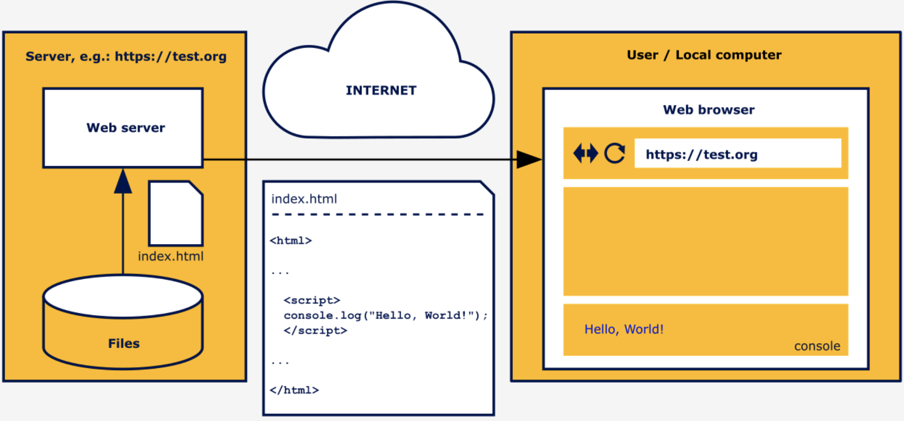
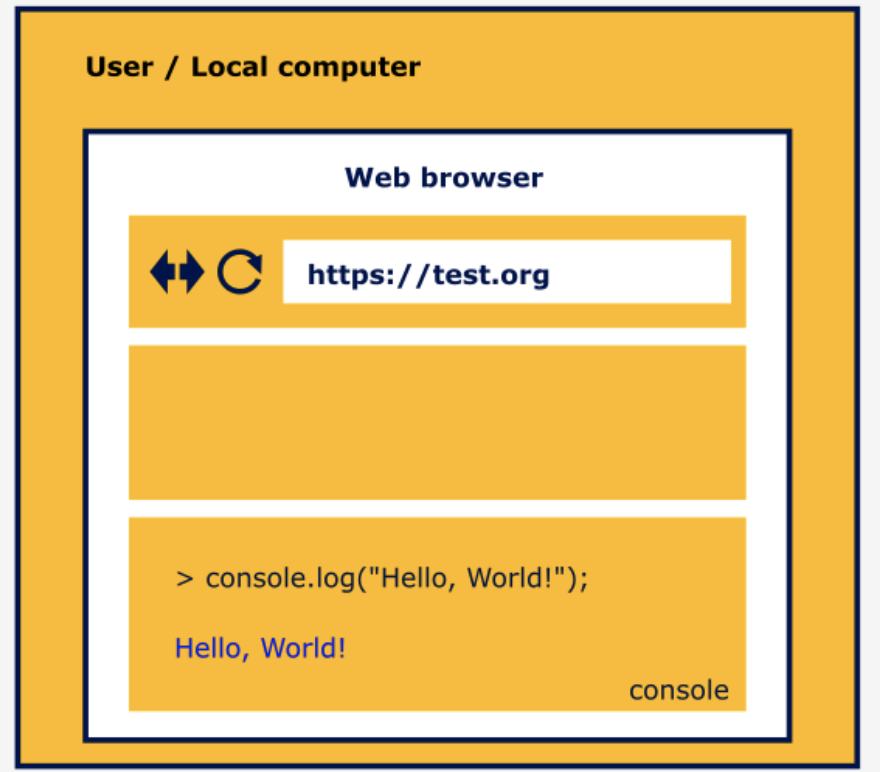
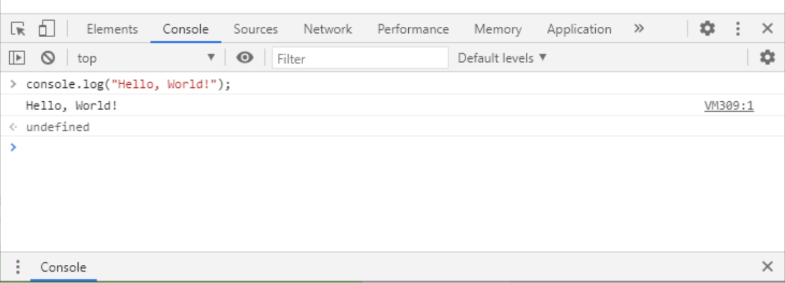

# Module 1 - Introduction to JavaScript and Computer Programming

After completing Module 1, the student will:

 * understand the fundamental programming concepts, such as: interpreting and the interpreter, compilation and the compiler, client-side vs. server-side programming;
 * have basic knowledge of how to set up and use the basic programming environment (online or local);
 * gain skills allowing them to run their first JavaScript program on the client side (both as an element embedded in the HTML page and directly in the browser console).

## Section 1 - About JavaScript


Topics in this section:

 * How to communicate with the computer?
 * What is JS?
 * JS – Advantages and Limitations
 * Where is JS used today?

### Introduction

So you want to learn how to program in JavaScript? That's great!

This course will be quite a long journey, but if you make it to the end, you will be able to read, understand, and of course, write JavaScript applications and programs. These new abilities may aid you in your current work, or allow you to reach new career opportunities in a steadily growing IT market. Let's start this adventure without any further ado, and let's find out what JavaScript is.

#### How to communicate with the computer

Let's start with something obvious – computers are everywhere. You are almost certainly reading this course on a computer; your phone is a computer; you will find computers in TVs and other home appliances, such as your automatic vacuum cleaner, which uses its computer and numerous sensors in its never-ending mission to eradicate dust from your life. We are surrounded by computers. Computers are used in science, medicine, banking, and business. We suspect that nowadays it would be difficult to find any area of life in which computers do not actively participate.

We use computers mainly because they are able to perform certain tasks incomparably faster and more accurately than people. However, computers cannot guess what kinds of tasks we have in mind or how to help us perform them. We have to tell them that. How? It's best to do so in a similar way as when passing information to other people, in other words, by using a language that is understandable to both sides. Using such a language, we write a program, a formalized solution to our problem, which can be executed by the computer.

Unfortunately, a language that is directly understandable by a computer will be absolutely illegible to a regular human being. It would be a sequence of bizarre instructions, written in numerical form, referring to computer components we didn’t even know existed (and frankly speaking we don't necessarily have to know). This way of communication, which dates from the beginning of computing, is nowadays used extremely rarely, and only in very specific situations.

So in order to help in communication with the computer, programming languages were invented that are somewhat similar to natural languages (that is, those used for communication between people). There are thousands of programming languages, and they differ in purpose (aside from general-purpose languages, there are many specialized ones, for example, languages designed only for statistical calculations), level of abstraction (in simple terms: the higher the language level, the less we need to know about the hardware on which the program is executed), ease of use, effectiveness of the programs written in them, etc.

### JavaScript as an interpreted language

JavaScript is a typical interpreted language. If we run a code written in JavaScript in a web browser, as it is happening, such as after loading the page we are currently reading (yes, yes, there are elements written in JavaScript on this page too), the interpreter will be the JavaScript engine built into the browser. This is not the only way to execute JavaScript code.

Perhaps you have heard of node.js. It is also an interpreter, but installed independently of browsers as an environment in the computer's operating system (it can be macOS, Windows, or Linux). Using node.js allows you to write programs in JavaScript that will, for example, turn your computer into a server.

At the beginning of this paragraph, we simplified things a bit. JavaScript is an interpreted language – there is no doubt about that. And in fact, running a program written in JavaScript looks as if we are executing our source code (that is, the code that we wrote) step by step. However, you may come across information about this language, and more specifically about particular interpreters, that is a bit different.

Most modern JavaScript engines use the Just In Time Compilation technique (JIT Compilation). This technique consists of compiling code fragments during the execution of the program (more than a single instruction) and allows you to increase its performance. However, from the user's point of view, such a change is virtually unnoticeable – it still looks as if only the interpreter is executing the source code, instruction by instruction.

Regardless of the language you choose, a few things remain the same while writing the program. First of all, an important, and probably the most difficult, stage of this process is to correctly define the problem we want to solve. Only then do we try to find the optimal solution, which we will finally present in the form of a program written in the chosen language.

So before you start explaining something to the computer, in other words, writing a program, you need to understand exactly what you want to achieve and how you want to achieve it. Secondly, the solution we propose and write in the form of a program must be 100% unambiguous – the computer cannot guess anything.

A simple example from a slightly different field: at some point in your life, you probably happened to buy a piece of furniture that required assembly. Assembling it is a problem that you, the buyer, have been burdened with. In order for you to cope with this task, you get a set of instructions to guide you through the whole process. You’re acting as an interpreter at this point, using a program that will allow you to complete the task. The success of your mission depends on the quality of these instructions, whether they are precise and unambiguous, and do not come from another piece of furniture. In the end, it may turn out that you have constructed not the furniture of your dreams, but a surrealistic construction from another dimension.

For the instructions to be good, someone who develops them must know exactly what they should illustrate, in what order certain actions should be carried out, at which stages something is easiest to confuse, and so on. And of course, they must know what effect is to be achieved at the end.

### A few more words on JavaScript

As we mentioned before, JavaScript is an interpreted programming language. Like most interpreted languages, it is also a high-level language (i.e. relatively easy to understand for people and separating us from the hardware details).

Back in the early 90s, all web pages were static. Things changed in 1995 when the Netscape corporation hired Brendan Eich, and tasked him to develop a new language for their product, the Netscape Navigator web browser. The new language was called LiveScript, but soon after its name was changed to JavaScript. Its main task was to add dynamics to websites, which would allow, for example, for more complex interaction with the user. And so the career of JavaScript began.

#### Client-side vs server-side programming

The use of JavaScript on websites, which over time has become more and more complex and often contain very sophisticated logic, is called client-side programming. The code to be executed is loaded together with the page in the browser, on the user's side, and the interpreter which is a part of the web browser allows for its execution.

Today, JavaScript is the sole language supported by all major web browsers, and about 95% of web pages worldwide embed JavaScript code within them. From the beginning, web pages used JavaScript on the **client-side** to add interactivity and dynamically change the content.

Now it’s much more than that, as JavaScript offers many great frameworks on which to build huge, complex web applications and social networks (you've probably heard the names of frameworks like **React** or **Angular**).

All this can work on a variety of equipment, from high-performance workstations to simple smartphones. Thanks to the power of JavaScript, we can order food, play browser-based games, watch movies on streaming platforms, and be in constant contact with the people important to us. JavaScript is so popular that continually more and more effort goes into using it, not only as a client-side solution.

Over time, JavaScript began to appear in other areas, such as programming the server-side parts of complex web applications, also called back-end. These programs are executed on servers, processing data (e.g. from databases), which after processing will be available on the client side. The flexibility of this language and its relative simplicity have made it much more applicable, for example, in mobile apps, or even in programming UAVs (some drones run programs written in this language).

### Is this the perfect programming language? - disadvantages
We say that JavaScript is a mature language, which means that most of the features are already implemented and stable, and we will probably not see any big changes in the language. Since 2015, many aspects of JavaScript have changed, and many new features have been added. A lot of these changes were introduced to make the migration to JavaScript easier for programmers who know other popular languages, from which JavaScript originally differed quite strongly in certain aspects, such as when handling objects. We can still use the language in the old way, but it is recommended rather to use the modern JavaScript.

But... there are no ideal solutions, so there are no good programming languages for all applications. Each of them has its own limitations, and it’s no different with JavaScript. Despite its popularity and success, JavaScript is not a perfect programming language. Due to its nature, it is not suitable for certain applications. For example, there is no point in using it to write programs that require advanced mathematical calculations or very high performance.

Some limitations are due to the very concept of the language, but the vast majority are related to the platform on which we use it. This is especially visible when writing code to be executed in a browser, which as we said earlier is called client-side. In such a situation, JavaScript is limited in functionality by the fact that browsers, for security reasons, run script code in a sandbox environment (an environment separated from the outer world), which doesn’t allow for access to local files and resources (i.e. those files that are on the computer where the browser is launched).

Another inconvenience is that since the code is not compiled, it goes into the browser in the same, or a very similar, form to what we wrote ourselves. Why is this a disadvantage? This is because everyone can see our solution in an easy-to-read form and use it (either fragments of it or even the whole of it) without our permission to write their own program.

Some help here may be code obfuscation, which consists of transforming our ready script into a slightly less readable form (e.g. by generating short random names of variables and functions, eliminating end-of-line signs, and so on), but the simple fact is that if somebody wants to steal our JavaScript code, there is very little we can do to stop them.

### Is this the perfect programming language? - advantages

On the other hand, JavaScript has many advantages over other programming languages, and one of the biggest is a very active and supportive community. It is easy to find solutions to common problems, and to find help in general. This also means that tools that work with JavaScript are actively developed.

Another big plus is a huge number of ready-to-use frameworks and libraries that provide most of the commonly required functionalities and features. The language itself is relatively easy to learn, and allows us to focus on the job instead of fighting with the syntax (that is, the way of building the instructions which make up the code of our program).

Additionally, JavaScript doesn’t require you to buy expensive tools to work with it, and really good tools are already embedded inside your web browser. Last but not least, big players like Google, Facebook, and Mozilla actively support JavaScript tools and their development.

However, what is an advantage for some may turn out to be a disadvantage for others. An example may be the dynamic typing characteristic of JavaScript. In short, it consists of the fact that we can store data of any type in a variable (a variable is a container in which we store the data we will use).

For example, during the program's execution, we can store the number 10 in a variable, and in the next step use the same variable to store the "abc" string (deleting the previous value automatically, of course – don’t worry if you don’t understand right now, because we’ll be covering all these terms later on).

Usually this is very convenient, but a number of people have found this feature of the language to be a disadvantage. In their opinion, it makes it easier for a programmer to make mistakes in certain situations. By adding static typing, where a variable can only contain one type of variable (e.g. numbers) during program execution, a new language called **TypeScript** was introduced.

Remember also that if you learn to program in one language, it will usually be much easier for you to learn the next one, which for some reason may be better to solve a particular problem.

But let’s start now with JavaScript, which, due to its flexible and simple syntax, is perfect to learn as a first language.

### Let's get ready to work

As we mentioned earlier, JavaScript can be used in various environments, although most often it will be a web browser or a server with a node.js environment. Each environment imposes a slightly different way of using this language, and some mechanisms or functions characteristic to it appear. However, the essential part of the language, its core, remains the same. In this part of the course, we will learn how to program using this invariable, core part of JavaScript: how to declare variables, write functions, conditional instructions or loops – all of this will be equally usable in any environment in which we decide to use this language.

Programming in any language is not an easy thing to learn, and you may feel overwhelmed by so much new information. If you’re persistent and focused, you’ll be writing simple scripts in no time, and there is no other way to learn to program than to write lots and lots of code.

Most importantly, don't give up even when you’re stuck: take a break, go for a walk, return to it with a fresh mind, and try again. In the end, slow and steady wins the race.

Now, let's begin!


## Section 2 - Setting up programming environment

Topics in this section:

 * Development tools
 * Online development environment
 * Local development environment (code editor, interpreter, debugger)

### Development tools

Like any other task, programming requires the proper tools and workspace. Software development, in most cases, requires a **code editor** and a **compiler** or **interpreter** of a given language. This is a minimum set, which we can extend as needed with various other tools.

At this stage of the course, apart from the JavaScript code editor and interpreter, we can also use the **debugger**, which is a tool that allows us, among other things, to pause the program in the indicated place and analyze its current state (e.g. the values of the indicated variables).

The tools in question will of course have to be run on the computer. At this stage, its performance is not particularly important, and any unit that can handle normal office tasks will suffice, so it's highly recommended to work from a desktop or laptop computer.

There is no denying that the size of the monitor will affect the comfort of your work. The bigger the monitor, the easier it will be to place the code editor, interpreter, and other content (e.g this course) next to each other. In normal working circumstances, programmers very often use several monitors.

The operating system doesn’t matter, as the appropriate tool can be found for Windows, macOS, and Linux.

At this moment, there are two choices. You can install all the necessary tools on your machine and work in the local environment. This is the preferred approach, as this is how it looks in real commercial projects most of the time. You can also customize everything to suit your needs.

Another approach is to use online tools. These can be convenient, as you don't need to install or configure anything – they just work. Most of them allow you to store your work in a cloud so you can access it from different devices, but on the other hand, they lack customization options, and you need to have a constant internet connection.

All the code that you’ll see in this course was tested in both local and online environments, so both options are valid. Finally, we can move on to the choice of tools.

#### Online development environment

**Online environments**, commonly known as code playgrounds, are sites that act as a simple editor and runtime environment. All of them have similar sets of features. They have different user interfaces, but in principle, they behave in a similar way. They allow you to write code, run it for testing purposes and most often share it with other users.

In the case of JavaScript, where preparing a fully working local environment actually boils down to installing a code editor and running the browser, they are not as important as regular development environments. They are mainly used as training and testing platforms, or places to publish sample solutions to programming problems.

Among JavaScript programmers, the most popular are the following:

 * JSFiddle
 * CodePen
 * JsBin
 * Plunker


During the course, we will use an online environment integrated with the training platform. OpenEDG provides a simple environment for writing and running code in several programming languages, including JavaScript. Thanks to that, you will be able to practice everything we talk about right away.

Don't forget, however, that this platform is a purely didactic and testing solution, and it certainly cannot be used as a fully-fledged development environment. However, it is ideal for our needs, because in most cases we will be able to forget about the web surroundings of programs written in JavaScript, including HTML elements. This will allow us to focus solely on learning the JavaScript language itself.

However, it is highly recommended that you also set up your own **local development environment**. It's not difficult, as you'll find out right away, and it will allow you to do some exercises in a way that is much closer to how you would do it during normal software development. If, in the further part of the course, any of the exercises will have to be done in such an environment, we will indicate this clearly.

#### Local development environment

As we wrote earlier, the JavaScript requirements for the development environment are very modest. In most cases, especially at the beginning of development, just three elements are sufficient: a code editor, an interpreter (i.e. a bootable environment) and a debugger.

Depending on the level of sophistication, the complexity of the written project, or the environment for which we write our programs (client-side, server-side, mobile), other tools may also be needed.

These will be, among others:

 * **package managers** – enabling the management of libraries (containing ready-made solutions that we can use in our programs) or components of the development environment (e.g. npm or yarn)

 * **task runners and module bundlers** – used, in simple terms, to automate the process of software development and merge the resulting code from many files and libraries (e.g. Grunt or Webpack)

 * **testing framework** – allows for automatic testing of the correctness of our program in search of potential errors (e.g. Mocha, Jasmine, or Jest)

 * **security analyzers** – as you can guess, used to control the security of our solution (e.g. Snyk, RetireJS, or OWASP Dependency Check)


The openness of web development environments is both a blessing and a curse. We have a choice of hundreds of components, from which we can create the most comfortable environment for ourselves.

However, their quantity, plus the dynamic changes of particular tools or even just the trends among programmers make it difficult to keep up with everything that’s happening within these environments.

But for us, this is a problem for the distant future.

For now, we need the minimal trio: a **code editor**, **interpreter**, and **debugger**.

#### Code editor

The code of almost all programming languages is composed of some form of text. So, to write the code, we need a text editor. But it needs to be an application that writes plain text (it can’t be a rich text editor, like MS Word). In other words, just a plain notepad that can write .txt files is enough to write code, although it’s much easier if you use a dedicated code editor. The market is full of professional code editors, both free and paid. Some of them are universal, while others are exclusive to specific languages. The main advantage of using a dedicated code editor is syntax highlighting, text autocomplete, and error checking. This improves work efficiency and code understanding, and lowers the number of errors and typos. There are many good code editors, but it can be really hard to select one that works for you.

Here are some popular ones:

 * [Visual Studio Code](https://code.visualstudio.com)[Windows, macOS, Linux]

    Powerful code editor free for both personal and commercial use. It has quickly become one of the favorites when it comes to web development. It has built-in features like a JavaScript debugger, and tools to streamline web projects. It’s also highly customizable via the extension system (there are many additions dedicated especially to the JavaScript language).


 * [WebStorm](https://www.jetbrains.com/webstorm/)[Windows, macOS, Linux]

    A popular commercial development environment, in which the code editor is just one of the smaller elements in a huge set of tools that improve code development (e.g. supporting testing). Intended for large projects, it may prove to be too heavy and complex for small programs. Although it is intended for commercial use, it is possible to obtain a free educational license.


 * [Sublime Text](https://www.sublimetext.com)[Windows, macOS, Linux]

    Fast and easy-to-use code editor with many advanced features, like multiple-line editing, fast search, and others. A trial version is available, but for long-term usage, a license needs to be purchased for both private and commercial use.


 * [Notepad++](https://notepad-plus-plus.org)[Windows]

    Free and lightweight code and text editor. The program is small and fast, supports dozens of programming languages, and can be extended with plugins. It may be old and ugly, but it’s still sharp.

Lots of other code editors exist, both free and paid, and you can use whichever one you prefer. Many developers use, among other things, console editors, including the legendary vim. Console editors are not run in a graphical environment, but in a text console. However, you can only reach for such solutions if the tasks you're going to do turn out to be too simple and you want to make your life a little bit more difficult.

#### Interpreter

We have already talked a bit about the **interpreter** and its role. It functions as a runtime environment for our program. It checks whether we have made any formal errors, for example, making a typo in the name of a function or forgetting to close a parenthesis, and then it executes the program instruction by instruction.

The choice of JavaScript interpreter will depend on which platform we write our software for. For example, if we want to write a simple server-side application, we will almost certainly choose the **node.js** environment, which we will have to install directly on our operating system. In the case of client-side software, our interpreter will simply be the web browser you already have installed (because how else would you read this course?).

Our course is about core JavaScript, that is, those language elements that will be equally useful in client-side, server-side, and mobile solutions. So we can practice them in any environment, using any interpreter. The easiest way to do this is to limit yourself to a web browser.

As we said before, practically all browsers have built-in JavaScript engines (or interpreters), but we strongly recommend using **Chrome** from Google, or **FireFox** from Mozilla. Both are known for their efficiency and integrated advanced tools for web developers (that’s you). They are available for Windows, macOS, and Linux.

Remember to regularly update your chosen browser and use the latest version. This is especially important when working with JavaScript. The language is constantly changing, with new features and mechanisms being added. You may find that your favorite but somewhat dated browser doesn't support certain features of the language. Your browser is now a tool, so try to keep it in good shape by updating it regularly.

#### Debugger

Computer programs are complicated beasts, thousands or even millions of lines of code (but calm down, we'll start with just a few). With such complexity and size, it’s impossible to produce code without any errors. Some types of errors, especially logical ones (formally, the program is written correctly, but probably we invented the wrong solution to the problem), can only be found while the program is running, and often only in special circumstances. It’s really hard to find out what exactly is happening inside a program that runs blazing fast, and for those problems, debuggers exist.

A **debugger** is a tool that allows you to slow down or even halt the execution of a program, run instructions step by step, and look at and analyze the state of the program at any given moment.

Fortunately, the moment we decided to use the web browser as our boot environment and JavaScript interpreter, we also got ourselves a debugger. All modern browsers are equipped with the developer tools. During normal operation, they are invisible, and we have to enable them in the browser options (more about this in the next chapter).

Depending on the browser, we will find various tools there, but there will certainly be:

 * **the inspector** – which will allow us, for example, to analyze the individual HTML elements of an open website;

 * **the JavaScript console** – which firstly shows all the information about the errors, and secondly allows us to run single JavaScript commands in the context of the current page;

 * **the debugger** – which, among other things, shows the current values of variables, and allows you to pause code execution in the indicated place and to perform step-by-step work (i.e. execute single instructions of the program).

How do you enable the developer tools? Unfortunately, there is no single answer; it depends on the browser you’re using (sometimes also on its version) and the operating system. Browser interfaces change quite often, so it is better to learn the right shortcuts instead of looking for the right option in the menu. Try the following key combinations:

 * Windows and Linux operating systems, all common browsers except Internet Explorer and Edge: 
ctrl + shift + I

 * Windows operating system, Internet Explorer and Edge: 
F12

 * macOS operating system, all common browsers: 
Command key + Option key + I

In the next chapter, we will return to this topic and learn a few more things about these useful tools.

In the next chapter we will write our first piece of JavaScript code. We will test it first of all in the runtime environment integrated with our training platform. We will also use it to check how our local development environment works. So, please make sure that your selected tools are installed and that you can start them up. If you still don't know what to choose, we suggest using the local environment with Visual Studio Code (our code editor) and the Chrome (web browser with JavaScript interpreter and debugger).


## Section 3 - Hello, World!

Topics in this section:

 * A few words about HTML
 * How can you run your JavaScript code?
 * Executing the code directly in the console

### The "Hello, World!" Program

Why "Hello, World!"? For almost 50 years, this sentence, and its derivatives, has marked someone as learning a new programming language, although it’s more a tradition than anything else. The phrase was used a long time ago in a very important book about the C language, but the text itself doesn’t matter.

The idea is to write out something on the screen using a specific language. First, it allows us to see the basic syntax of the language and compare it to other programming languages. Second, it’s a very simple program, and anyone can easily write it or copy it from the internet and check if their tools and environment are set up correctly. Third, it’s a program that outputs something, so it provides feedback on whether it was executed correctly or not.

In the case of client-side JavaScript, displaying something on the screen can be understood in two ways.

First, client-side JavaScript is always executed in the context of a website and allows you to manipulate elements of that website. So we can, for example, use the appropriate function to insert some text, change a title, create a table, etc. on the page. This way, we control the visual part of the website.

Second, we can use the **console** as a screen to write some information. The console, as we mentioned in the previous chapter, is part of the developer tools. So it is not visible by default, and it must be properly enabled (we also wrote about this in the previous chapter). For our needs, it will be much more convenient to use the console, as we will avoid the need for a thorough analysis of the structure of the website.

But what actually is a console? First of all, it is a place where various messages are displayed, normally invisible to the browser user. These messages can, for example, be generated by the JavaScript interpreter after encountering an error or if we print it, by calling the appropriate function. Secondly, we can run individual JavaScript commands in the console, which will be executed in the context of the currently loaded web page (a little more about that in a moment).


The basic function allowing us to write information to the console is console.log. So, to refer to the eternal "Hello, World!", we should call it as follows:

```
console.log("Hello, World!");
```

We can treat the `console.log` as a function*. In fact, the function is only a log, and console is the object to which the function belongs.

*This type of function, belonging to an object, is generally called a method. But once again, for the time being, to simplify certain things, let’s assume that this is an ordinary function – it will not bother us at all (we’ll learn about objects much later).

The function is a piece of code that allows you to perform a specific task (in our case, to display something on the console). Functions often take arguments, in other words, data that they will use during operation. In JavaScript, we run a function by calling it, and we call it by writing its name followed by a pair of parentheses, where the arguments are provided (if the function does not need arguments, the parentheses are left empty). In our example, the argument is the text we want to display. Note that in order to indicate that "Hello, World!" is the text, we put it in quotation marks.

To let the interpreter know where the command ends, we put a semicolon at the end of the function call. In this case, the interpreter would manage without such help, but it is a good habit to end each command with a semicolon, so that you do not forget it when it is really needed.

We already know what to write, and the only question is, where to do it?

#### Online development environment


Luckily, our platform uses a ready-made online environment, as we mentioned in the previous chapter. The OpenEDG environment allows you to edit and run programs written in JavaScript. Please note that the part of the screen dedicated to this environment is divided into three parts. The upper part is the editor, where we can choose whether to edit a JavaScript, HTML, or CSS file (we will say a few words about HTML and CSS in a moment). All these files together form the code to be executed in our training environment. We will mainly be interested in the JavaScript file tab – app.js. In the lower part of the screen on the left, there is a window simulating the console, on which messages from the interpreter will appear as well as the information we write out. The window on the right side is designed to display the page in the context of which our JavaScript code is executed. This window will be the least useful in this part of the course.

In the editor, you should see the piece of code that was just discussed, containing the console.log function. Try to run it. You need to press the highlighted button with the play icon, located directly above the editor. As a result, the lower window simulating the console should show:

```
Hello, World!
```

Go to the editor again and change the word "World" to your name. Start the program again and check what appears in the console window. Congratulations, you just modified a program written in JavaScript.

We could discuss your first JavaScript program based on this example. You've learned its syntax, run it online, checked its effect, and even modified it yourself. You can test all the examples that we discuss in this course in this way. However, in the chapter before, we urged you to configure your local development environment. So it would be good to show you how this example can be run in such an environment. And this will require a slightly longer introduction.

### Local development environment

Client-side JavaScript is a language of the web and exists only in the web ecosystem. In this setup, JavaScript cannot exist by itself. JavaScript code needs to be embedded in an HTML document. When we used the online environment to run our program, certain aspects were hidden from us. This time we will have to look at them more closely.

### A few words about HTML

**HyperText Markup Language**, or **HTML** for short, is a set of tags used to describe the structure of a website. It allows us to give a page the format of a document containing sections, headers, paragraphs, lists, and the like. HTML is definitely beyond the scope of the current course, so we will present only some basic information about it, just enough for you to understand where and how we can run the JavaScript code associated with a given page.

Tag types are predefined. For example, the tag that specifies a paragraph is `<p>` and the tag for the first degree (largest) header is `<h1>`. The tag name must be placed in angle brackets. Tags are usually used in pairs, limiting a certain area of the document (we have an opening and a closing tag). The closing tag is different from the opening tag, because a slash appears before the name. For example, a paragraph may look like this:

```
<p>quite an ordinary paragraph</p>
```

Often, tags can (and sometimes must) be placed within the range of other tags. For example, our paragraph should be placed inside the `<body>` tags, which separate the main part of our document.

```
<body>
<p>quite an ordinary paragraph</p>
</body>
```


#### Minimal HTML document

Let's try to create a minimal HTML that defines an empty page.

```
<!DOCTYPE html>
<html>
  <head>
    <title>Empty Page</title>
  </head>
  <body>
  </body>
</html>
```

Let's start with the declaration <!DOCTYPE html>. This is not a typical tag, as it is used to inform the browser that the whole document has been prepared according to HTML5. The actual document description starts with the <html> tag, which together with the </html>tag sets the boundaries of the document. Every other tag should be inside these. If any given tag holds other content, there will be a corresponding closing tag, forming some sort of container.

The next tag, <head>, contains additional information about the document, which must also be placed in tags. The most basic one is the <title> tag, which sets the title of the page mostly visible in the browser title bar. After <head> there is the <body> element, and the visible content of the web page should be placed there (e.g. our paragraph).

#### `<script>` tag

The JavaScript code to be executed by the browser on the page must be attached to the HTML using the `<script>` tag, and there are two ways it can be done. The code can be embedded directly inside of the `<script>` and `</script>` tags, but this is only recommended when the code is short. Another approach is to use the `"src"` attribute to point to a separate file that contains the JavaScript code. This is especially true when the same code is going to be used on several pages, because repeating exactly the same code many times is bad practice, as any changes need to be applied to all the files; and additionally, it artificially increases the page size. The JavaScript file extension is .js.

HTML is read by the browser line by line, and script tags are executed right at the moment when the browser parses the `<script>` tag (parsing for programming languages means a formal analysis of the code by a machine in order to understand its structure). Usually `<script>` tags are inserted in the page header between the `<head>` and `</head>` tags, and we can insert many of them in a file, for example, in order to include JavaScript code from different files. This behavior can be changed for external scripts pointed to by the `"src"` attribute by using the `"defer"` or "async" attributes.

 * `defer` – means that the script should be executed after the whole page is loaded;
 * `async` – means that the script will be executed immediately, but in parallel to parsing the rest of the page.

#### ... and a little something about CCS

**CSS**, or **Cascading Style Sheets**, is a language used together with HTML to describe the appearance of a page and its elements. In a nutshell, HTML describes the structure of a document, while CSS describes its presentation.

For example, in HTML, we can describe a page that has a header, two paragraphs, and a data table.

In CSS, we can define what font will be used on the whole page, what color the background will have, or whether the mouse cursor, when moved over the table, should change shape.

So we can treat CSS as some kind of configuration of the visual layer of the page. Thus, the website will most often be built on the basis of an HTML file (that is, a description of the structure), JavaScript code (allowing us to add, for example, some interaction mechanisms) and a CSS file (describing the presentation layer of the page). However, what is important is that there will be no page without an HTML file, but we can easily create a page without using CSS files. The CSS description itself is outside the scope of the current course, and we mention it only for the sake of order.


### How can we run our JavaScript code?

Let's start with a simple example, where the browser gets a simple (maybe even an empty) page from https://test.org. The address is made up for this example, so don't really try to enter it. Look at the figure below.



Let's start from the right side of the figure. The user runs a web browser on their computer (e.g. Chrome). Using the appropriate hotkey shortcut, they turn on the **developer tools** (see the previous chapter) to be able to use the console. Remember that these tools are not needed for normal browser use, and are therefore hidden by default. Then the user types https://test.org (the URL of our fake site) in the address bar.

On the remote server (left side of the drawing), associated with the address https://test.org, a web server is launched, which, after receiving a request from our user, will prepare an answer for them. In the simplest case, the answer will only contain an html file, which can be stored on the same server. The html file (in this example, index.html) is sent back to the user and processed by the browser. If some content (e.g. a paragraph with text) is defined in it, it will be displayed in the browser window.

However, we are more interested in the fact that the index.html file contains the `<script>` and `</script>` tags, with a piece of JavaScript code between them. Do you recognize it? This is obviously an attempt to show our "Hello, World!" on the console. When loading the page, the code placed inside the `<script>` tags should be executed and, if the developer tools are enabled and the console panel is visible, the console will show `"Hello, World!"`.

As we said before, the `<script>` tag can be used in a different way, not only to constrain the place where we write JavaScript code directly. If we use the "src" attribute in this tag, we can indicate a separate JavaScript file that will be attached here.

The picture below shows an example of such a scenario. In the index.html file there is the `<script>` tag again. This time there is no JavaScript code placed after it, but by using the "src" attribute, it is indicated that the code from the main.js file should be attached here.


Everything will work exactly the same as in the previous scenario, except that the web server will provide the main.js file in addition to index.html. The user will not notice any difference. Of course, placing our code on a remote server just to test it would be a bit cumbersome.


We have another possibility, which is that we can load a local html file (i.e. one that is on our computer) into the browser. If this code contains a `<script>` tag indicating some JavaScript file, then this file will also be loaded from the local resources.

The picture shows a simple scenario in which the user loads a local index.html file into the browser, in which there is a reference to main.js (so this file will automatically be loaded, too).


You can load a local html file either by typing its local path after file:/// in the address bar, or by simply opening it in your browser using the Open command from the menu. Since the menu in browsers is very often hidden, a simpler way may be to use a shortcut to open existing documents in applications. The shortcut is universal, not only for browsers and you have probably already seen it:

Ctrl + O

or in the case of macOS:

Command + O

#### Okay, maybe we could finally run something...

To run this locally, you’ll need to open the code editor of your choice. Create a new file with the extension .html (the name of the file doesn't matter, but it’s good practice to avoid spaces in the file name). Put the following code in this file and save it.

```
<!DOCTYPE html>
<html>
  <head>
    <title>Empty Page</title>
    <script src="main.js"></script>
  </head>
  <body>
  </body>
</html>
```

Then, in the same editor, create another file, this time called main.js (this is the name we used in our html file). It should contain one line you've seen before:

```
console.log("Hello, World!");
```

Save the changes and go to the browser. Open a new tab, enable the developer tools (they open for a particular tab), and select the console tool. Give yourself a moment to get used to the layout of the developer tools (each tool, including the console, should be placed in a separate panel, which can be selected).

Just in case, make sure that the focus is set to the browser window (i.e. the new tab) by clicking on it. Then, using the appropriate keyboard shortcut open the html file you have just created. If everything has been done correctly, you should see our "Hello, World!" sign in the console. Make sure that it works and that you can see a message displayed in the debug console. If necessary, do it again, carefully following the steps.

And now a small challenge. Try to modify the html file yourself so that it does not refer to the main.js file. Instead, the same JavaScript code that we wrote in main.js should be placed directly after the `<script>` tag. If you have problems, go back to the first drawing in this section.

To run this code in the online environment, place it inside the HTML tabs, and if necessary, press the run button.

#### Executing the code directly in the console

We have another, quite convenient option when it comes to running short pieces of JavaScript code in the browser (and our program, consisting of one instruction, is definitely short). As we said before, the console is not only used to display information, but also allows you to run individual JavaScript instructions. These instructions must be executed in the context of some HTML page. However, you don't necessarily have to write your minimal page, as we did a moment ago. Try to open a new tab and type `about:blank` in the address bar. This is a pseudo address that tells your browser to generate and load a minimal blank HTML page.

Then run the developer tools. At the beginning, we can check what the HTML generated by the browser looks like. To do so, select the first tool from the panel (in Chrome, it will be Elements, in Firefox Inspector). You should see absolutely minimal html code:

```
<html>
  <head></head>
  <body></body>
</html>
```

Now choose the console from the developer tools. You should see a prompt, usually a sign `>` or `>>` followed by a flashing cursor (if there is no cursor, click on the prompt). Then you can enter the instruction that will show "Hello, World!" on the console (using the console.log function). The scenario is shown in the figure below.



In fact, regardless of the browser, we should get the same effect – the console will display the text we specified. In the case of Chrome (running on the Windows operating system), the console should look something like this after completing this task:



In the case of Firefox (also Windows) this way:


For both browsers, the debugger windows containing the console may vary minimally depending on the version of the software and the operating system running it. The developer tools can be moved. They can be located at the bottom of the browser, as in the examples shown, but they can also be placed on the left or right side of the window (or as a separate window entirely). So don't be surprised if your browser's layout is slightly different from the pictures.

## Summary

Our first program was launched in an online environment at the beginning. This environment allows us to hide certain details that are not important to us at this stage of the course. All exercises and examples that we will discuss should be done in this environment.

However, from time to time, it would be good for you to try to do the chosen example in the local environment as well. It is much closer to what is actually used in the work of a web developer. Running JavaScript code in the local environment may seem a bit cumbersome at first, but fortunately this is just a first impression. Remember, to test simple instructions, you only need to use the console with an empty page (e.g. about:blank). If you want to test a slightly larger piece of code, it is best to create a minimal html file that will refer to the file containing our JavaScript code using the `<script>` tag.