# Module 6 - Errors, exceptions, debugging, and troubleshooting

After completing Module 6, the student will:

 * gain an understanding of the differences between syntactic, semantic, and logical errors;
 * understand the concept of an exception and distinguish between the basic exceptions generated by JS when an error occurs: SyntaxError, ReferenceError, TypeError, RangeError;
 * have the ability to handle exceptions using the try-catch-final statement;
 * be able to generate their own exceptions using the throw statement;
 * have the skills to use the debugger for basic analysis of their own code, including: step-by-step execution, viewing and modifying variables, measuring code execution time.


## Section 1 - Errors and Exceptions – Part 1

Topics in this section:

 * Errors – the programmer’s daily bread
 * Natural languages and communication errors
 * Errors vs exceptions
 * Errors without exceptions
 * Limited confidence


### Errors end exceptions
It is really important to brace yourself for this simple truth:

#### Errors will happen.

You have certainly witnessed, multiple times, different applications malfunctioning, becoming unstable, returning unexpected results, or even shutting down uncontrollably. Unfortunately, we, the programmers, are responsible for most of these. Even if we didn't cause these problems directly, we probably didn't anticipate certain situations that could lead to a program malfunctioning (e.g. lack of a network connection).

Errors in the operation of programs happen. We have to accept that, while trying to minimize their number and mitigate the damage they can potentially cause. We can make errors at every stage of software development, from wrong design to common typos in the code we write. The errors will be the result of a misconception when trying to solve a certain problem, the wrong use of the programming language, or the inability to predict strange user behavior. Unfortunately, bugs in the code causing errors are an integral part of programming.

This fact is best expressed by the words of one of the founders of modern computer science, Edsger W. Dijkstra: _"If debugging is the process of removing software bugs, then programming must be the process of putting them in"_.

#### Natural languages and communication errors

Programming languages are not by chance called languages. Just like natural languages, languages we use to communicate with other people, programming languages are used to precisely formulate unambiguously interpretable sentences (instructions). And just like natural languages, they have their grammar and vocabulary.

Grammar, or formally, the syntax of a programming language, is a set of rules defining the structure of the instructions (that is, the sentences of natural language). These rules are usually very precise and specify, for example, the order in which we write certain keywords or operators.

Each language also has its own limited vocabulary, which is a list of words that can be used to build instructions (that is, again, the sentences of a natural language). This picture is quite simplified, but it should allow us to understand what errors can occur when using the language. To begin, we will try to present the difference between various categories of errors using natural language, in this case, written English.


### Natural languages and communication errors

Imagine that you are organizing a party by the lake for your friends. As the organizer, you explain to everyone how to get there, but as always in such situations, someone gets lost. They’re almost there, but then they send a text message asking for additional tips. You send an answer, in which you tell them to turn right on the first path after leaving the forest, and then drive for another 500 meters. Since you are still on your way, you ask them to wait on the spot. The correct message could look like this:

---

After leaving the forest, turn right into the first path, and drive 500m. Wait on the spot.

---

This is a sentence that we can treat as an instruction, unambiguously describing a certain procedure. What would happen if we rushed when writing this information? Let's start with the missing punctuation marks:

---

after leaving the forest turn right into the first path and drive 500m wait on the spot

---

This is an example of a _**syntax error**_ (or more precisely, errors). In English, a declarative sentence should end with a period. Probably the person who receives this message will easily guess what it is about, but formally it will be incorrect and ambiguous. The interpreter (e.g. the JavaScript engine) or compiler cannot guess the meaning of what we have written. If such an error occurs, it will require us to correct it. Such errors are usually very easy to detect automatically, and always need to be corrected. They violate the language syntax rules. The program will not run if it contains a syntax error.

Let's restore the punctuation marks, but change one of the words, replacing “path” with the misspelled “pth”.

---

After leaving the forest, turn right into the first <span style="color:red">pth</span>, and drive 500m. Wait on the spot.

---

Again, the recipient will probably guess what it is about, but the interpreter cannot afford to guess what the word “pth” may stand for, because it does not know the meaning of such a word. Such an error is also easy to detect, because the word “pth” is not in the vocabulary of our language. This is a _**semantic error**_. In compiled programming languages, this type of error will not allow the compiling and running of the program. In JavaScript, the interpreter will start the program and stop its execution after reaching such an instruction. This specific type of _semantic error_ in JavaScript is called a _**reference error**_.

What happens if we replace a word by a typo with one that exists in our dictionary?

---

After leaving the forest, turn right into the <span style="color:red">fist</span> path, and drive 500m. Wait on the spot.

---

This time we’ve lost the letter “r” in the word “first” and got the word “fist”. If the sentence is analyzed by a person, they will feel that something is wrong and start looking for an error – the word “fist” absolutely does not match the sentence, and they will probably guess what to replace it with. This type of error will no longer be so easy to detect for an interpreter. The word is in the vocabulary, and the analysis has to be done in a broader context. It is also a semantic error.

The last category is logical errors. They are by far the hardest to find, because from a formal point of view, everything will look correct. We should tell our friend to turn right, but busy with something else we rush to write ... left.

---

After leaving the forest, turn <span style="color:red">left</span> into the first path, and drive 500m. Wait on the spot.

---

Formally, everything looks correct: syntax, vocabulary, context. The information is consistent and unambiguous. And obviously incorrect. The error will not be detected until someone tries to follow this instruction and disappears somewhere in the wilderness.

The last two errors may look quite similar at first glance, but they describe two completely different situations. A logical error makes it possible to execute the instruction, but it will give the wrong result. An instruction with a semantic error will make no sense, so most likely it will not be possible to execute it at all in this form.

### ReferenceError

We’ve seen this one already. It occurs when we try to access a function or a variable that doesn't exist. The JavaScript engine does not know the meaning of the given name, so it is an error that we will classify as a semantic error. The corresponding exception is thrown at the execution time of the program, when the wrong instruction is reached (i.e. in JavaScript, semantic errors are run-time errors).

```
let a = b; // -> Uncaught ReferenceError: b is not defined
```

The attempt to declare variable a is unsuccessful because at the same time, we want to initialize it with the value of variable b. Variable b has not been declared anywhere before, so the JavaScript engine does not know this name.

```
fun(); / -> Uncaught ReferenceError: fun is not defined
```

This time, we’ve tried to call the function fun. If we haven’t declared it before, and there is no function with this name among the standard JavaScript functions, the call ends in an error.


### Errors and exceptions in JavaScript

Let's try to generate syntax, semantic, and logical errors in JavaScript, for tests in a controlled way. Let's say we want to write a simple arrow function called multiply, which will multiply the two provided arguments:

```
let multiply = (a b) => a + b; // -> Uncaught SyntaxError: Unexpected identifier
let result = multiply(10, 20);
console.log(result);
```

In the example, there is a typical syntax error: we’ve forgotten about the comma between the parameters of the multiply function. The error is detected by the JavaScript engine, which does not allow us to execute the program. We correct it, but we also make another error:

```
let multipl = (a, b) => a + b;
let result = multiply(10, 20); // -> Uncaught ReferenceError: multiply is not defined
console.log(result);
```

This time, we have a typo in the name of the declared function: instead of `multiply`, we’ve written `multipl`. In the call, we use a multiply name, which does not exist. This is a semantic error, in this case easy to detect, because there is no function with this name. The execution of the program is interrupted at the line of the error. Pay attention to two things. First of all, the error messages displayed in the console quite precisely determine what and where something goes wrong – read this information carefully, as it will help to get rid of the error. The second thing is the beginning of the message – `Uncaught ....` If an error can be uncaught, it can probably be caught. And indeed it is, as we will see in a moment.

First, however, let's correct the error and run the program again:

```
let multiply = (a, b) => a + b;  
let result = multiply(10, 20);
console.log(result); // -> 30 ?
```

Success, no mistakes have been made! But ... the result is slightly suspicious: 30 is certainly not the result of multiplying 10 by 20. Of course, the code is still not correct, as the function is supposed to be used for multiplication, but by mistake we have inserted an addition sign instead of multiplication. This is a typical logical error, impossible to detect automatically. From a formal point of view, everything is constructed correctly, but the logic of our function is incorrect (we’re making it do something different to what we intended). The JavaScript interpreter is not able to detect such errors, because it cannot know what we plan to achieve by writing such a function.

Let's correct it once again:

```
let multiply = (a, b) => a * b;
let result = multiply(10, 20);
console.log(result); // -> 200
```

When JavaScript detects syntactic or semantic errors, it generates and **throws** specific objects containing information about the encountered error. Usually, in such a situation, we say that an error has been thrown. In the case of syntax errors, the JavaScript engine does not allow us to run the program, and on the console, we receive information about what is incorrect. Errors other than syntax errors (e.g. semantic errors) are generally called **run-time errors** in JavaScript. They appear while the program is running. We can also call them **exceptions**. By default, thrown exceptions interrupt program execution and cause the appropriate information to appear on the console (we observed this in our example with the `multiply` function). Let's generate the erroneous situation again:

```
console.log('abc'); // -> abc
conole.log('def'); // -> Uncaught ReferenceError: conole is not defined
console.log('ghi');
```

The typo in the word console is a semantic error, in JavaScript called a `ReferenceError`. JavaScript does not know a word like conole. As you can see, the program will stop working only at the second line, and it will still be able to execute the first line correctly. It is possible to prevent the program from stopping in such a situation. This is called exception handling (or more generally, error handling). To handle exceptions generated in JavaScript (as in many other languages) we use the `try ... catch` statement.

```
try {
    console.log('abc'); // -> abc
    conole.log('abc');
} catch (error) {  
    console.log(error.message); // -> conole is not defined 
}
```

If an exception is thrown in the code block after the try keyword, the program does not interrupt completely, but jumps to the part of the code after the catch keyword, and continues from there. We'll take a closer look at this construction shortly.


### Errors without exceptions?

In JavaScript, not all erroneous situations throw exceptions. Many of them are handled in a slightly different way. The best example are _arithmetic errors_.

```
console.log(100 / 0); // -> Infinity
console.log(100 * "2"); // -> 200
console.log(100 * "abc"); // -> NaN
```

None of the above commands will generate an exception, although they don't look like the most correct arithmetic. Dividing by zero will result in an `Infinity` value. Multiplication of a number by a string, which will represent a number, will automatically convert this string to a number (and then perform multiplication). An attempt to perform an arithmetic operation on a string that does not represent a number (i.e. that cannot be converted) will result in `NaN` (not a number). At least two of these cases are clearly wrong (the first and the third), but instead of exceptions, the information about the error is the specific value that is returned. Let's look at one more example:

```
console.log(Math.pow("abc", "def")); // -> NaN
```

This time, we use the pow method of `Math`, which is used to raise a given number to the given power. The `Math` object will be discussed in the next parts of the course, but at this point it is enough for us to say that `Math.pow` is simply a function that takes two numbers as arguments and returns the result of their power. However, the two strings of characters we’ve provided to this function are hard to call numbers. The function does not generate an exception, however, but returns the `NaN` value.

The conclusion is quite simple – if you are learning about a new function or operator, you have to check in the documentation (e.g. on the MDN page) how they behave in the case of errors. Some of them will generate exceptions, while others will return some specific values. Depending on that, you will be able to properly prepare yourself for handling errors using the try method or simple conditional instructions. By the way, for the examples just shown, the most sensible solution would be to check if the provided values really are numbers (remember the `typeof` operator?).


### Limited confidence

Programs are not run in a vacuum. Usually during their execution, there are interactions with users (e.g. entering data needed to calculate certain values) or other programs or systems (e.g. downloading data from the server). The behavior of both users and other systems should be treated with caution, and we cannot assume that the user will provide data in the format we require, or that the data server will always work. Such unexpected situations will also be sources of errors in our program. And although they are not directly dependent on us, it is our responsibility to anticipate potentially dangerous situations. If, for example, we write a calculator to which the user enters their values, then we should probably check if the divisor is not a zero before we do the division. Theoretically, the user should know that we do not divide by zero, but we are responsible for the stability of the program. Do not believe the user or other systems. Predict what may go wrong, and check the data received before you use it in your program.

Let's write a piece of code that will ask you to enter two numbers. We then want to display the result of dividing the first number by the second:

```
let sX = prompt("Enter the first number");
let sY = prompt("Enter the second number");
let x = Number(sX);
let y = Number(sY);
if (Number.isFinite(x) && Number.isFinite(y) && y !== 0) {
    console.log(x / y);
} else {
    console.log("incorrect arguments");
}
```

You probably remember the `prompt` function, which displays a dialog box into which we can enter a value. `Prompt` will return the entered value, always as a string (even if the user enters a number, e.g. they enter 1024, but we get the string "1024"). We are explicitly converting such a string into a number using the `Number` constructor (this will be discussed in detail in the next course). Since we disbelieve the user, we predict that instead of a number, they could have given a string such as "abcd", or a second value equal to "0". Therefore, before we perform the division, we check whether we can accept the converted values. We use the `Number.isFinite` method for this purpose. It returns `true` if the argument is a correct number, and `false` if it is, for example `Infinity` or `NaN`. Additionally, we check if the divisor is not zero.


## Section 2 - Errors and Exceptions – Part 2

Topics in this section:

 * Types of errors – SyntaxError
 * Types of errors – ReferenceError
 * Types of errors – TypeError
 * Types of errors – RangeError
 * The try–catch statement
 * Conditional exception handling
 * The finally statement
 * The throw statement and custom errors


### A few more details about JavaScript errors and exceptions

Let's try to organize the information about errors and exceptions, and above all, their handling. This time, let's look at the problem from a strictly functional point of view. We will start with an overview of the most important types of errors detected by JavaScript, discuss in more detail the try ... catch construction, and show that we can also directly throw exceptions.

#### Basic types of errors

There are a few underlying types of errors that JavaScript produces. Most often, especially at the beginning, you will encounter syntax and reference errors. We will also discuss type and range errors.

#### 1. **SyntaxError**

As we previously said, a `SyntaxError` appears when a code is ill-formed, when there are typos in the keywords, unmatching parentheses or brackets, etc. The code can’t even be executed, as JavaScript isn’t able to understand it. The corresponding error is therefore thrown before the program is started.

```
"use strict";
iff (true) { //-> Uncaught SyntaxError: Unexpected token '{'
    console.log("true");
}
```

In the example above, we’ve made a typo in the keyword `if`, adding an additional letter f. The JavaScript engine treats the unknown name as a function call (it finds the round brackets after iff) and is surprised by the presence of a curly bracket.

#### 2. ReferenceError

We’ve seen this one already. It occurs when we try to access a function or a variable that doesn't exist. The JavaScript engine does not know the meaning of the given name, so it is an error that we will classify as a semantic error. The corresponding exception is thrown at the execution time of the program, when the wrong instruction is reached (i.e. in JavaScript, semantic errors are run-time errors).

```
let a = b; // -> Uncaught ReferenceError: b is not defined
```

The attempt to declare variable a is unsuccessful because at the same time, we want to initialize it with the value of variable b. Variable b has not been declared anywhere before, so the JavaScript engine does not know this name.

```
fun(); / -> Uncaught ReferenceError: fun is not defined
```

This time, we’ve tried to call the function fun. If we haven’t declared it before, and there is no function with this name among the standard JavaScript functions, the call ends in an error.

#### 3. TypeError

This type of error occurs when a certain value is not of the expected type (i.e. you try to perform an operation on it that is not acceptable). Typical examples are changing the constant value or checking the length of a variable that is not a string. This error is particularly important when working with objects that are outside the scope of this course (we will talk about them in the next part of the course). This is a typical `run-time error`, so the appropriate exception will be thrown while the program is running, after reaching the problematic instruction.

```
const someConstValue = 5;
someConstValue = 7; // -> Uncaught TypeError: Assignment to constant variable.
```

Trying to store the new value to the constant someConstValue has failed for obvious reasons, resulting in a TypeError.

```
let someNumber = 10;
someNumber.length(); // -> Uncaught TypeError: someNumber.length is not a function
```

This time, we’ve tried to treat the contents of the variable `someNumber` as a string, and check its length. The JavaScript engine notices that the variable stores a number, and such an operation is not allowed.

#### 4. RangeError

This type of error is generated when you pass a value to a function that is outside its acceptable range.

Again, it is a _**run-time error**_, and the exception is thrown while the program is running, after reaching the wrong instruction. In fact, this exception is more useful when writing your own functions and handling errors. You can then throw an exception in certain situations.

```
let testArray1 = Array(10);
console.log(testArray1.length); // -> 10
let testArray2 = Array(-1); // -> Uncaught RangeError: Invalid array length
console.log(testArray2.length);
```

In the example, we’ve attempted to create two arrays, using the constructor (i.e. de facto function) `Array`. If we pass one argument to this function, it will be treated as the size of the newly created array. The first array (`testArray1`) is created without any problem. As you can guess, creating a `testArray2` array with a negative length fails.

#### 5. Other errors

There are a few more error types: `EvalError`, `InternalError`, and `URIError`, but they’re rather rare, and we’ll come back to them if needed.


### The `try ... catch` statement

As we said before, exceptions interrupt the program execution. The `try ... catch` construction, which we also mentioned before, allows you to change this default action. The program will interrupt what it is currently doing, but it will not terminate automatically. The syntax for `try...catch` looks like this:

```
try {
    // code to try
} catch (error) {
    // code to run in case of an error, which throw an exception
}
```

The basic premise is simple: if we have a piece of code that can possibly go wrong, we can enclose it in the `try` clause. JavaScript will try to execute this code, and if any error occurs and an exception is thrown, the code inside the `catch` block will be executed; if the `try` code is executed without errors, then the catch block is ignored. After executing the commands from the `catch` block, the program will continue to run from the first instruction outside the `try ... catch` statement.

Note that the `catch` keyword is followed by parentheses containing the parameter error. This is a variable name that will hold information about the error that was caught, and it can have any valid name, but the names `error`, `err`, or just `e`, are commonly used. In the case of an exception thrown by JavaScript, the error object will contain information about the error type, and is converted to a string to be logged or processed in any way the developer needs.

So let's modify the code that we saw earlier, and which we know for sure throws errors:

```
try {
    let a = b;
} catch (error) {
    console.log("Caught " + error); // -> Caught ReferenceError: b is not defined
}
console.log("We handled the exception!"); // -> we handled the exception!
```

The statement that produces `ReferenceError` is now inside the `try` block. The result is that our code is no longer stopped by errors. And we can react to it in the catch block. In this example, we log a message about the error. The first error that is thrown in the `try` block will always be caught, execution will jump to the `catch` block, and no further errors in the `try` block will be caught. What's important is that after leaving the `catch` block, the program will continue to work normally (in our case it will write “We handled the exception!” on the console).

Note that `try...catch` will not work on a `SyntaxError`. This should not come as a surprise to you. As we have said several times before, if the JavaScript engine detects a _syntax error_, it will not allow you to run the program. If the program has not been run, it is rather hard to imagine that it could react somehow to what has happened.

#### Task

Rewrite all examples from this chapter in such a way, that the errors will be caught by a `try...catch` statement.


### Conditional exception handling

Sometimes we want to be able to react differently to specific types of errors inside the `catch` block. We can do this by using the operator `instanceof`. We’ll discuss the operator itself further down the road, because it’s a rather complicated topic. For now, it’s enough to know how we can use it when handling errors. The syntax for the `instanceof` operator looks like this:

```
variable instanceof type
```

If, for example, we receive an error in the `catch` block (passed as an error argument), we can check whether it is of the `ReferenceError` type as follows:

```
let result = error instanceof ReferenceError;
```

The operator `instanceof` returns a boolean, so this expression will return `true` if the error variable does indeed hold a type `ReferenceError`, and false if it doesn’t. We can use `if...else` or switch statements to then execute different code in the case of different errors if needed.

The operator `instanceof` returns a boolean, so this expression will return `true` if the error variable does indeed hold a type `ReferenceError`, and `false` if it doesn’t. We can use `if...else` or switch statements to then execute different code in the case of different errors if needed.

In this example, we can see how we can react in a specific way only to the selected type of error:

```
let a = -2;
try {
    a = b;
} catch (error) {
    if (error instanceof ReferenceError) {
        console.log("Reference error, reset a to -2"); // -> Reference error, reset a to -2
        a = -2;
    } else {
        console.log("Other error - " + error);
    }
}
console.log(a); // -> -2
```

It’s important to know that any variable that gets declared using the `let` keyword inside a `try` block is not accessible in the `catch` block (nor in the `finally` block, which will be discussed in a moment). If you are not sure why this is the case, go back for a moment to the chapter on variable declarations and their scope of visibility (the block scope topic).


### The finally statement

The last optional block of the `try` statement is the `finally` block. It can be used with or without the `catch` block, and it’s always executed after `try` and `catch` blocks, regardless of whether any errors are thrown. The syntax for `try ... finally` looks like this:

```
try {
    // code to try
} finally {
    // this will be always executed
}
```

Let's do a little experiment. We will make a correct substitution to the variable a inside the `try` block.

```
let a = 10;
try {
    a = 5;
} finally {
    console.log(a); // -> 5
}
console.log(a); // -> 5
```

The new value has been stored, without calling an error, in variable a. Then the content of the `finally` block is executed, i.e. the new value of our variable is displayed on the console. The program continues after leaving the `finally` block, displaying our variable again. Nothing surprising, everything simple and predictable.

Let's break down our example by trying to refer to a non-existent variable, b. As you can guess, this will generate a ReferenceError error:

```
let a = 10;
try {
    a = b;  // ReferenceError
} finally {
    console.log(a); // -> 10
}
console.log(a);
```

What’s happening this time? The exception (`ReferenceError`) interrupts the program in the `try` block. Because the JavaScript engine cannot find the catch block, it immediately jumps to the finally block, executing its contents and ending its work.

The `finally` block can also be used together with the `catch` block, as both of them are optional, but at least one of them is required by the `try` statement, and if none of them is present, a `SyntaxError` is thrown.

```
let a = 10;
try {
    a = b;  // ReferenceError
} catch (error) {
    console.log("An Error!"); // -> An Error!
} finally {
    console.log("Finally!"); // -> Finally!
}
console.log(a); // -> 10
```

In this case, the exception causes a jump to the `catch` block, then to the `finally` block. The program then continues to work outside of the `try...catch` statement.


### Why should we use a finally block?

This is a good question, especially since we can achieve almost the same result just by writing the code right outside the `try...catch` statement, like this:

```
let a = 10;
try {
    a = b;  // ReferenceError
} catch (error) {
    console.log("An Error!");
}
console.log("Finally!");
```

This code will have a similar result as the previous example: it will log `An Error!` and then `Finally!`. It’s true that in this simple example, both `scripts` will behave the same, but there are slight differences, and the most important is that the finally block will be executed even when an error is thrown from the `catch` block.

```
let a = 10;
try {
    a = b;  // First ReferenceError
} catch (error) {
    console.log(b); // Second ReferenceError

}
console.log("Finally!");
```

Now the last `console.log` call will never be executed, as another (this time uncaught) error is thrown in the `catch` block. This won’t happen if we use the `finally` block like this:

```
let a = 10;
try {
    a = b;  // First ReferenceError
} catch (error) {
    console.log(b); // Second ReferenceError

} finally {
    console.log("Finally!");
}
```

Now the `console.log` call from the finally block will be executed, although this doesn't change the fact that program execution will be stopped at this second `ReferenceError`, as it isn’t caught.

`Try...catch...finally` blocks can be nested, so we can use a whole `try...catch` block inside another `try...catch` block. This is useful when we expect multiple errors to occur and need to handle them all.

```
let a = 10;
try {
    a = b; // First ReferenceError
} catch (error) {
    try {
        console.log(b); // Second ReferenceError
    } catch {
        console.log("Second catch!"); // -> Second catch!
    }
} finally {
    console.log("Finally!"); // -> Finally!
}
```

In this example, we catch the exception inside the `catch` block by placing the code inside another `try...catch` statement.


### The throw statement and custom errors

There are several reasons why you generate your own exceptions. Most of them are quite complex and not very useful at this stage of learning. The easiest situation to imagine is when you write a function of your own, which should signal the incorrect data that has been passed to it.

To throw an exception, we use the throw instruction. It is followed by any value that will be treated as an exception. It can be, for example, a number, or one of the ready-made error objects (e.g. `RangeError`).

An exception that we throw will cause the program to react in the same way as the original JavaScript exceptions (i.e. it will stop its execution). That is, unless we throw it inside the try block to handle it. Let's look at a simple example, without trying to find any special meaning in it. This is just an illustration of the use of the `throw` instruction:

```
console.log("start"); // -> start
throw 100; // -> Uncaught 100
console.log("end");
```

An unsupported exception (if the number 100 can be called an exception) causes the program to stop. The second `console.log` instruction is never executed.

Let's close the throw instruction inside the `try` block:

```
console.log("start"); // -> start
try {
    throw 100;
} catch (error) {
    console.log(error); // -> 100
}
console.log("end"); // -> end
```

This time, our exception is caught and handled in the `catch` block, and doesn’t interrupt further execution.

Let's try to write something a little more sensible.

We dream of a function that will allow us to count factorials (hopefully you still remember what a factorial is from your math lessons; if in doubt, take a quick look at Wikipedia for an example). We will write it in an iterative version, that is, using a loop. It will be neither the most elegant, nor the most optimal solution, but simple and legible.

```
function factorial(n) {
    let result = 1;
    for (; n > 1; n--) {
        result = result * n;
    }
    return result;
}

console.log(factorial(3)); // -> 6
console.log(factorial(5)); // -> 120
console.log(factorial(8)); // -> 40320
console.log(factorial(20)); // -> 2432902008176640000
console.log(factorial(1000)); // -> Infinity
```

Let's say that we are a little scared by the large numbers returned by our function, especially the `Infinity` value, so we decide to limit the maximum range of supported values. We will not accept arguments larger than 20.

```
Function factorial(n) {
    if (n > 20) {
        throw new RangeError("Max value 20");
    }
    let result = 1;
    for (; n > 1; n--) {
        result = result * n;
    }
    return result;
}

console.log(factorial(20)); // -> 2432902008176640000
console.log(factorial(1000)); // -> Uncaught RangeError: Max value 20
```

The presence of a conditional instruction inside our function is rather obvious. So is the use of the throw instruction. The construction new `RangeError`("`Max value 20`") definitely needs an explanation. It is a bit out of the scope of this part of the course, so we will try to explain it in the simplest possible way, focusing only on its functional side.

As we mentioned earlier, the `throw` instruction can take any value. Previously, we used a simple number, but this time we’re reaching for something more complex. It is an object, which is a composite data type. You can create a new object in many ways, including by using the operator new. Using this operator, we create a `RangeError` class object, which is a predefined error that we discussed a while ago. The new object is initiated by the Max value 20 string. And such a new object, of the `RangeError` type, containing, among other things, the string we provided, will be thrown if the n parameter exceeds the allowed value.


### Summary

Errors will happen, but when a developer accepts that, they can write code that will be ready for most of them. It’s good practice to always prepare for problems, and also to run the code as often as possible, as this will minimize the amount of new code that can potentially introduce new errors. Try to remember some basic things:

While writing and testing the program, carefully read everything that appears on the console. Error information is usually quite precise, so do not try to make corrections blindly.
Just because you have eliminated all syntax and semantic errors, does not mean that the program is already 100% correct. Logical errors can only occur under certain specific circumstances.
Anticipate and be distrustful of users, their behavior, and the data they input. You cannot assume that the data you receive will always be correct.
Check the JavaScript documentation for the behavior of operators and functions in the case of errors. Sometimes exceptions will be thrown, sometimes a specific value will be returned (remember the arithmetic errors). However, always try to be prepared to handle errors.


## Section 3 - Code Debugging and Troubleshooting

Topics in this section:

 * What is debugging?
 * Step-by-step execution
 * Environment preparation
 * The debugger statement
 * The resume option
 * Code debugging without the debugger statement
 * The step over option
 * The step into option
 * The call stack option
 * Viewing and modifying variables
 * The step out option
 * Measuring code execution time


### Testing and debugging your code

As we have already written, errors in programs happen. It is completely normal. At the beginning, you will mostly make errors resulting from a lack of knowledge of the programming language (e.g. syntax errors). They will be easy to correct, because the interpreter will detect them and usually will also suggest what is wrong. Logical errors, however, are a different problem. As we showed earlier, the interpreter has no way of detecting them, so we have to look by ourselves for the answer to the question: why does the program not work as we assumed it would?

Let’s look at a simple example:

```
function average(a, b) {
    return a + b / 2;
}

console.log(average(2, 10));   // -> 7 expected: 6
console.log(average(5, 5));    // -> 7.5 expected: 5
```

We see a function that calculates the average of two numbers and returns the result. The function looks simple – it adds two given numbers and divides them by 2. This code has valid syntax, there are no formal problems with it, and we expect the results of the two calls in the example to be 6 and 5. But when we run this code, the results are very different. Can you see where the error is?

```
return a + b / 2;
```

This doesn’t work as expected (dividing the sum of two numbers by 2) because of the order of the operations. The division `b / 2` is calculated first, then a is added, so this code is the same as this:

```
return a + (b / 2);
```

and to produce the result we expect, the code should look like this:

```
return (a + b) / 2
```

This is a good example of a **logical error**. The code itself is perfectly valid, nothing to complain about from the JavaScript point of view. But the function doesn't return the values that the programmer intended. Most of the time, these kinds of errors are the hardest to find if the code is not tested properly.

Here we have another example where the error is not so obvious:

```
function largest(a, b, c) {
    if (a > b && a > c) {
        return a;
    } else if (b > a && b > c) {
        return b;
    } else {
        return c;
    }
}
```

We see a function that should return the largest of three numbers. The idea of how to solve this problem is simple: when variable `a` is bigger than `b` and `c`, `a` is the largest number. If this isn’t the case, then if `b` is bigger than `a` and `c`, `b` is the largest number. If neither is true, that means that `c` is the largest number. Take some time and try to spot the flaw in this logic. As a hint, try to call the largest function with these sets of parameters:

```
console.log(largest(1, 1, 2)); // -> 2
console.log(largest(1, 2, 3)); // -> 3
console.log(largest(3, 2, 1)); // -> 3
console.log(largest(2, 2, 1)); // -> 1
```

Can you now spot the error based on when it occurs?

If the first and second numbers are equal, the function incorrectly returns the third value. This is due to the fact that when a and b are equal, both `a > b` and `b > a` are not true. This error is much harder to find, as this code does what it should most of the time, and only in specific cases does it return incorrect values. When found, the problem is rather easy to fix, as we only need to change the greater than operator to a greater than or equal to operator inside our `if` statement.


### Debugging

To be conducted efficiently, debugging requires tools, and if our code is executed in the browser, we almost certainly have all the necessary tools already available. To check if our browser supports this functionality, we can simply try to execute this code with the developer console opened.

```
console.log("Before debugger");
debugger;
console.log("After debugger");
```

If the debugger is present, the console will show only the "Before debugger" log, and depending on the installed browser, we should see information about code execution either stopped, or paused in the debugger, or in debug mode. The second log message is not displayed because the debugger statement works as a breakpoint in the code execution. So whenever JavaScript encounters the debugger statement, it checks if the debugger is present, and if so, code execution is halted at that exact point. This of course is not helpful by itself, but this is only the beginning of the features of the debugger.

#### Step-by-step program execution

One of the main features of the debugger is its ability to execute code on a **step-by-step** basis. This means that we can stop program execution at any place using a `debugger` statement, and then continue execution one instruction at a time.

This is really helpful when we suspect that the program behavior or logic is flawed, and the code goes to an incorrect branch of execution (it goes to the wrong `if` statement, etc.). In this mode, we can see each line that is executed, and each line that is not. We can easily see if the logic in the flow control statements is valid or not.

So we know already that the `debugger` statement, when encountered by JavaScript, will stop code execution at that place. Depending on the browser we’re using, the flow control buttons can look different, and can be located in different places. In general, all modern browsers support the following options to control the execution of the script in debug mode:

 * **Resume / Continue**. This will resume the execution of the script in a normal way, and is used when we’ve checked what we wanted to check, and now we want to continue with the execution of the script.

 * **Step Into**. This executes the next instruction in the code only, and pauses it again, and we use this when we want to analyze the code in detail, or check which exact path the execution takes when complex branching is happening due to cascading `if...else` statements, or other complicated logic. If the next instruction is a function call, using Step Into will jump inside the code of this function.

 * **Step Over**. This works like Step Into, except that if this is used when the next instruction is a function call, the code will not jump into the function code, but the whole function will be executed, and the program will be paused again after jumping out of this function. This is often used when the next instruction is a call to a function where we don’t know if it will have any impact, or we’re simply not interested in looking.

 * **Step Out**. This allows us to immediately jump out of a function in which the code is paused.

Let's try to practice some basic actions that can be performed with the debugger. The JavaScript program we will be debugging should be rewritten in your local development environment (for some reason, debugging is more readable if we don't use the OpenEDG platform in these exercises). Remember how you can do something like this? At the beginning of the course, we ran our code by opening a simple HTML file in the browser, which included a reference to the JavaScript file to be run (the chapter titled "The Hello, World! Program").


#### Preparation of the environment and an example

Create two files in any code editor (we described how to configure the local environment in the "Development tools" chapter): _index.html_ and _main.js_. In the _index.html_ file, place the code for this very simple HTML web page:

```
<!DOCTYPE html> 
<html> 
  <head> 
    <script src="main.js"></script> 
  </head> 
  <body>
    <p>Test Site</p>
  </body> 
</html> 
```

Save the file to your local drive, preferably in a newly-created, empty directory. In the same directory, save the _main.js_ file (which, as you may have noticed, is referenced in the _index.html_ code), placing the following code inside it:

```
function outer() {
    let name = "outer";
    let str = inner();
    return str;
}

function inner() {
    let name = "inner";
    return "Hello !";
}

console.log("before outer() call");
console.log(outer());
console.log("after outer() call");
```

In the browser you are using, open a new tab and load the index.html file into it. Depending on your browser and system, you can either use the program menu or the appropriate keyboard shortcut (in Linux and Windows: Ctrl + O, in macOS: ⌘ + O). If everything has been done correctly, you will see this text in the tab: "Test Site".

Now we need to start the Developer Tools. We discussed how to run them on different systems and browsers in the chapter titled "Development tools". For example, in Chrome and Firefox browsers, on Windows and Linux, we use the key combination: Ctrl + Shift + I. In the remainder of this exercise, we will limit ourselves to discussing how the debugger works using the Chrome and Firefox browsers as examples.

Select Console from the Developer Tools tabs. Reload the page (key combination Ctrl + R or ⌘ + R). The following messages should appear on the console:

```
before outer() call
Hello !
after outer() call
```

This is the result of the `console.log` methods from the program written in the main.js file. If everything has worked so far, we are ready to start playing with debugging.


### Use of the debugger statement

Let's try the `debugger` statement in practice. Place it in the _main.js_ code before calling the function outer. So the last lines of the _main.js_ file should now look like this:

```
console.log("before outer() call");
debugger;
console.log(outer());
console.log("after outer() call");
```

Do not forget to save the modified file. Go back to your browser and reload the page. What has happened? First of all, in the Developer Tools, the selected tab has changed: in Chrome, it will be to Sources, in Firefox to Debugger. The debugger statement causes the program to stop its execution on the line where we put it and wait for our decision. In the tab, among other information, you should see the code of our program, with the line on which the execution has stopped clearly highlighted.

In Sources / Debugger view, we also have the option to use the console (we don't have to switch to the Console tab). Try pressing the Esc key several times. Notice that the console will appear and disappear at the bottom of the tab. For further work, leave it visible. Since only one `console.log` is executed before the program stops, you should only see the following in the console:

```
before outer() call
```

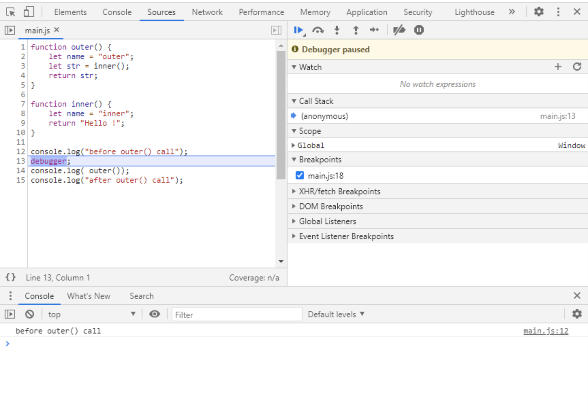

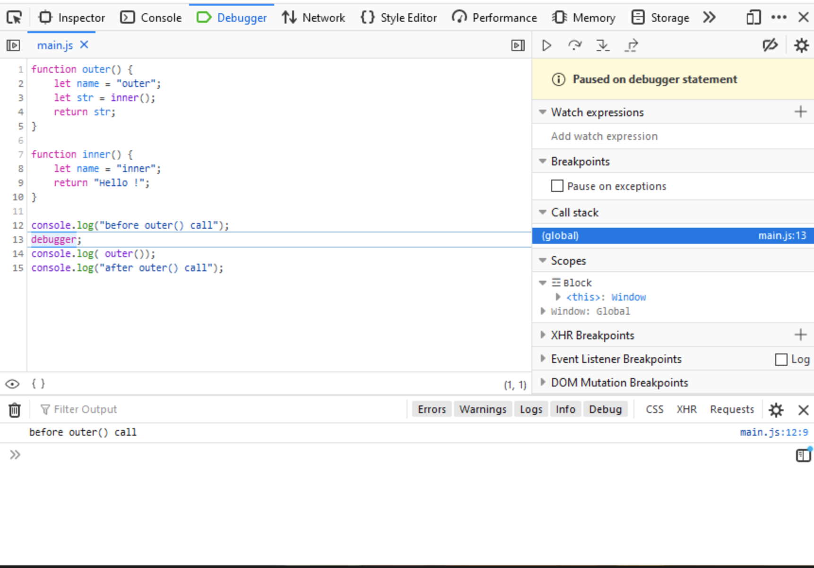


Let’s now try some simple scenarios


### Resume execution
To the right of the tab, locate the **Resume** button (the triangle icon rotated to the right – play). If you hover your mouse over this button, a tooltip should appear so that you can make sure it's the right button. Press this button, or use the keyboard shortcut **F8**. As a result, the program will move on, and without stopping any more, it will execute to the end by itself. The console should now show the complete information generated by the program:

```
before outer() call
Hello !
after outer() call
```

Using Resume does not necessarily cause the program to execute to completion. We can indicate where it should stop again. Reload the page again. Notice that the debugger displays line numbers to the left of the code. Click on the number 15, indicating the last line in our code. This is how we set the breakpoint (the line will be highlighted). Click on the line number again if you want to remove the breakpoint (do not delete it yet). If we now click on the Resume button (or use F8) the program will move on and will stop at the **breakpoint**. As a result, the console will display the following text:

```
before outer() call
Hello !
```

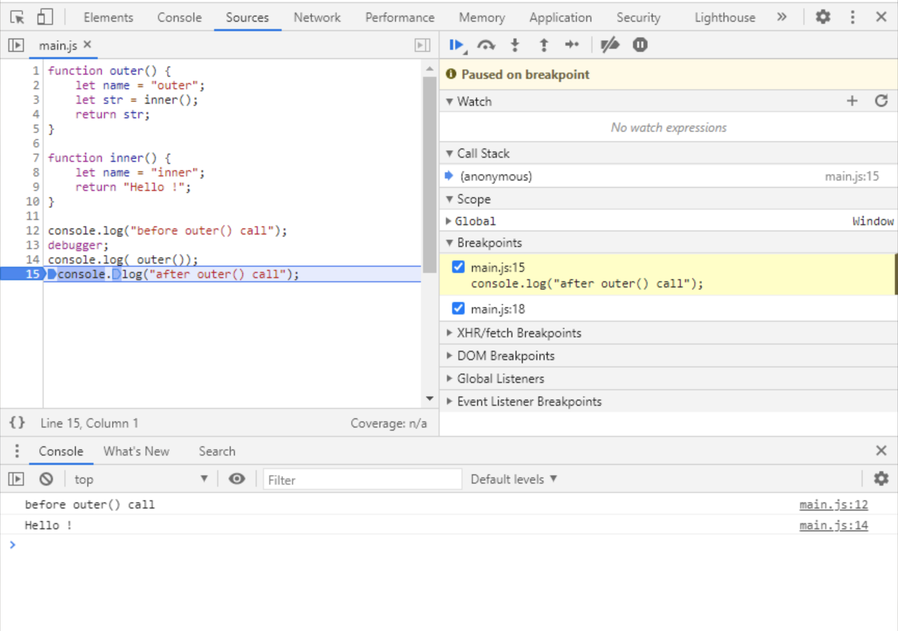
Chrome debugger 

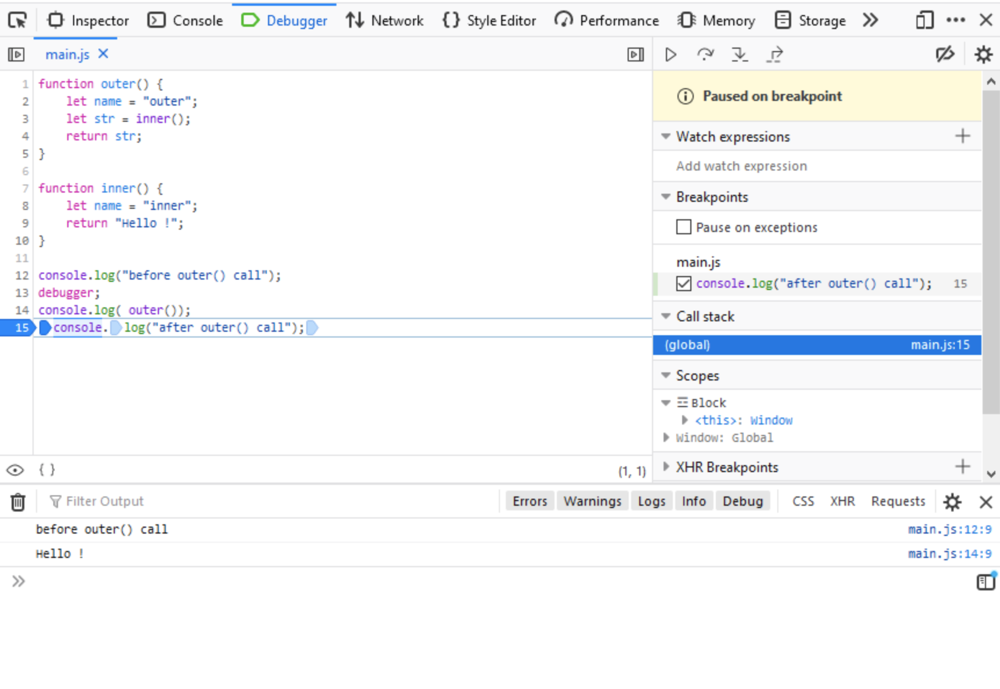
Firefox debugger 

Only by clicking Resume again will the program execute to completion, and the console will show:

```
before outer() call
Hello !
after outer() call
```

To be honest, when debugging code, we rarely use the debugger statement. Most often, at the place where the program should stop, we just indicate it using breakpoints set directly in the Developer Tools. Before further work, remove the breakpoints (by clicking on the appropriate line numbers).

### How to deal without the debugger statement

Again, modify the program saved in _main.js_, this time removing the line containing the debugger command. Save the changes, go back to your browser and reload the page. Obviously the program has executed to the end, but we now know how to stop it. Set two breakpoints, one on the `console.log("before outer() call");` the other on the `console.log("after outer() call");` (these should now be lines 12 and 14 respectively). Reload the page. The program should stop at the first breakpoint. Clicking **Resume** will cause the program to resume execution and stop at the second breakpoint.

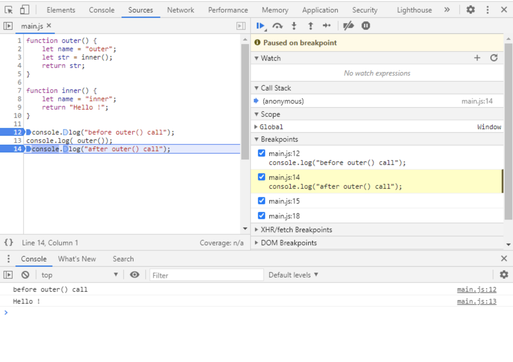
Chrome debugger 

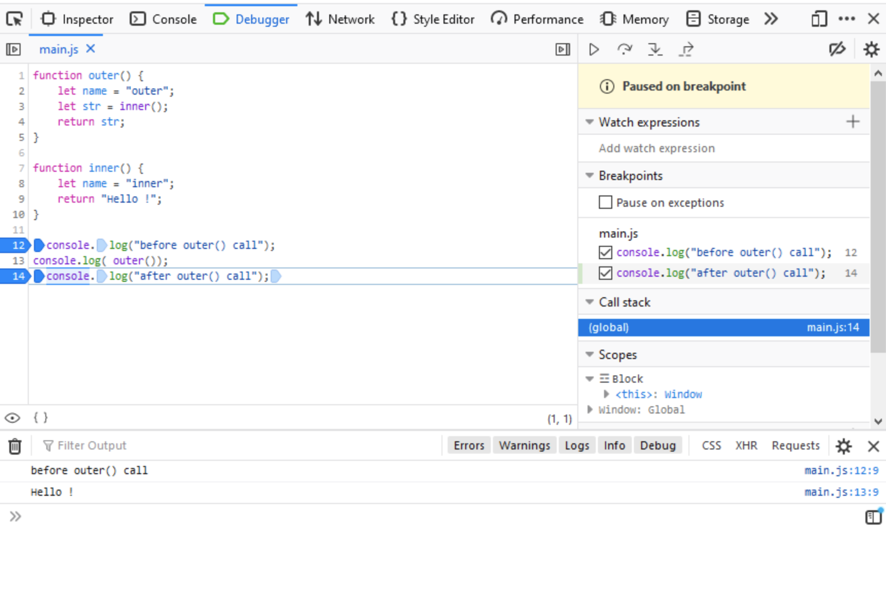
Firefox debugger 

Another click on **Resume** will cause the program to execute to the end.

### Step over

Apart from jumping between successive breakpoints with **Resume**, we have the possibility to perform a real step-by-step execution (i.e. to call the instructions of our program one at a time). There is a small problem here. If an instruction is a call to a function, should the debugger go inside the function and execute the instructions inside it step by step, or treat it as an indivisible whole and just execute it? Of course, there is no one correct answer, and everything will depend on the specific situation and what we want to achieve. That is why debuggers distinguish between two modes of step execution: **Step Into** (treating the function as a set of instructions, which we want to execute separately) and **Step Over** (treating the function call as something indivisible).

Remove the second breakpoint (from the last line of the code) and reload the page. Locate the **Step Over** button (to the right of Resume, the arrow arcing over the dot). Press it – the highlight in the code should move to the next line after the breakpoint. At the same time, the console will show the effect of the instruction you just performed.

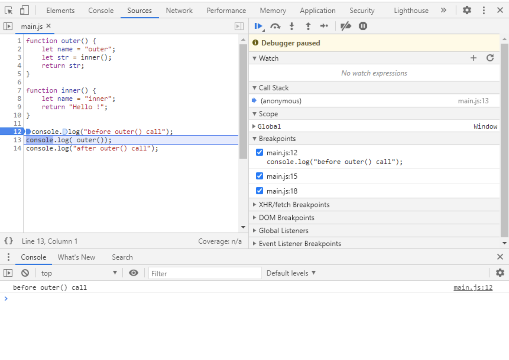
Chrome debugger 

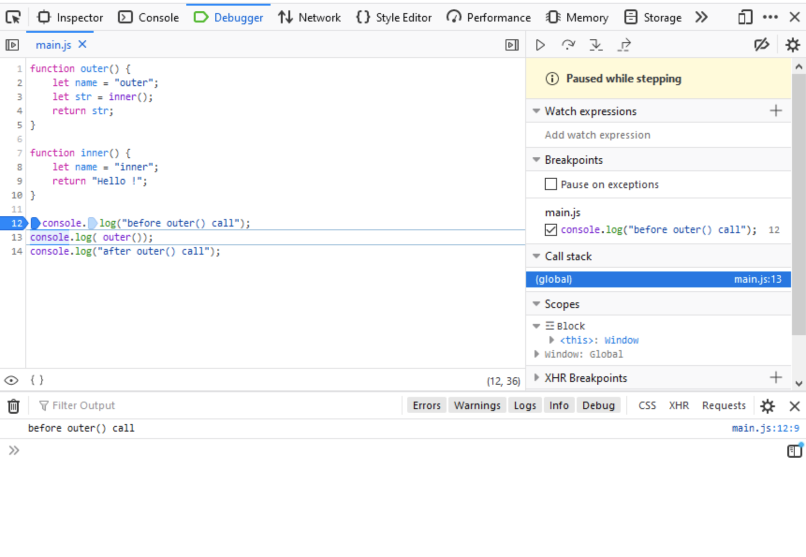
Firefox debugger 

Press **Step Over** twice more (alternatively, use the shortcut F10) observing the changes in the console and code highlighting.


### Step into

Let's see what the difference between **Step Over** and **Step Into** is in practice. Leave the breakpoint setting unchanged, and reload the page. First execute **Step Over** (press the button or the F10 shortcut). Then, when we stop at the `console.log(outer())` line, execute **Step Into**.

What happens? This time the debugger treats the `outer` function as a set of instructions, jumps inside it and sets itself at its first line. Using **Step Into**, go further into the `inner` function, and stop on the `return "Hello !"` line.

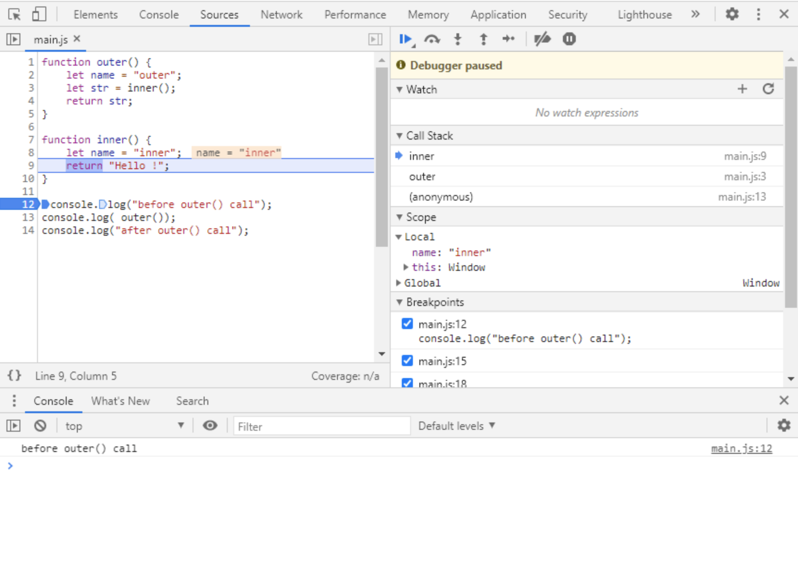
Chrome debugger 

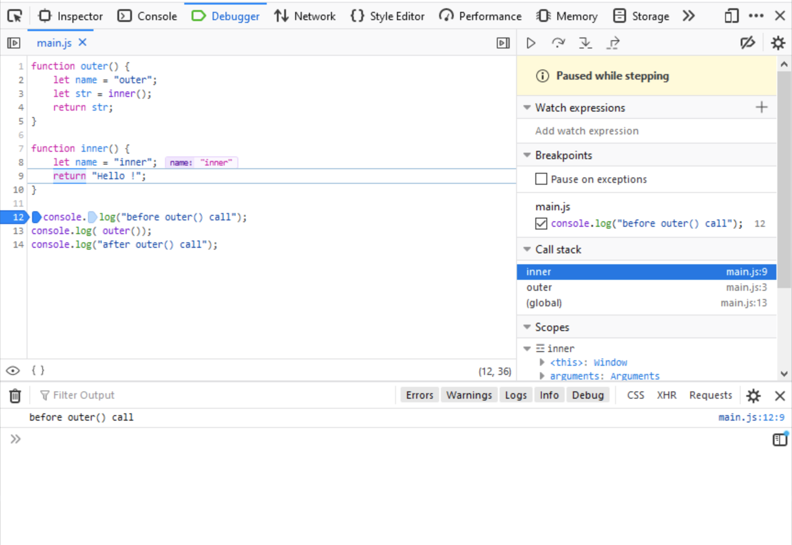
Firefox debugger


### Call stack

This is a good moment to take a look at another element of the debugger – the **Call Stack**. In a window with such a name, we can see what function we are currently in (in our case `inner`). What is more, we will see there all the functions that are currently active. The Call Stack is important in the case of nested functions, like in our example. Using Step Into, we call the outer function in the main program, step into it, and call the inner function. If we stop inside the inner function, then the active functions will be: inner and outer (creating a stack). At the very bottom of the stack, we will see the main function (it doesn't have a name, and in Firefox it is marked as (global), and in Chrome (anonymous)). This is the place from where the outer function is called.

We stop on line 9, inside the inner function, at the return "Hello !" command. So we are in the context of the inner function at this point. In the console at the bottom of the screen, type the command:

```
console.log(name); // -> inner
```

As a result of its execution, the name "inner" should be displayed (i.e. the contents of the local variable name of the inner function). If you click on the name of the outer function on the Call Stack, you will be taken to the context of that function (note that the selection of the current line has changed). Try calling the same command again in the console:

```
console.log(name); // -> outer
```

This time we should see "outer". We are in the context of the outer function, which has its own local variable named name. This variable contains the word "outer". Click again on the inner function name in the **Call Stack** to change the context back. Note that despite the context change, the program execution still stops in exactly the same place.

#### Viewing and modifying variables

During the step-by-step execution, we have free access to the variables of our program, which are visible in the context we are currently in. As we have just seen, using the console.log method we can write out the values of such variables. We can also modify them without any problem.

Let’s go back to the context of the inner function. Run the following sequence of commands in the console:

```
console.log(name); // -> inner
name = "new name";
console.log(name); // -> new name
```

As you can see, we have modified the value of the local variable name, which is located in the inner function. If we continue the program execution (Step or Resume), the program will use this new value.

Above the **Call Stack** window is another window called **Watch** (or Watch expressions). It allows us to view and modify the variables without using the console. In this window, we can find the + button, which after pressing, we can enter the name of the variable whose value changes we want to track. In order to change the current value of a variable, it is enough to double-click in the watch window on the observed variable, and enter the new value. Remember that during function calls or in code blocks, the scope of variable visibility may vary, so don't be surprised if the values of local variables are not visible in the global context.

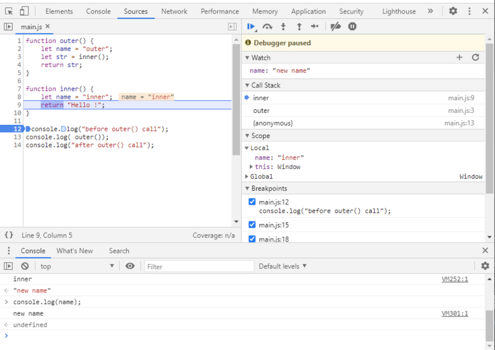
Chrome debugger 

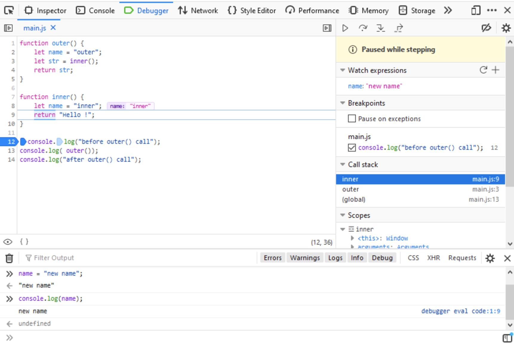
Firefox debugger 


### Step out

During debugging, it can be useful to use one more option. In the panel with the **Resume**, **Step Over**, or **Step Into** buttons, you will also find a **Step Out** button. It resumes program operation by executing successive commands until the current function is exited to the function from which it was called.

Remove all breakpoints and set a new one at line 8, inside the inner function. Reload the program, and execution should stop at the line we’ve marked. Pressing the **Step Out** button will execute the rest of the instructions in the inner function, and stop at the first line after it is called (inside the outer function). Simple, right?

The example we use doesn’t really require debugging. It’s just to demonstrate to you the basic functions of the debugger. You will need them if the program you are going to write behaves inconsistently with your expectations.

Sometimes it is not possible to locate the problem immediately and it is necessary to trace the operation of the program one fragment at a time, preferably using a step-by-step operation. Then we are able to check how the values of variables change in subsequent steps, which commands are executed, or whether or not conditions or loops have been constructed correctly.

The ability to use a debugger is essential for every programmer.

### Measuring code execution time

The basic requirement we place on programs is, of course, that they work correctly. Their functioning should be predictable and consistent with our assumptions, and the results they return should be correct. However, the program's efficiency is often also important. Sometimes the same effect can be achieved in several ways, so it is worth choosing the one that will work not only correctly but also quickly.

In the examples discussed so far in the course, speed has been of marginal importance. The programs were simple, they performed uncomplicated operations, and these operations were usually very few. In reality, however, the aspect of code execution speed is quite important. It is affected by many elements, such as the choice of an optimal algorithm for solving a given problem, the selection of appropriate functions, or the avoidance of redundant actions.

One of the easiest ways to measure the speed of the program is to use the `console.time` and `console.timeEnd` methods, which allow us to make a precise measurement of the time between two specified places in our code, and display the result on the console. There are of course many more advanced tools, which can help us during the optimization of our code, but it is worth knowing these simple methods, which in many cases are enough to analyze the performance of the program.

Suppose we want to calculate the approximate value of the number π. There are many methods that allow this, one of which is to use the Leibniz formula:


which can be expanded into the series:

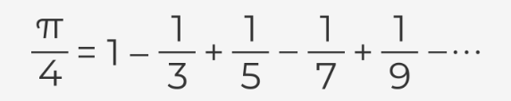

The value of π calculated in this way is approximate, but it is more accurate the longer the series is (i.e. the larger the value of k we use). Higher accuracy will of course involve a larger number of operations to be performed and therefore will affect the time of program execution. Let’s check what an example program written in JavaScript might look like, which would allow us to perform such calculations:

```
let part = 0;
for (let k = 0; k < 10000000; k++) {
    part = part + ((-1) ** k) / (2 * k + 1);
}
let pi = part * 4;
console.log(pi); // -> 3.1415925535897915
```

The variable part will contain a partial result, which will be modified in each iteration of the for loop. The loop will be executed ten million times (i.e. `k` will take values from 0 to 999999). The most time-consuming part will be the execution of the for loop, because in each iteration, operations such as summing, multiplying, dividing, and exponentiation are performed.

Let's check how much time it takes for the program to execute this piece of code. For this purpose, we will use the methods `console.time` and `console.timeEnd`.

```
let part = 0;
console.time('Leibniz');
for (let k = 0; k < 10000000; k++) {
    part = part + ((-1) ** k) / (2 * k + 1);
}
console.timeEnd('Leibniz'); // -> Leibniz: 456.60498046875 ms
let pi = part * 4;
console.log(pi); // -> 3.1415925535897915
```

With `console.time`, we indicate where to start the time measurement, while with `console.timeEnd` we end the measurement, and the result is displayed on the console at this point (the result you get will obviously differ from the one in the example). The time is given in milliseconds. In the calls of the `console.time` and `console.timeEnd` methods, we can specify a string (in the example it is `'Leibnitz'`) that will identify our stopwatch in case we use many of them in our program.

Let's look inside the `for` loop. In each iteration, the number -1 is raised to the power of k. Exponentiation is quite a time-consuming operation, so we can suspect that it strongly affects the speed of our program (especially as we do it ten million times). If the base of the exponentiation is the number -1, we will always get -1 or 1 as a result, depending on whether the exponent is odd or even. In this case, we can replace exponentiation with a conditional instruction that checks if k is even (divisible by 2) or odd and returns 1 or -1 respectively.

```
let part = 0;
console.time('Leibniz');
for(let k = 0; k < 10000000; k++) {
    part = part + (k % 2 ? -1 : 1) / (2 * k + 1);
}
console.timeEnd('Leibniz'); // -> Leibniz: 175.5458984375 ms
let pi = part * 4;
console.log(pi);
```

As you can see, even such a small change allows us to more than double the speed of the program! Using the `console.time` and `console.timeEnd` methods allows us to analyze our code for performance. If we have the impression that something works too slowly, but we do not know which piece of code is responsible for this, we can perform measurements, locate the problem and, optionally, try to optimize the code. As we said before, there are many tools that also help us in this. Some of them are built into the Developer Tools integrated with the browser, but often the methods shown are enough to perform basic tests.

Try to test both the solutions in your local environment, and see what differences in times you get.


### Summary

The ability to use the Developer Tools, including the **debugger**, is very important in the work of a programmer. It allows, among others, to effectively eliminate logical errors in our code, as well as to optimize it.

Without the use of **step-by-step** execution, we will often not be able to discover the reasons why our program does not work as expected. The possibility to stop the execution on a given instruction, checking the current state of the variables or tracing the sequence of calls to nested functions, may turn out to be crucial while testing and fixing our program.

