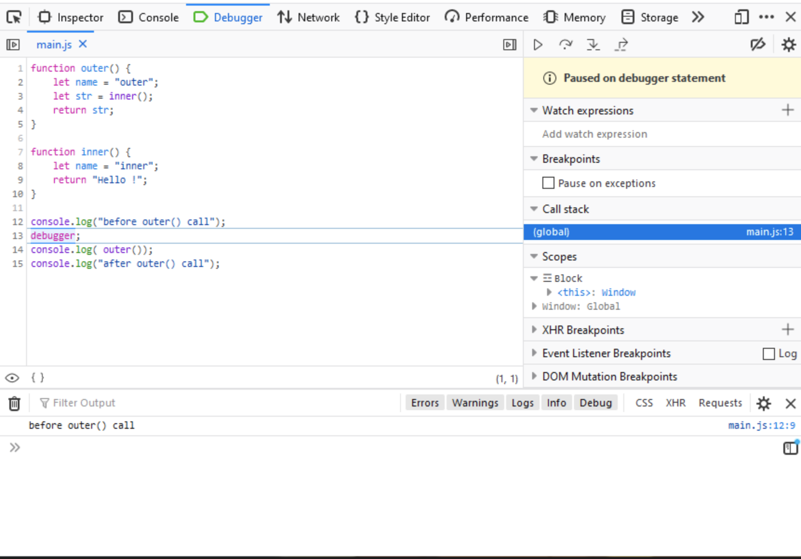
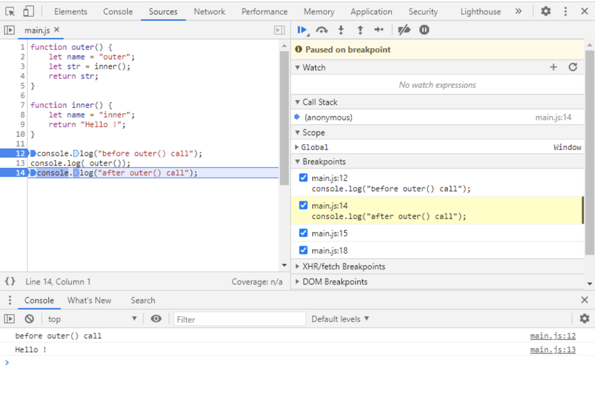
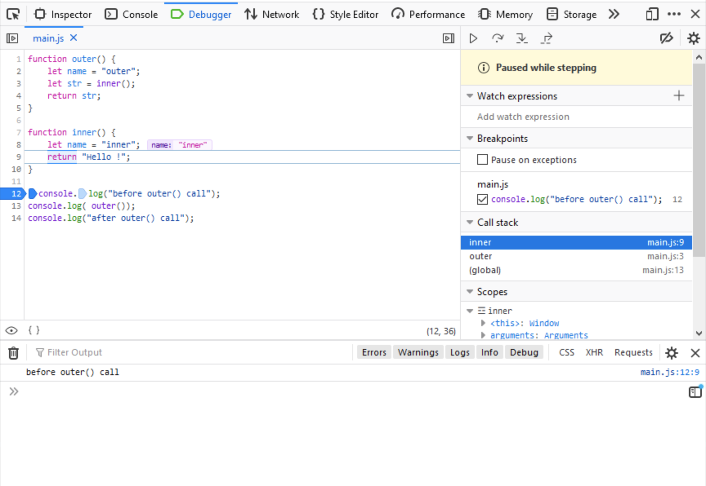
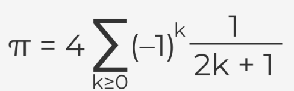
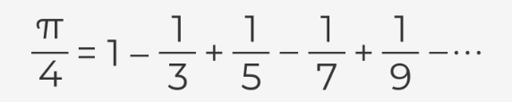

# Module 1 - Introduction to JavaScript and Computer Programming

After completing Module 1, the student will:

 * understand the fundamental programming concepts, such as: interpreting and the interpreter, compilation and the compiler, client-side vs. server-side programming;
 * have basic knowledge of how to set up and use the basic programming environment (online or local);
 * gain skills allowing them to run their first JavaScript program on the client side (both as an element embedded in the HTML page and directly in the browser console).

## Section 1 - About JavaScript


Topics in this section:

 * How to communicate with the computer?
 * What is JS?
 * JS – Advantages and Limitations
 * Where is JS used today?

### Introduction

So you want to learn how to program in JavaScript? That's great!

This course will be quite a long journey, but if you make it to the end, you will be able to read, understand, and of course, write JavaScript applications and programs. These new abilities may aid you in your current work, or allow you to reach new career opportunities in a steadily growing IT market. Let's start this adventure without any further ado, and let's find out what JavaScript is.

#### How to communicate with the computer

Let's start with something obvious – computers are everywhere. You are almost certainly reading this course on a computer; your phone is a computer; you will find computers in TVs and other home appliances, such as your automatic vacuum cleaner, which uses its computer and numerous sensors in its never-ending mission to eradicate dust from your life. We are surrounded by computers. Computers are used in science, medicine, banking, and business. We suspect that nowadays it would be difficult to find any area of life in which computers do not actively participate.

We use computers mainly because they are able to perform certain tasks incomparably faster and more accurately than people. However, computers cannot guess what kinds of tasks we have in mind or how to help us perform them. We have to tell them that. How? It's best to do so in a similar way as when passing information to other people, in other words, by using a language that is understandable to both sides. Using such a language, we write a program, a formalized solution to our problem, which can be executed by the computer.

Unfortunately, a language that is directly understandable by a computer will be absolutely illegible to a regular human being. It would be a sequence of bizarre instructions, written in numerical form, referring to computer components we didn’t even know existed (and frankly speaking we don't necessarily have to know). This way of communication, which dates from the beginning of computing, is nowadays used extremely rarely, and only in very specific situations.

So in order to help in communication with the computer, programming languages were invented that are somewhat similar to natural languages (that is, those used for communication between people). There are thousands of programming languages, and they differ in purpose (aside from general-purpose languages, there are many specialized ones, for example, languages designed only for statistical calculations), level of abstraction (in simple terms: the higher the language level, the less we need to know about the hardware on which the program is executed), ease of use, effectiveness of the programs written in them, etc.

### JavaScript as an interpreted language

JavaScript is a typical interpreted language. If we run a code written in JavaScript in a web browser, as it is happening, such as after loading the page we are currently reading (yes, yes, there are elements written in JavaScript on this page too), the interpreter will be the JavaScript engine built into the browser. This is not the only way to execute JavaScript code.

Perhaps you have heard of node.js. It is also an interpreter, but installed independently of browsers as an environment in the computer's operating system (it can be macOS, Windows, or Linux). Using node.js allows you to write programs in JavaScript that will, for example, turn your computer into a server.

At the beginning of this paragraph, we simplified things a bit. JavaScript is an interpreted language – there is no doubt about that. And in fact, running a program written in JavaScript looks as if we are executing our source code (that is, the code that we wrote) step by step. However, you may come across information about this language, and more specifically about particular interpreters, that is a bit different.

Most modern JavaScript engines use the Just In Time Compilation technique (JIT Compilation). This technique consists of compiling code fragments during the execution of the program (more than a single instruction) and allows you to increase its performance. However, from the user's point of view, such a change is virtually unnoticeable – it still looks as if only the interpreter is executing the source code, instruction by instruction.

Regardless of the language you choose, a few things remain the same while writing the program. First of all, an important, and probably the most difficult, stage of this process is to correctly define the problem we want to solve. Only then do we try to find the optimal solution, which we will finally present in the form of a program written in the chosen language.

So before you start explaining something to the computer, in other words, writing a program, you need to understand exactly what you want to achieve and how you want to achieve it. Secondly, the solution we propose and write in the form of a program must be 100% unambiguous – the computer cannot guess anything.

A simple example from a slightly different field: at some point in your life, you probably happened to buy a piece of furniture that required assembly. Assembling it is a problem that you, the buyer, have been burdened with. In order for you to cope with this task, you get a set of instructions to guide you through the whole process. You’re acting as an interpreter at this point, using a program that will allow you to complete the task. The success of your mission depends on the quality of these instructions, whether they are precise and unambiguous, and do not come from another piece of furniture. In the end, it may turn out that you have constructed not the furniture of your dreams, but a surrealistic construction from another dimension.

For the instructions to be good, someone who develops them must know exactly what they should illustrate, in what order certain actions should be carried out, at which stages something is easiest to confuse, and so on. And of course, they must know what effect is to be achieved at the end.

### A few more words on JavaScript

As we mentioned before, JavaScript is an interpreted programming language. Like most interpreted languages, it is also a high-level language (i.e. relatively easy to understand for people and separating us from the hardware details).

Back in the early 90s, all web pages were static. Things changed in 1995 when the Netscape corporation hired Brendan Eich, and tasked him to develop a new language for their product, the Netscape Navigator web browser. The new language was called LiveScript, but soon after its name was changed to JavaScript. Its main task was to add dynamics to websites, which would allow, for example, for more complex interaction with the user. And so the career of JavaScript began.

#### Client-side vs server-side programming

The use of JavaScript on websites, which over time has become more and more complex and often contain very sophisticated logic, is called client-side programming. The code to be executed is loaded together with the page in the browser, on the user's side, and the interpreter which is a part of the web browser allows for its execution.

Today, JavaScript is the sole language supported by all major web browsers, and about 95% of web pages worldwide embed JavaScript code within them. From the beginning, web pages used JavaScript on the **client-side** to add interactivity and dynamically change the content.

Now it’s much more than that, as JavaScript offers many great frameworks on which to build huge, complex web applications and social networks (you've probably heard the names of frameworks like **React** or **Angular**).

All this can work on a variety of equipment, from high-performance workstations to simple smartphones. Thanks to the power of JavaScript, we can order food, play browser-based games, watch movies on streaming platforms, and be in constant contact with the people important to us. JavaScript is so popular that continually more and more effort goes into using it, not only as a client-side solution.

Over time, JavaScript began to appear in other areas, such as programming the server-side parts of complex web applications, also called back-end. These programs are executed on servers, processing data (e.g. from databases), which after processing will be available on the client side. The flexibility of this language and its relative simplicity have made it much more applicable, for example, in mobile apps, or even in programming UAVs (some drones run programs written in this language).

### Is this the perfect programming language? - disadvantages
We say that JavaScript is a mature language, which means that most of the features are already implemented and stable, and we will probably not see any big changes in the language. Since 2015, many aspects of JavaScript have changed, and many new features have been added. A lot of these changes were introduced to make the migration to JavaScript easier for programmers who know other popular languages, from which JavaScript originally differed quite strongly in certain aspects, such as when handling objects. We can still use the language in the old way, but it is recommended rather to use the modern JavaScript.

But... there are no ideal solutions, so there are no good programming languages for all applications. Each of them has its own limitations, and it’s no different with JavaScript. Despite its popularity and success, JavaScript is not a perfect programming language. Due to its nature, it is not suitable for certain applications. For example, there is no point in using it to write programs that require advanced mathematical calculations or very high performance.

Some limitations are due to the very concept of the language, but the vast majority are related to the platform on which we use it. This is especially visible when writing code to be executed in a browser, which as we said earlier is called client-side. In such a situation, JavaScript is limited in functionality by the fact that browsers, for security reasons, run script code in a sandbox environment (an environment separated from the outer world), which doesn’t allow for access to local files and resources (i.e. those files that are on the computer where the browser is launched).

Another inconvenience is that since the code is not compiled, it goes into the browser in the same, or a very similar, form to what we wrote ourselves. Why is this a disadvantage? This is because everyone can see our solution in an easy-to-read form and use it (either fragments of it or even the whole of it) without our permission to write their own program.

Some help here may be code obfuscation, which consists of transforming our ready script into a slightly less readable form (e.g. by generating short random names of variables and functions, eliminating end-of-line signs, and so on), but the simple fact is that if somebody wants to steal our JavaScript code, there is very little we can do to stop them.

### Is this the perfect programming language? - advantages

On the other hand, JavaScript has many advantages over other programming languages, and one of the biggest is a very active and supportive community. It is easy to find solutions to common problems, and to find help in general. This also means that tools that work with JavaScript are actively developed.

Another big plus is a huge number of ready-to-use frameworks and libraries that provide most of the commonly required functionalities and features. The language itself is relatively easy to learn, and allows us to focus on the job instead of fighting with the syntax (that is, the way of building the instructions which make up the code of our program).

Additionally, JavaScript doesn’t require you to buy expensive tools to work with it, and really good tools are already embedded inside your web browser. Last but not least, big players like Google, Facebook, and Mozilla actively support JavaScript tools and their development.

However, what is an advantage for some may turn out to be a disadvantage for others. An example may be the dynamic typing characteristic of JavaScript. In short, it consists of the fact that we can store data of any type in a variable (a variable is a container in which we store the data we will use).

For example, during the program's execution, we can store the number 10 in a variable, and in the next step use the same variable to store the "abc" string (deleting the previous value automatically, of course – don’t worry if you don’t understand right now, because we’ll be covering all these terms later on).

Usually this is very convenient, but a number of people have found this feature of the language to be a disadvantage. In their opinion, it makes it easier for a programmer to make mistakes in certain situations. By adding static typing, where a variable can only contain one type of variable (e.g. numbers) during program execution, a new language called **TypeScript** was introduced.

Remember also that if you learn to program in one language, it will usually be much easier for you to learn the next one, which for some reason may be better to solve a particular problem.

But let’s start now with JavaScript, which, due to its flexible and simple syntax, is perfect to learn as a first language.

### Let's get ready to work

As we mentioned earlier, JavaScript can be used in various environments, although most often it will be a web browser or a server with a node.js environment. Each environment imposes a slightly different way of using this language, and some mechanisms or functions characteristic to it appear. However, the essential part of the language, its core, remains the same. In this part of the course, we will learn how to program using this invariable, core part of JavaScript: how to declare variables, write functions, conditional instructions or loops – all of this will be equally usable in any environment in which we decide to use this language.

Programming in any language is not an easy thing to learn, and you may feel overwhelmed by so much new information. If you’re persistent and focused, you’ll be writing simple scripts in no time, and there is no other way to learn to program than to write lots and lots of code.

Most importantly, don't give up even when you’re stuck: take a break, go for a walk, return to it with a fresh mind, and try again. In the end, slow and steady wins the race.

Now, let's begin!


## Section 2 - Setting up programming environment

Topics in this section:

 * Development tools
 * Online development environment
 * Local development environment (code editor, interpreter, debugger)

### Development tools

Like any other task, programming requires the proper tools and workspace. Software development, in most cases, requires a **code editor** and a **compiler** or **interpreter** of a given language. This is a minimum set, which we can extend as needed with various other tools.

At this stage of the course, apart from the JavaScript code editor and interpreter, we can also use the **debugger**, which is a tool that allows us, among other things, to pause the program in the indicated place and analyze its current state (e.g. the values of the indicated variables).

The tools in question will of course have to be run on the computer. At this stage, its performance is not particularly important, and any unit that can handle normal office tasks will suffice, so it's highly recommended to work from a desktop or laptop computer.

There is no denying that the size of the monitor will affect the comfort of your work. The bigger the monitor, the easier it will be to place the code editor, interpreter, and other content (e.g this course) next to each other. In normal working circumstances, programmers very often use several monitors.

The operating system doesn’t matter, as the appropriate tool can be found for Windows, macOS, and Linux.

At this moment, there are two choices. You can install all the necessary tools on your machine and work in the local environment. This is the preferred approach, as this is how it looks in real commercial projects most of the time. You can also customize everything to suit your needs.

Another approach is to use online tools. These can be convenient, as you don't need to install or configure anything – they just work. Most of them allow you to store your work in a cloud so you can access it from different devices, but on the other hand, they lack customization options, and you need to have a constant internet connection.

All the code that you’ll see in this course was tested in both local and online environments, so both options are valid. Finally, we can move on to the choice of tools.

#### Online development environment

**Online environments**, commonly known as code playgrounds, are sites that act as a simple editor and runtime environment. All of them have similar sets of features. They have different user interfaces, but in principle, they behave in a similar way. They allow you to write code, run it for testing purposes and most often share it with other users.

In the case of JavaScript, where preparing a fully working local environment actually boils down to installing a code editor and running the browser, they are not as important as regular development environments. They are mainly used as training and testing platforms, or places to publish sample solutions to programming problems.

Among JavaScript programmers, the most popular are the following:

 * JSFiddle
 * CodePen
 * JsBin
 * Plunker


During the course, we will use an online environment integrated with the training platform. OpenEDG provides a simple environment for writing and running code in several programming languages, including JavaScript. Thanks to that, you will be able to practice everything we talk about right away.

Don't forget, however, that this platform is a purely didactic and testing solution, and it certainly cannot be used as a fully-fledged development environment. However, it is ideal for our needs, because in most cases we will be able to forget about the web surroundings of programs written in JavaScript, including HTML elements. This will allow us to focus solely on learning the JavaScript language itself.

However, it is highly recommended that you also set up your own **local development environment**. It's not difficult, as you'll find out right away, and it will allow you to do some exercises in a way that is much closer to how you would do it during normal software development. If, in the further part of the course, any of the exercises will have to be done in such an environment, we will indicate this clearly.

#### Local development environment

As we wrote earlier, the JavaScript requirements for the development environment are very modest. In most cases, especially at the beginning of development, just three elements are sufficient: a code editor, an interpreter (i.e. a bootable environment) and a debugger.

Depending on the level of sophistication, the complexity of the written project, or the environment for which we write our programs (client-side, server-side, mobile), other tools may also be needed.

These will be, among others:

 * **package managers** – enabling the management of libraries (containing ready-made solutions that we can use in our programs) or components of the development environment (e.g. npm or yarn)

 * **task runners and module bundlers** – used, in simple terms, to automate the process of software development and merge the resulting code from many files and libraries (e.g. Grunt or Webpack)

 * **testing framework** – allows for automatic testing of the correctness of our program in search of potential errors (e.g. Mocha, Jasmine, or Jest)

 * **security analyzers** – as you can guess, used to control the security of our solution (e.g. Snyk, RetireJS, or OWASP Dependency Check)


The openness of web development environments is both a blessing and a curse. We have a choice of hundreds of components, from which we can create the most comfortable environment for ourselves.

However, their quantity, plus the dynamic changes of particular tools or even just the trends among programmers make it difficult to keep up with everything that’s happening within these environments.

But for us, this is a problem for the distant future.

For now, we need the minimal trio: a **code editor**, **interpreter**, and **debugger**.

#### Code editor

The code of almost all programming languages is composed of some form of text. So, to write the code, we need a text editor. But it needs to be an application that writes plain text (it can’t be a rich text editor, like MS Word). In other words, just a plain notepad that can write .txt files is enough to write code, although it’s much easier if you use a dedicated code editor. The market is full of professional code editors, both free and paid. Some of them are universal, while others are exclusive to specific languages. The main advantage of using a dedicated code editor is syntax highlighting, text autocomplete, and error checking. This improves work efficiency and code understanding, and lowers the number of errors and typos. There are many good code editors, but it can be really hard to select one that works for you.

Here are some popular ones:

 * [Visual Studio Code](https://code.visualstudio.com)[Windows, macOS, Linux]

    Powerful code editor free for both personal and commercial use. It has quickly become one of the favorites when it comes to web development. It has built-in features like a JavaScript debugger, and tools to streamline web projects. It’s also highly customizable via the extension system (there are many additions dedicated especially to the JavaScript language).


 * [WebStorm](https://www.jetbrains.com/webstorm/)[Windows, macOS, Linux]

    A popular commercial development environment, in which the code editor is just one of the smaller elements in a huge set of tools that improve code development (e.g. supporting testing). Intended for large projects, it may prove to be too heavy and complex for small programs. Although it is intended for commercial use, it is possible to obtain a free educational license.


 * [Sublime Text](https://www.sublimetext.com)[Windows, macOS, Linux]

    Fast and easy-to-use code editor with many advanced features, like multiple-line editing, fast search, and others. A trial version is available, but for long-term usage, a license needs to be purchased for both private and commercial use.


 * [Notepad++](https://notepad-plus-plus.org)[Windows]

    Free and lightweight code and text editor. The program is small and fast, supports dozens of programming languages, and can be extended with plugins. It may be old and ugly, but it’s still sharp.

Lots of other code editors exist, both free and paid, and you can use whichever one you prefer. Many developers use, among other things, console editors, including the legendary vim. Console editors are not run in a graphical environment, but in a text console. However, you can only reach for such solutions if the tasks you're going to do turn out to be too simple and you want to make your life a little bit more difficult.

#### Interpreter

We have already talked a bit about the **interpreter** and its role. It functions as a runtime environment for our program. It checks whether we have made any formal errors, for example, making a typo in the name of a function or forgetting to close a parenthesis, and then it executes the program instruction by instruction.

The choice of JavaScript interpreter will depend on which platform we write our software for. For example, if we want to write a simple server-side application, we will almost certainly choose the **node.js** environment, which we will have to install directly on our operating system. In the case of client-side software, our interpreter will simply be the web browser you already have installed (because how else would you read this course?).

Our course is about core JavaScript, that is, those language elements that will be equally useful in client-side, server-side, and mobile solutions. So we can practice them in any environment, using any interpreter. The easiest way to do this is to limit yourself to a web browser.

As we said before, practically all browsers have built-in JavaScript engines (or interpreters), but we strongly recommend using **Chrome** from Google, or **FireFox** from Mozilla. Both are known for their efficiency and integrated advanced tools for web developers (that’s you). They are available for Windows, macOS, and Linux.

Remember to regularly update your chosen browser and use the latest version. This is especially important when working with JavaScript. The language is constantly changing, with new features and mechanisms being added. You may find that your favorite but somewhat dated browser doesn't support certain features of the language. Your browser is now a tool, so try to keep it in good shape by updating it regularly.

#### Debugger

Computer programs are complicated beasts, thousands or even millions of lines of code (but calm down, we'll start with just a few). With such complexity and size, it’s impossible to produce code without any errors. Some types of errors, especially logical ones (formally, the program is written correctly, but probably we invented the wrong solution to the problem), can only be found while the program is running, and often only in special circumstances. It’s really hard to find out what exactly is happening inside a program that runs blazing fast, and for those problems, debuggers exist.

A **debugger** is a tool that allows you to slow down or even halt the execution of a program, run instructions step by step, and look at and analyze the state of the program at any given moment.

Fortunately, the moment we decided to use the web browser as our boot environment and JavaScript interpreter, we also got ourselves a debugger. All modern browsers are equipped with the developer tools. During normal operation, they are invisible, and we have to enable them in the browser options (more about this in the next chapter).

Depending on the browser, we will find various tools there, but there will certainly be:

 * **the inspector** – which will allow us, for example, to analyze the individual HTML elements of an open website;

 * **the JavaScript console** – which firstly shows all the information about the errors, and secondly allows us to run single JavaScript commands in the context of the current page;

 * **the debugger** – which, among other things, shows the current values of variables, and allows you to pause code execution in the indicated place and to perform step-by-step work (i.e. execute single instructions of the program).

How do you enable the developer tools? Unfortunately, there is no single answer; it depends on the browser you’re using (sometimes also on its version) and the operating system. Browser interfaces change quite often, so it is better to learn the right shortcuts instead of looking for the right option in the menu. Try the following key combinations:

 * Windows and Linux operating systems, all common browsers except Internet Explorer and Edge: 
ctrl + shift + I

 * Windows operating system, Internet Explorer and Edge: 
F12

 * macOS operating system, all common browsers: 
Command key + Option key + I

In the next chapter, we will return to this topic and learn a few more things about these useful tools.

In the next chapter we will write our first piece of JavaScript code. We will test it first of all in the runtime environment integrated with our training platform. We will also use it to check how our local development environment works. So, please make sure that your selected tools are installed and that you can start them up. If you still don't know what to choose, we suggest using the local environment with Visual Studio Code (our code editor) and the Chrome (web browser with JavaScript interpreter and debugger).


## Section 3 - Hello, World!

Topics in this section:

 * A few words about HTML
 * How can you run your JavaScript code?
 * Executing the code directly in the console

### The "Hello, World!" Program

Why "Hello, World!"? For almost 50 years, this sentence, and its derivatives, has marked someone as learning a new programming language, although it’s more a tradition than anything else. The phrase was used a long time ago in a very important book about the C language, but the text itself doesn’t matter.

The idea is to write out something on the screen using a specific language. First, it allows us to see the basic syntax of the language and compare it to other programming languages. Second, it’s a very simple program, and anyone can easily write it or copy it from the internet and check if their tools and environment are set up correctly. Third, it’s a program that outputs something, so it provides feedback on whether it was executed correctly or not.

In the case of client-side JavaScript, displaying something on the screen can be understood in two ways.

First, client-side JavaScript is always executed in the context of a website and allows you to manipulate elements of that website. So we can, for example, use the appropriate function to insert some text, change a title, create a table, etc. on the page. This way, we control the visual part of the website.

Second, we can use the **console** as a screen to write some information. The console, as we mentioned in the previous chapter, is part of the developer tools. So it is not visible by default, and it must be properly enabled (we also wrote about this in the previous chapter). For our needs, it will be much more convenient to use the console, as we will avoid the need for a thorough analysis of the structure of the website.

But what actually is a console? First of all, it is a place where various messages are displayed, normally invisible to the browser user. These messages can, for example, be generated by the JavaScript interpreter after encountering an error or if we print it, by calling the appropriate function. Secondly, we can run individual JavaScript commands in the console, which will be executed in the context of the currently loaded web page (a little more about that in a moment).


The basic function allowing us to write information to the console is console.log. So, to refer to the eternal "Hello, World!", we should call it as follows:

```
console.log("Hello, World!");
```

We can treat the `console.log` as a function*. In fact, the function is only a log, and console is the object to which the function belongs.

*This type of function, belonging to an object, is generally called a method. But once again, for the time being, to simplify certain things, let’s assume that this is an ordinary function – it will not bother us at all (we’ll learn about objects much later).

The function is a piece of code that allows you to perform a specific task (in our case, to display something on the console). Functions often take arguments, in other words, data that they will use during operation. In JavaScript, we run a function by calling it, and we call it by writing its name followed by a pair of parentheses, where the arguments are provided (if the function does not need arguments, the parentheses are left empty). In our example, the argument is the text we want to display. Note that in order to indicate that "Hello, World!" is the text, we put it in quotation marks.

To let the interpreter know where the command ends, we put a semicolon at the end of the function call. In this case, the interpreter would manage without such help, but it is a good habit to end each command with a semicolon, so that you do not forget it when it is really needed.

We already know what to write, and the only question is, where to do it?

#### Online development environment


Luckily, our platform uses a ready-made online environment, as we mentioned in the previous chapter. The OpenEDG environment allows you to edit and run programs written in JavaScript. Please note that the part of the screen dedicated to this environment is divided into three parts. The upper part is the editor, where we can choose whether to edit a JavaScript, HTML, or CSS file (we will say a few words about HTML and CSS in a moment). All these files together form the code to be executed in our training environment. We will mainly be interested in the JavaScript file tab – app.js. In the lower part of the screen on the left, there is a window simulating the console, on which messages from the interpreter will appear as well as the information we write out. The window on the right side is designed to display the page in the context of which our JavaScript code is executed. This window will be the least useful in this part of the course.

In the editor, you should see the piece of code that was just discussed, containing the console.log function. Try to run it. You need to press the highlighted button with the play icon, located directly above the editor. As a result, the lower window simulating the console should show:

```
Hello, World!
```

Go to the editor again and change the word "World" to your name. Start the program again and check what appears in the console window. Congratulations, you just modified a program written in JavaScript.

We could discuss your first JavaScript program based on this example. You've learned its syntax, run it online, checked its effect, and even modified it yourself. You can test all the examples that we discuss in this course in this way. However, in the chapter before, we urged you to configure your local development environment. So it would be good to show you how this example can be run in such an environment. And this will require a slightly longer introduction.

### Local development environment

Client-side JavaScript is a language of the web and exists only in the web ecosystem. In this setup, JavaScript cannot exist by itself. JavaScript code needs to be embedded in an HTML document. When we used the online environment to run our program, certain aspects were hidden from us. This time we will have to look at them more closely.

### A few words about HTML

**HyperText Markup Language**, or **HTML** for short, is a set of tags used to describe the structure of a website. It allows us to give a page the format of a document containing sections, headers, paragraphs, lists, and the like. HTML is definitely beyond the scope of the current course, so we will present only some basic information about it, just enough for you to understand where and how we can run the JavaScript code associated with a given page.

Tag types are predefined. For example, the tag that specifies a paragraph is `<p>` and the tag for the first degree (largest) header is `<h1>`. The tag name must be placed in angle brackets. Tags are usually used in pairs, limiting a certain area of the document (we have an opening and a closing tag). The closing tag is different from the opening tag, because a slash appears before the name. For example, a paragraph may look like this:

```
<p>quite an ordinary paragraph</p>
```

Often, tags can (and sometimes must) be placed within the range of other tags. For example, our paragraph should be placed inside the `<body>` tags, which separate the main part of our document.

```
<body>
<p>quite an ordinary paragraph</p>
</body>
```


#### Minimal HTML document

Let's try to create a minimal HTML that defines an empty page.

```
<!DOCTYPE html>
<html>
  <head>
    <title>Empty Page</title>
  </head>
  <body>
  </body>
</html>
```

Let's start with the declaration <!DOCTYPE html>. This is not a typical tag, as it is used to inform the browser that the whole document has been prepared according to HTML5. The actual document description starts with the <html> tag, which together with the </html>tag sets the boundaries of the document. Every other tag should be inside these. If any given tag holds other content, there will be a corresponding closing tag, forming some sort of container.

The next tag, <head>, contains additional information about the document, which must also be placed in tags. The most basic one is the <title> tag, which sets the title of the page mostly visible in the browser title bar. After <head> there is the <body> element, and the visible content of the web page should be placed there (e.g. our paragraph).

#### `<script>` tag

The JavaScript code to be executed by the browser on the page must be attached to the HTML using the `<script>` tag, and there are two ways it can be done. The code can be embedded directly inside of the `<script>` and `</script>` tags, but this is only recommended when the code is short. Another approach is to use the `"src"` attribute to point to a separate file that contains the JavaScript code. This is especially true when the same code is going to be used on several pages, because repeating exactly the same code many times is bad practice, as any changes need to be applied to all the files; and additionally, it artificially increases the page size. The JavaScript file extension is .js.

HTML is read by the browser line by line, and script tags are executed right at the moment when the browser parses the `<script>` tag (parsing for programming languages means a formal analysis of the code by a machine in order to understand its structure). Usually `<script>` tags are inserted in the page header between the `<head>` and `</head>` tags, and we can insert many of them in a file, for example, in order to include JavaScript code from different files. This behavior can be changed for external scripts pointed to by the `"src"` attribute by using the `"defer"` or "async" attributes.

 * `defer` – means that the script should be executed after the whole page is loaded;
 * `async` – means that the script will be executed immediately, but in parallel to parsing the rest of the page.

#### ... and a little something about CCS

**CSS**, or **Cascading Style Sheets**, is a language used together with HTML to describe the appearance of a page and its elements. In a nutshell, HTML describes the structure of a document, while CSS describes its presentation.

For example, in HTML, we can describe a page that has a header, two paragraphs, and a data table.

In CSS, we can define what font will be used on the whole page, what color the background will have, or whether the mouse cursor, when moved over the table, should change shape.

So we can treat CSS as some kind of configuration of the visual layer of the page. Thus, the website will most often be built on the basis of an HTML file (that is, a description of the structure), JavaScript code (allowing us to add, for example, some interaction mechanisms) and a CSS file (describing the presentation layer of the page). However, what is important is that there will be no page without an HTML file, but we can easily create a page without using CSS files. The CSS description itself is outside the scope of the current course, and we mention it only for the sake of order.


### How can we run our JavaScript code?

Let's start with a simple example, where the browser gets a simple (maybe even an empty) page from https://test.org. The address is made up for this example, so don't really try to enter it. Look at the figure below.


Let's start from the right side of the figure. The user runs a web browser on their computer (e.g. Chrome). Using the appropriate hotkey shortcut, they turn on the **developer tools** (see the previous chapter) to be able to use the console. Remember that these tools are not needed for normal browser use, and are therefore hidden by default. Then the user types https://test.org (the URL of our fake site) in the address bar.

On the remote server (left side of the drawing), associated with the address https://test.org, a web server is launched, which, after receiving a request from our user, will prepare an answer for them. In the simplest case, the answer will only contain an html file, which can be stored on the same server. The html file (in this example, index.html) is sent back to the user and processed by the browser. If some content (e.g. a paragraph with text) is defined in it, it will be displayed in the browser window.

However, we are more interested in the fact that the index.html file contains the `<script>` and `</script>` tags, with a piece of JavaScript code between them. Do you recognize it? This is obviously an attempt to show our "Hello, World!" on the console. When loading the page, the code placed inside the `<script>` tags should be executed and, if the developer tools are enabled and the console panel is visible, the console will show `"Hello, World!"`.

As we said before, the `<script>` tag can be used in a different way, not only to constrain the place where we write JavaScript code directly. If we use the "src" attribute in this tag, we can indicate a separate JavaScript file that will be attached here.

The picture below shows an example of such a scenario. In the index.html file there is the `<script>` tag again. This time there is no JavaScript code placed after it, but by using the "src" attribute, it is indicated that the code from the main.js file should be attached here.


Everything will work exactly the same as in the previous scenario, except that the web server will provide the main.js file in addition to index.html. The user will not notice any difference. Of course, placing our code on a remote server just to test it would be a bit cumbersome.


We have another possibility, which is that we can load a local html file (i.e. one that is on our computer) into the browser. If this code contains a `<script>` tag indicating some JavaScript file, then this file will also be loaded from the local resources.

The picture shows a simple scenario in which the user loads a local index.html file into the browser, in which there is a reference to main.js (so this file will automatically be loaded, too).


You can load a local html file either by typing its local path after file:/// in the address bar, or by simply opening it in your browser using the Open command from the menu. Since the menu in browsers is very often hidden, a simpler way may be to use a shortcut to open existing documents in applications. The shortcut is universal, not only for browsers and you have probably already seen it:

Ctrl + O

or in the case of macOS:

Command + O

#### Okay, maybe we could finally run something...

To run this locally, you’ll need to open the code editor of your choice. Create a new file with the extension .html (the name of the file doesn't matter, but it’s good practice to avoid spaces in the file name). Put the following code in this file and save it.

```
<!DOCTYPE html>
<html>
  <head>
    <title>Empty Page</title>
    <script src="main.js"></script>
  </head>
  <body>
  </body>
</html>
```

Then, in the same editor, create another file, this time called main.js (this is the name we used in our html file). It should contain one line you've seen before:

```
console.log("Hello, World!");
```

Save the changes and go to the browser. Open a new tab, enable the developer tools (they open for a particular tab), and select the console tool. Give yourself a moment to get used to the layout of the developer tools (each tool, including the console, should be placed in a separate panel, which can be selected).

Just in case, make sure that the focus is set to the browser window (i.e. the new tab) by clicking on it. Then, using the appropriate keyboard shortcut open the html file you have just created. If everything has been done correctly, you should see our "Hello, World!" sign in the console. Make sure that it works and that you can see a message displayed in the debug console. If necessary, do it again, carefully following the steps.

And now a small challenge. Try to modify the html file yourself so that it does not refer to the main.js file. Instead, the same JavaScript code that we wrote in main.js should be placed directly after the `<script>` tag. If you have problems, go back to the first drawing in this section.

To run this code in the online environment, place it inside the HTML tabs, and if necessary, press the run button.

#### Executing the code directly in the console

We have another, quite convenient option when it comes to running short pieces of JavaScript code in the browser (and our program, consisting of one instruction, is definitely short). As we said before, the console is not only used to display information, but also allows you to run individual JavaScript instructions. These instructions must be executed in the context of some HTML page. However, you don't necessarily have to write your minimal page, as we did a moment ago. Try to open a new tab and type `about:blank` in the address bar. This is a pseudo address that tells your browser to generate and load a minimal blank HTML page.

Then run the developer tools. At the beginning, we can check what the HTML generated by the browser looks like. To do so, select the first tool from the panel (in Chrome, it will be Elements, in Firefox Inspector). You should see absolutely minimal html code:

```
<html>
  <head></head>
  <body></body>
</html>
```

Now choose the console from the developer tools. You should see a prompt, usually a sign `>` or `>>` followed by a flashing cursor (if there is no cursor, click on the prompt). Then you can enter the instruction that will show "Hello, World!" on the console (using the console.log function). The scenario is shown in the figure below.


In fact, regardless of the browser, we should get the same effect – the console will display the text we specified. In the case of Chrome (running on the Windows operating system), the console should look something like this after completing this task:


In the case of Firefox (also Windows) this way:


For both browsers, the debugger windows containing the console may vary minimally depending on the version of the software and the operating system running it. The developer tools can be moved. They can be located at the bottom of the browser, as in the examples shown, but they can also be placed on the left or right side of the window (or as a separate window entirely). So don't be surprised if your browser's layout is slightly different from the pictures.

## Summary

Our first program was launched in an online environment at the beginning. This environment allows us to hide certain details that are not important to us at this stage of the course. All exercises and examples that we will discuss should be done in this environment.

However, from time to time, it would be good for you to try to do the chosen example in the local environment as well. It is much closer to what is actually used in the work of a web developer. Running JavaScript code in the local environment may seem a bit cumbersome at first, but fortunately this is just a first impression. Remember, to test simple instructions, you only need to use the console with an empty page (e.g. about:blank). If you want to test a slightly larger piece of code, it is best to create a minimal html file that will refer to the file containing our JavaScript code using the `<script>` tag.

# Module 2 - Variables, Data Types, Type Casting, and Comments

After completing Module 2, the student will:

 * have the knowledge and skills to work with variables (i.e. naming, declaring, initializing and modifying their values);
 * understand concepts such as scope, code blocks, shadowing, and hoisting;
 * know the basic properties of primitive data types such as boolean, number, bigint, undefined, null, and be able to use them;
 * be familiar with the basic properties of the primitive data type string, including string literals – single or double quotes, the escape character, string interpolation, basic properties and methods;
 * know the basic properties of complex data types such as Array and Object (treated as a record) and be able to use them in practice.

## Section 1 - Variables

Topics in this section:

 * Naming, declaring and initializing variables
 * Declarations and strict mode
 * Changing variable values
 * Constants
 * Scope (blocks, shadowing, hoisting)

### Variables

The ability to write various information on the screen, such as "Hello, World!" can be fun for a while, but it is not a universal way of writing programs. It's time to start learning more about the puzzle elements that will ultimately allow you to create programs that solve real problems.

There are quite a few of these elements, and we’ll introduce them gradually, although not necessarily in a simple chronology. We will often come back to what has already been discussed, extending the previous information with something new. Sometimes we will also go forward, using mechanisms that will only be explained in more detail over time. At first it may seem a bit overwhelming, but with time everything should start to merge into one coherent picture.

The first element of programming that we will talk about is the **variable**. You may know the name of a variable from mathematics, where it means a symbol used as a placeholder for different values that can change. They have a similar role in programming.

What do we actually need them for? As you can guess, most programs are quite complex, and we are rarely able to solve the problem with a single operation. Usually, the program will consist of many more operations, each of which can produce some intermediate results, which will be needed in the next steps. Variables allow us to store such results, to modify them, or to feed them into subsequent operations.

#### Naming the variables

Imagine variables as containers in which you can store certain information (such information will be called variable values). Each container must have its own name, by which we will be able to clearly indicate it.

Usually, we have quite a lot of freedom when it comes to inventing these names, but remember that they should refer to what we will store in the variable (e.g. height, color, stepCounter, and so on). Of course, JavaScript will not verify the correlation between the name and the contents of the variable – it is simply one of the many good practices that make it easier for us and others to understand the code later on.

In most programming languages, a variable must be declared before use, and JavaScript is no exception. Declaring a variable is simply "reserving" the name of the variable. This way, we inform the program that in the further part of the execution, we will use this name to refer to our container, in order to retrieve a value from it, or save a value to it.

In JavaScript, variable names may consist of any sequence of letters (lower-case and upper-case), digits, underscore characters, and dollar signs, but they must not start with a digit. There is a list of reserved words that cannot be used as variable names (look at the table below).

The important thing is also that the JavaScript interpreter distinguishes between lower-case and upper-case letters, also in variable names, so names such as `test`, `Test`, or `TEST` will be treated as different.

|  |
|----------|
The names of variables in JavaScript can be virtually any character string. However, there is a set of reserved words that cannot be used to name variables, functions, or anything else. They are integral parts of the language and are assigned meaning that cannot be changed. Below you will find a list of them.

|  |  |  |  |
|----------|----------|----------|----------|
| abstract | arguments | await | boolean |
| break | | byte | | case | | catch |
| char | class | const | continue |
| debugger | default | delete | do |
| double | else | enum | eval|
| export | extends | false | final|
| finally | float | for | function|
| goto | implements | if | import|
| in | instanceof | int | interface|
| let | long | native | new|
| null | package | private | protected|
| public | return | short | static|
| super | switch | synchronized | this|
| throw | throws | transient | true|
| try | typeof | var | void|
| volatile | while | with | yield|


#### Declaring variables

As we mentioned before, we **declare** the variable to reserve a name for it. This is a simplification, because in fact, memory space is also reserved for the variable, but when programming in JavaScript, we practically never have to think about what happens in the memory. Usually, the values stored in the variable will be able to be modified during the execution of the program (they are "variables", after all). Why usually? Because we can declare variables whose values cannot be changed. To be honest, we don't even call them variables anymore – we call them **constants**. For the declarations, we use the keywords `var` or `let` for **variables** and `const` for **constants**. For now, however, let's stay with the usual variables, and we will return to the constants in a moment.

Let’s analyze the following code sample (you will also find it in the editor window – run it there and watch the results in the console):

```
var height;
console.log(height); // -> undefined
console.log(weight); // -> Uncaught ReferenceError: weight is not defined
```

The first line is the variable **declaration** (we can see the `var` keyword). This declaration means that the word height will be treated as the name of the container for certain values.

The declaration, like other JavaScript instructions, should end with a semicolon. In the second line, we try to write out the value of this variable (that is, what is in the container) on the console. Because we haven't put anything there yet, the result is undefined (the interpreter knows this variable, but it has no value yet – the value is undefined). In the next line, we try to print out the contents of the weight variable ... which we forgot to declare. This time, we will see `ReferenceError`. The JavaScript interpreter, which executes our program, has informed us that it doesn’t know a variable by this name (so the variable itself is undefined).

In the example, we use the keyword `var`. The alternative to it is the keyword `let`. We use both keywords in the same way. Both are meant for declaring variables, and both can be found in different examples on the Internet or in books. However, they are not exactly the same, and we’ll discuss the differences in their operation later in this chapter (even in several places).

The keyword `var` comes from the original JavaScript syntax, and the keyword `let` was introduced much later. Therefore, you will find var more in older programs. Currently, it is highly recommended to use the word `let` for reasons that we’ll discuss in a moment.

So, let's take a look at our example rewritten this time using the keyword `let`.

```
let height;
console.log(height); // -> undefined
```

One of the basic differences in the use of var and let is that let prevents us from declaring another variable with the same name (an error is generated). Using var allows you to re-declare a variable, which can potentially lead to errors in the program execution.

```
var height;
var height;
console.log(height); // -> undefined
```

The example above demonstrates the possibility of re-declaring a variable using the keyword var. In this situation, it will not cause an error, but in more complex programs a redeclaration, especially by accident, may no longer be without consequences. When declaring with let, the interpreter checks whether such a variable has already been declared, no matter if let or var is used in the previous declaration.

```
let height;
let height; // -> Uncaught SyntaxError: Identifier 'height' has already been declared
console.log(height);
```

So use `let` to declare variables, if only because you don't want to accidentally declare a variable again.

#### Initializing variables

After a successful declaration, the variable should be **initialized**, in other words, it should be given its first value. **Initialization** is done by assigning a certain value to a variable (indicated by its name). To assign it, we use the operator =.

You can assign to a variable: a specific value; the contents of another variable; or, for example, the result returned by a function.

Initialization can be done either together with the declaration, or separately as an independent command. It is important to enter the first value into the variable before trying to read, modify, or display it.

```
let height = 180;
let anotherHeight = height;
let weight;
console.log(height); // -> 180
console.log(anotherHeight); // -> 180
weight = 70;  
console.log(weight); // -> 70
```

In the above example (check it in the editor), the declarations of the variables height and anotherHeight are combined with their initialization, while the variable weight is declared and initialized separately. The height and weight variables are initialized by providing specific values (more precisely, a number), while the anotherHeight variable receives a value read from the height variable. The values of all the variables are displayed on the console.

By the way, pay attention to one thing. If you specify a variable name in console.log, the interpreter recognizes it and displays its value. If you put the same name in quotation marks, it will be treated as plain text, and displayed as such.

```
let height = 180;
console.log(height); // -> 180
console.log("height"); // -> height
```

#### Declarations and strict mode

JavaScript had some major changes introduced in 2009 and 2015. Most of these changes extended the language syntax with new elements, but some of them concerned only the operation of the JavaScript interpreters. Often it was about clarifying the interpreters' behavior in potentially erroneous situations, such as in cases of variable initialization without any prior declaration.

Let's look at an example:

```
height = 180;
console.log(height); // -> 180
```

At first glance, you can see that we’ve forgotten to declare the variable height. The original JavaScript syntax allowed for such negligence, and at the moment of initialization it made this declaration for us. It seems like quite a good solution, but unfortunately it can sometimes lead to ambiguous and potentially erroneous situations (we’ll say a few more words about it while discussing the scope).

Let's modify our example:

```
"use strict";

height = 180; // -> Uncaught ReferenceError: height is not defined
console.log(height);
```

At the beginning of our code, we’ve added `"use strict";`. This statement has radically changed the behavior of the interpreter. Why? We use it when we want to force the interpreter to behave according to modern JavaScript standards. So, as long as you aren’t running some really old code, you should always use it. And this time, using a variable without its previous declaration is treated as an error.

The sentence `"use strict";` must be placed at the very beginning of the code. It will cause the interpreter to deal with the rest of the code using strict mode, which is the modern JavaScript standard. All further examples in our course will be prepared to work in this mode by default, even if `"use strict";` does not always appear at the beginning of the code.

#### Changing variable values

Variables, as their name suggests, can store data that will vary. Changes are made by assigning a new value to the variable, which overwrites the previous one.

```
let steps = 100;
console.log(steps); // -> 100
steps = 120; // -> 120
console.log(steps);
steps = steps + 200;
console.log(steps); // -> 320
```

In our example, we’ve declared a variable called steps. Initially, it contains the number 100, which is then changed to 120. Then we add 200 to the current contents of the variable, as a result of which the variable contains 320.

Variables in the JavaScript language are untyped (or, to be more precise, they are weakly and dynamically typed). This means that JavaScript will not control what type of value we store in the variable. What exactly is the data type? You can probably intuitively answer this question yourself. The type determines the belonging of a given data to a certain set that share the same properties and on which you can perform the same operations. Data types vary greatly depending on the programming language. In JavaScript, the main types are number and character string. We will talk much more about types in the next chapter. Let's declare a few variables and initialize them with values of different types:

```
let greeting = "Hello!";
let counter = 100;
```

As you can see, the greeting variable is initiated with a value of the string type, while the counter variable is initiated with a value of the number type. Continuing the example, we will make a small change in the contents of the greeting variable.

```
console.log(greeting); // -> Hello!
greeting = 1;
console.log(greeting); // -> 1
```

JavaScript allows us to easily replace the greeting variable with a value whose type is different from the one originally stored there. JavaScript goes one step further and not only allows us to change the types of values kept in a variable, but it also performs their implicit conversion if necessary (we will also return to this topic of conversion when discussing types). Let's restore the original value of the greeting variable and then add the value of the counter variable to it.

```
greeting = "Hello!";
greeting = greeting + counter;
console.log(greeting); // -> Hello!100
```

The interpreter will check the type of value stored in the greeting variable and convert the value from the counter variable to the same type before performing an addition operation. As a result, the string `"100"` will be added to the `"Hello!"` character string and stored to the greeting variable. By the way, note that JavaScript interprets `100` as a number, but `"100"` as a string.

### Constants

The `const` keyword is used to declare containers similar to variables. Such containers are called **constants**. Constants are also used to store certain values, but once values have been entered into them during initialization, they can no longer be modified. This means that this type of container is simultaneously declared and initialized. For example, the following declaration of the greeting constant is correct:

```
const greeting = "Hello!";
```

But this next one definitely causes an error:

```
const greeting; // -> Uncaught SyntaxError: Missing initializer in const declaration
greeting = "Hello!";
```

As we said, a change in the constant is impossible. This time the declaration is correct, but we try to modify the value stored in the constant.

```
const greeting = "Hello!";
greeting = "Hi!"; // -> Uncaught TypeError: Assignment to constant variable.
```

The main purpose of a constant is to eradicate the possibility of accidentally changing a value stored in it. This is important when we have some values that really should never change. Typical examples of constants are paths to resources, tokens, and other data that never change throughout the lifetime of the script.

But constants can also be used as sub results in calculations or in other places where whatever information was gathered or calculated will not change any further. Using a const, besides preventing a value from being changed by mistake, allows the JavaScript engine to optimize the code, which may affect its performance.

### Scope

Until now, we assumed that after declaring a variable, its name could be used in the whole code of the program (i.e. the scope of the variable is global). This is not entirely true – the scope of a variable depends on where it is declared. Unfortunately, for a good understanding of variable scope, we need to learn a few more programming elements, such as conditional instructions or functions, which will be discussed in more detail later in the course. So here we will limit ourselves to basic information, and will come back to this issue in different parts of the course. One of the basic elements that influence the scope of variables is a **program block**.

#### Program blocks

We can separate the code of a program into blocks. In the blocks that we create using curly brackets, there is a set of instructions, which for some reason should be treated independently. The blocks are usually associated with conditional instructions, loops, or functions, which we will talk about later. We can also separate a block of a program unrelated to anything special, simply by choosing a certain range of instructions (in practice, this is not particularly justified, and for now we will only do it for educational reasons).

Let's look at an example:

```
let counter;
console.log(counter); // -> undefined
{
    counter = 1;
    console.log(counter); // -> 1
}
counter = counter + 1;
console.log(counter); // -> 2
```

First, we declare the variable counter. Then we open a block inside which we initialize this variable and display its contents. Outside the block, we increase the value stored in the variable by 1 and display it again. In this case, the interpreter will execute the program as if it hadn't noticed the block, going through the instructions before the block, in the block, and after the block. Creating a block here, without, for example, conditional instructions, has no real justification – it is just an example of using brackets.

Program blocks can be nested, that is, we can create one block inside of another one.

```
let counter;
console.log(counter); // -> undefined
{
    counter = 1;
    {
        console.log(counter); // -> 1
    }
}
counter = counter + 1;
console.log(counter); // -> 2
```


By the way, please note that the code inside the block has been moved to the right. This is called an **indentation**. For a JavaScript interpreter, it doesn't matter at all, but it definitely increases the readability of the code, allowing the readers (including you) to quickly find out which parts of the code are inside, and which are outside, the block. Code editors usually add indentations in the right places by themselves, but it is a good habit to remember this yourself and, if they do not appear automatically, format the code by hand.

It's time to move on to determine what is actually going on with these scopes. Unfortunately, the scopes of variables (and constants) declared with `let` and `const` look slightly different than those declared with var. So we will discuss them independently.

#### `let` and `const`

The first rule is simple. If we declare any variable or constant using `let` or `const`, respectively, outside the code blocks, they will be **global**. By this we mean that their names will be visible throughout the program, outside blocks, inside blocks, in functions, and so on. We will be able to refer to them anywhere by their names, and of course have access to their values.

What happens if we declare something using let or const inside a block? This will create a local variable or constant. It will be visible only inside the block in which it was declared and in blocks that can optionally be nested in it.

Let's look at a simple example:

```
let height = 180;
{
    let weight = 70;
    console.log(height); // -> 180
    console.log(weight); // -> 70   
}
console.log(height); // -> 180
console.log(weight); // -> Uncaught ReferenceError: weight is not defined
```

The height variable, declared outside the block, is global. The weight variable is local – its scope is limited by the block in which it was declared. This is clearly visible when trying to display the values of both variables inside and outside the block. We can also test the case with nested blocks

```
let height = 200;
{
    let weight = 100;
    {
        let info = "tall";
        console.log(height); // -> 200
        console.log(weight); // -> 100
        console.log(info); // -> tall
    }
    console.log(height); // -> 200
    console.log(weight); // -> 100
    console.log(info); // -> Uncaught ReferenceError: info is not defined
 }
```

As you can see, the info variable declared in the most internal block is visible only inside it. The weight variable is visible both inside the block in which it was declared and inside the block nested in it. And the global variable height is visible everywhere.

Simple, isn't it?

#### `var`
In the case of variable declarations using the keyword `var`, the situation is slightly different. The variable declared using it outside the blocks will, as in the case of let, be global, in other words, it will be visible everywhere. If you declare it inside a block, then... well, it will usually turn out to be global again.

Let's start with a simple example:

```
var height = 180;
{
    var weight = 70;
    console.log(height); // -> 180
    console.log(weight); // -> 70   
}
console.log(height); // -> 180
console.log(weight); // -> 70
```

As expected, both variables, `height` and `weight`, turn out to be global. Will the variables declared using `var` always, regardless of the place of declaration, be global? Definitely not. The problem is that var ignores ordinary program blocks, treating them as if they do not exist. So in what situation can we declare a local variable using var? Only inside a function. We will devote a lot of space to discussing the function, and then we will come back to the problem of the variable scope as well. Now we will try to present and discuss only a simple example, which will show that var variables are sometimes local, too.

### A brief word about functions

Let's start by explaining what **functions** are. It often happens that a certain piece of code, performing some specific task, will be used many times. Yes, you can copy this piece of code, all of its instructions, to any place where you want to use it. However, this would be very inefficient. First of all, the size of our program would grow unnecessarily. Secondly, if we would like to make some changes to this piece of code, for example, to correct some bug, we would have to do it in every place where we used it.

A simple solution to this problem is a function. A **function** is just a separated piece of code that you name, in the same way that you name a variable. If you want to use it somewhere, you simply refer to it using that name (we say that we call the function).

The declaration of a simple function, let's say `testFunction`, may look like this:

```
function testFunction() {
    console.log("Hello");
    console.log("World");
}
```

The way to define the function shown in the example is one of several available in JavaScript. The definition starts with the `function` keyword, followed by the function name we invented. After the name, you see parentheses, which optionally could contain parameters passed to the function (we will come back to this when we discuss the function more precisely). Then we open the program block, which contains the instructions belonging to the function. When defining a function, the instructions contained in the function are not executed. To execute the function, you must call it independently, using its name.

Take a look at the following program.

```
console.log("let's begin:"); // -> let's begin:
console.log("Hello"); // -> Hello
console.log("World"); // -> World
console.log("and again:"); // -> and again:
console.log("Hello"); // -> Hello
console.log("World"); // -> World
console.log("and once more:"); // -> and once more:
console.log("Hello"); // -> Hello
console.log("World"); // -> World
```

It will print out a sequence of text on the console:

```
let's begin:
Hello
World
and again:
Hello
World
and once more:
Hello
World
```

We can rewrite the same program using our `testFunction` function. Let's declare it again and call it in the right places:

```
function testFunction() {
    console.log("Hello");
    console.log("World");
}

console.log("let's begin:");
testFunction();
console.log("and again:");
testFunction();
console.log("and once more:");
testFunction();
```

The effect of the program will be the same as before (test both examples).

### The `var` keyword - continued

After this short introduction to functions (this is obviously not our last meeting with them) let's return to the keyword `var` and variable scopes.

If we declare a variable using the keyword var inside a function, its scope will be limited only to the inside of that function (it's a local scope). This means that the variable name will be correctly recognized only inside this function.

Let's consider the following example:

```
var globalGreeting = "Good ";

function testFunction() {
    var localGreeting = "Morning ";  
    console.log("function:");
    console.log(globalGreeting);
    console.log(localGreeting);
}

testFunction();

console.log("main program:");
console.log(globalGreeting);
console.log(localGreeting); // -> Uncaught ReferenceError: localGreeting is not defined
```

First of all, run this program and observe the results on the console. What happened, and above all, why did it happen?

Let's take a closer look at the code. In the example, we declared the global variable `globalGreeting`. Then we defined the `testFunction` function, inside which we declared the local variable `localGreeting`. Then we called the `testFunction` function, which resulted in writing out the values of both variables (inside the function, we have access to both the global variable and the local ones). Attempting to access the local variable `localGreeting` outside the function will fail. So we’ve finally succeeded in demonstrating that variable declarations using the word `var` can also be local.

### Variable shadowing

JavaScript allows for variable shadowing. What does that mean? It means that we can declare a global variable and a local variable of the same name.

In the local scope, in which we declare a local variable using its name, we will have access to the local value (the global variable is hidden behind the local one, so we do not have access to it in this local scope). Using this name outside the local scope means that we will be referring to the global variable. **This is not best programming practice, however, and we should avoid such situations**. It is not difficult to guess that with a bit of inattention, using this mechanism can lead to unintended situations and probably to errors in the operation of the program.

If we are to avoid such situations, it would be good to see exactly what they are about. Let's begin with an example without shadowing:

```
let counter = 100;
console.log(counter); // -> 100
{
   counter = 200;
   console.log(counter); // -> 200
}
console.log(counter); // -> 200
```

The `counter` variable, declared at the beginning of the program, is a global variable. Throughout the program, also inside the block, we operate on this very variable. A small change in the code is enough for the program to behave completely differently.

```
let counter = 100;
console.log(counter); // -> 100
{
  let counter = 200;
  console.log(counter); // -> 200
}
console.log(counter); // -> 100
```

You see the difference? This time in the block, instead of `counter = 200`; (i.e. changes in the contents of the global counter variable), the `let counter = 200`; statement appears (i.e. declarations of the local variable combined with its initialization). The interpreter would consider such a situation to be wrong if the re-declaration appeared in the same scope.

However, the declaration is local (it’s a different scope than global) and all references to the variable with this name inside the block will refer to this local variable. Outside the block, the global variable will still be seen under the same name. Pay attention to the values displayed by the console.

covers a global variable. If nested scopes appear (e.g. nested blocks in the case of a let declaration), the local variable declared in a more nested block will overshadow the local variable of the same name declared in the external block.

Shadowing is also present in variable declarations using the word `var`, and this time the local scope is limited not by the program block, but by the function block.

```
var counter = 100;

function testFunction() {
    var counter = 200;  
    console.log(counter);
}

console.log(counter); // -> 100
testFunction(); // -> 200
console.log(counter); // -> 100
```

In most cases, this is not desirable, so try to avoid giving the same variable names to multiple variables, regardless of where you declare them.

### Hoisting

Remember how we said that all variables must be declared before use? This is not entirely true, and really the word "should" is a better fit than "must". Of course, good practice is always to declare variables before they are used. And stick to this. But the original JavaScript syntax allows for some deviations from this rule.

The JavaScript interpreter scans the program before running it, looking for errors in its syntax, among other things. It does one more thing on this occasion. It searches for all variable declarations and moves them to the beginning of the range in which they were declared (to the beginning of the program if they are global, to the beginning of the block if it is a local `let` declaration, or to the beginning of the function if it is a local `var` declaration). All this happens, of course, in the interpreter memory, and the changes are not visible in the code.

**Hoisting**, because we are talking about it, is a rather complex and frankly speaking quite incoherent mechanism. Understanding it well requires the ability to freely use many JavaScript elements, which we have not even mentioned yet.

What's more, it's rather a curiosity than something practical that you will use when writing programs, so we will look at just one small example that will allow us to roughly understand the very principle of hoisting. This may make it easier for you to understand some surprising situations when writing your own code, or testing examples you find in various sources.

```
var height = 180;
console.log(height);  // -> 180
console.log(weight);  // -> Uncaught ReferenceError: weight is not defined
```

In the above example, we forgot to declare the variable weight. The result is obvious: we’re referring to a variable (that is, we’re trying to read its contents) which does not exist. Something like this must end in an error.

Let's make a small change:

```
var height = 180;
console.log(height);  // -> 180
console.log(weight);  // -> undefined
var weight = 70;
console.log(weight);  // -> 70
```

This time we declared our variable, but in a rather strange place. Together with the declaration, we also performed initialization. The result of the program may be a bit surprising. This time there are no errors. Hoisting has worked, and the declaration has been moved by the interpreter to the beginning of the range (in this case the program).

However, the attempt to display the contents of the weight variable give two different results. Why? Hoisting only concerns the declaration, not initialization. So the value 70, which we assign to the weight variable, remains on the line where the original declaration is. The above example is interpreted by the JavaScript engine more or less in the following way:

```
var weight;
var height = 180;
console.log(height);  // -> 180
console.log(weight);  // -> undefined
weight = 70;
console.log(weight);  // -> 70
```

Hoisting unfortunately works a little differently with the `let` and `const` declarations.

However, we will not go into it. It is enough that you are aware of the phenomenon. And most of all, you will remember ALWAYS to declare variables before using them.

### Summary

Using variables, in other words, declaring, initializing, changing, or reading their values is an elementary part of practically every programming language. JavaScript is no exception, as you need to use variables to program in it. Remember to declare variables before using them. Pay attention to where you declare them – whether they are local or global. Try to use the keywords let and const, not the word var. Knowing the latter will be useful not for understanding the examples found in various sources, but rather so that you can avoid using it yourself. Remember not to use the same names for different variables, even if you declare them in different ranges. And, of course, give the variables names that will be related to what you want to store in them – the code should be readable not only to the interpreter, but also to people.


## Section 2 - Data types and type casting – Part 1

Topics in this section:

 * Data types in JS
 * Primitive data types – Boolean
 * Primitive data types – Number
 * Primitive data types – BigInt
 * Primitive data types – String
 * Primitive data types – undefined
 * Primitive data types – Symbol
 * Primitive data types – null
 * Type casting – primitive construction functions
 * Type casting – primitive conversions
 * Conversion to String
 * Conversion to Number
 * Conversion to Boolean
 * Conversion to BigInt
 * Implicit Conversions
 * Scope (blocks, shadowing, hoisting)

### Data types and type conversions

Programs are intended to process data. No matter if it is a web shop application, a human resources management system, or a computer game, each of these programs reads, processes and stores huge amounts of data. In the previous chapter, we already learned how to declare, initiate, and modify the variables that allow these data to be stored in the context of a running program. While discussing variables, the concept of data types appeared, and it turned out that the JavaScript language is weakly typed, so among other things it allows you to change the type of data stored in one variable.

We can divide the data according to their properties. For example, you will certainly intuitively distinguish between numeric data and text data. Such classification is of course arbitrary. **Numbers** can be further divided into, for example,** integer numbers** and **real numbers**.

Distinguishing data by their types is one of the characteristic features of any programming language. Each type of data is connected with certain operations we can perform on it. Usually, there are also methods of converting data between selected types (e.g. a number can be converted so that it is saved as a string).

In JavaScript, data types are divided into **primitive** (or simple) and **complex** (or composite). Among the primitive types, we can find **numbers** and **strings of characters**, while the complex types include, for example, **arrays** and objects.

The difference between these data types is contained quite precisely in their names. The primitive types, well, are simply not complex. If you write a data of a primitive type into a variable, one particular value will be stored there. This value will be atomic, in other words, it will not be possible to extract components from it. Data of complex types, such as an array, will consist of many elements of primitive (not complex) types.

Thus, we will logically deal with primitive types first.

Before we move on to discussing data types, we need to introduce one more new concept: **literals**.

**Literals** are a way of noting specific values (data) in the program code. Literals are found in virtually all programming languages, including JavaScript. We used literals in the previous chapter when initializing variables.

Let's take a look at an example:

```
let year = 1990;
console.log(year); // -> 1990
console.log(1991); // -> 1991
console.log("Alice"); // -> Alice
```

In this example, we declare the variable year and immediately initiate it with the value 1990. The digits 1990, written in the code at the place of variable initialization, are a literal that represents a **number**. The value 1990 is displayed on the console using the year variable. Then we display on the console the value 1991 and "Alice", in both cases using literals (representing a **number** and a **string** respectively). In JavaScript, almost each data type has its own literal.


#### the `typeof` operator

While learning about JavaScript data types, the `typeof` **operator** may be useful. Actually, it is also useful for normal work with this language, so it would be good if you remembered it for later. We will devote one of the later chapters to **operators**, but at this point it is enough to know that an operator is a symbol or name that represents some action to be performed on the indicated arguments. For example, the `+` symbol is a two-argument operator representing summation.

The `typeof` operator just mentioned is unary (it takes only one argument) and informs us of the type of data indicated as a given argument. The argument can be either a literal or a variable – in the latter case we will be told about the type of data stored in it. The typeof operator returns a string with one of the fixed values assigned to each of the types.

All possible return values of the typeof operator are:

```
"undefined"
"object"
"boolean"
"number"
"bigint"
"string"
"symbol"
"function"
```

This list roughly shows us what types of data we will be dealing with in JavaScript.

Let's test the typeof operator using a simple example:

```
let year = 1990;
console.log(typeof year); // -> number
console.log(typeof 1991); // -> number

let name = "Alice";
console.log(typeof name); // -> string
console.log(typeof "Bob"); // -> string

let typeOfYear = typeof year;
console.log(typeOfYear); // -> number
console.log(typeof typeOfYear); // -> string
```

Again we declare and initiate the variable year. As you can see, typeof for both the literal 1991 and the variable containing a number (we initialize it with the literal 1990) will return the word "number". We perform a similar test on the "Alice" and "Bob" strings, using the variable name. Additionally, we do a small experiment. The result of typeof year is stored to the variable named typeOfYear. As you can see, it stores the value as a “number”. If we check the type of this variable, we get “string”. Check the example yourself in the editor.

#### Primitive data types

In JavaScript, there are six primitive (or simple) data types: **Boolean**, **Number**, **BigInt**, **String**, **Symbol**, and **undefined**. Additionally, the primitive **null** value is also treated as a separate type. The primitive, as we have already said, is a type of data whose values are atomic. This means that the value is one, indivisible element.

Let's try to take a closer look at primitives.

##### Boolean

The Boolean is a logical data type. It can only take one of two values: `true` or `false`. It’s mainly used as a conditional expression needed for deciding what part of the code should be executed, or how long something should be repeated (this is called a control flow statement, and we’ll take a closer look at it in Module 4).

Booleans are also used as what is commonly referred to as a **flag**, a variable that signals something that can be either present or absent, enabled or disabled, etc. Like any other variable, booleans should have clear and informative names. It’s not mandatory, but we can often see that boolean flag names are prefixed with "is", to show the intent of checking this for true/ false values.

```
let isDataValid = true;
let isStringTooLong = false;
let isGameOver = false;
continueLoop = true;

console.log(false); // -> false
console.log(typeof false); // -> boolean
console.log(isDataValid); // -> true
console.log(typeof isDataValid); // -> boolean
```

We can perform, without conversion (i.e. change to another type) logical operations on boolean values, some perhaps that you know from mathematics, such as NOT, AND, and OR (the symbols !, && and || correspondingly). We will find out more about them in the chapter on operators.

##### Number

This is the main numeric type in JavaScript that represents both real numbers (e.g. fractions) and integers. The format in which the data of this type is stored in the memory means that the values of this type are sometimes approximate (especially, but not only, very large values or some fractions). It is assumed, among other things, that in order to ensure the correctness of calculations, the integer values should be limited in JavaScript to the range from `-(253 – 1)` to `(253 – 1)`.

**Numbers** allow for all typical arithmetic operations, like addition, subtraction, multiplication, and division.

```
const year = 1991;
let delayInSeconds = 0.00016;
let area = (16 * 3.14);
let halfArea = area / 2;

console.log(year); // -> 1991;
console.log(typeof year); // -> number;
```

Numbers in JavaScript are usually presented in decimal form, which we are used to in everyday life. However, if a literal describing a number is preceded by an appropriate prefix, we can present it in hexadecimal `(0x…)`, octal `(0o...)` or binary `(0b...)` form. We can also write numbers in exponential form, so for example, instead of `9000`, we can write `9e3`, and instead of `0.00123`, we can write `123e-5`. You are probably already familiar with the terms we used just now, such as decimal, hexadecimal, or exponential representation.

```
let a = 10; // decimal - default 
let b = 0x10; // hexadecimal 
let c = 0o10; // octal 
let d = 0b10; // binary 
 
console.log(a); // -> 10 
console.log(b); // -> 16 
console.log(c); // -> 8 
console.log(d); // -> 2 

let x = 9e3;
let y = 123e-5;
console.log(x); // -> 9000
console.log(y); // -> 0.00123
```

In addition to regular numbers in JavaScript, we use three additional special values, which are: `Infinity`, `-Infinity` and `NaN` (not a number). The first two do not require any additional explanations – they are exactly what we know from mathematics. The last one, `NaN`, is not so much a numerical value as a notification that some arithmetic action (or mathematical function) could not be performed because the argument is either not a number, or cannot be converted to a number.

```
let a = 1 / 0;
let b = -Infinity;

console.log(a); // -> Infinity
console.log(b); // -> -Infinity
console.log(typeof a); // -> number
console.log(typeof b); // -> number

let s = "it's definitely not a number";
let n = s * 10;
console.log(n); // -> NaN
console.log(typeof n); // -> number
```

Test these examples, and try to change the values that appear in them yourself.

##### BigInt

The **BigInt** type is not used too often. It allows us to write integers of virtually any length. For almost any normal numerical operations, the **Number** type is enough, but from time to time we need a type that can handle much bigger integers.

We can use mathematical operations on BigInts in the same way as on Numbers, but there is a difference when dividing. As the BigInt is an integer type, the division result will always be **rounded down** to the nearest whole number.

BigInt literals are numbers with the **…n** suffix.

```
let big = 1234567890000000000000n;
let big2 = 1n;

console.log(big); // -> 1234567890000000000000n
console.log(typeof big); // -> bigint

console.log(big2); // -> 1n
console.log(7n / 4n); // -> 1n
```

You cannot use other types in arithmetic operations on BigInts, that is, you cannot add a BigInt and a Number to each other (this will generate an error).

```
let big3 = 1000n + 20; 
// -> Uncaught TypeError: Cannot mix BigInt and other types, use explicit conversions
```

The BigInt does not have its own equivalent of `Infinity` or `NaN` values. In the case of the Number type, such values appear when dividing by 0 (Infinity result) or trying to perform an arithmetic action on a value that is not a number (NaN result). In the case of the BigInt type, such actions will generate an error.

```
let big4 = 1000n / 0n; // -> Uncaught RangeError: Division by zero
```

##### String

The String type represents a sequence of characters forming a piece of text. Common operations on texts include concatenation, extraction of the substring, and checking the length of the string. Strings are extensively used in programming and even more so in web development, as both HTML and a big part of Internet content is text.

The most common use of text in web development includes:

 * links and paths to resources;
 * tokens;
 * checking user-filled forms and input;
 * dynamic content generation

**Strings**, like other primitives, are immutable, so when we want to change even one letter in a string, in reality, we create a new string.

In previous examples, we already used character strings. We used quotation marks to indicate that a given text is to be treated as a string (i.e. String type). String literals can be created using single or double quotes, as long as both beginning and end quote characters match up.

```
let country = "Malawi";
let continent = 'Africa';

console.log(country); // -> Malawi
console.log(typeof country); // -> string
console.log(continent); // -> Africa
console.log(typeof continent); // -> string
```

If you use double quotes to mark a string, you can place single quotes inside the string, and they will be treated as ordinary characters. This will also work in the opposite situation (i.e. placing double quotes between the single quotes).

```
let message1 = "The vessel 'Mars' called at the port.";
let message2 = 'Cyclone "Cilida" to pass close to Mauritius.';

console.log(message1); // -> The vessel 'Mars' called at the port.
console.log(message2); // -> Cyclone "Cilida" to pass close to Mauritius.
```

If you want to put a single or double quote inside the string, you can also use the escape character – backslash. A quote mark preceded by the \ (backslash) character will be interpreted as ordinary characters that are part of our string, not parts of a literal construction. The backslash itself, if it is to be treated as an ordinary character (not a control character), must also be preceded by ... an escape character (i.e. a backslash).

```
let message1 = 'The vessel \'Mars\' called at the port.';
let message2 = "Cyclone \"Cilida\" to pass close to Mauritius.";

console.log(message1); // -> The vessel 'Mars' called at the port.
console.log(message2); // -> Cyclone "Cilida" to pass close to Mauritius.

let path = "C:\\Windows";
console.log(path); // -> C:\Windows
```

Trying to perform arithmetic operations on String type values, such as subtraction, multiplication, or division, will usually end in an error. More precisely, the NaN value will be returned as a result of the action.

Why is this happening? Seeing the arithmetic operators `-`, `*`, or `\`, the JavaScript interpreter tries to interpret the given values as numbers, or convert them into numbers. So if the character strings consists of digits, the automatic conversion will be successful and we will get the result of the arithmetic action as a Number type value. If the character string cannot be interpreted as a number (and converted) we will get the NaN result. We will talk more about conversion in a moment.

```
let path = "C:\\Windows" - "Windows";
console.log(path); // -> NaN

let test = "100" - "10";
console.log(test); // -> 90
console.log(typeof test); // -> number
```

The exception is the addition operation, which will not be treated as an arithmetic one, but as an attempt to create a new string by combining two input strings.

```
let path = "C:\\" + "Windows";
console.log(path); // -> C:\Windows

let test = "100" + "10";
console.log(test); // -> 10010
console.log(typeof test); // -> string
```

A very convenient mechanism that was introduced to JavaScript in 2015 is **string interpolation**. It allows you to treat a character string as a template, in which you can place values in selected places, such as those taken from variables. Such a literal is created using backticks (or grave accents) instead of quotation marks. The places where values are inserted are marked with curly brackets preceded by a `$` sign.

```
let country = "Malawi";
let continent = "Africa";

let sentence = ' ${country} is located in ${continent}.';
console.log(sentence); // -> Malawi is located in Africa.
```

You can do a lot of useful work on String type data. Unfortunately, they require two new concepts: **methods** (and indirectly, objects) and **autoboxing**. The exact explanation of both concepts goes beyond the scope of this course, so we will try to make them a little simpler.

In one of the previous chapters, we introduced the concept of a function, also in a somewhat simplified form. Now let’s talk about methods.

A **method** is a special kind of function that belongs to an object. **Objects** are complex data types, which can consist of many values (stored in properties) and methods. If you want to call the method of an object, you write the name of the method after a dot. Does this remind you of something? This is exactly the notation you use when calling `console.log`. The console object has many other methods besides the `log` method, such as `time` and `timeEnd` (which can be used to measure time).

```
console.time();
console.log("test console"); // -> test console
console.timeEnd(); // -> default: 0.108154296875 ms
```

All data of primitive types such as Number, BigInt, Boolean, or String have corresponding objects to which they can be converted. Each of these objects will have methods designed for a specific data type. At this point, we come to another concept, that is, **autoboxing**. If a dot appears after a literal representing a primitive type, or after a variable containing this type of data, the JavaScript interpreter tries to treat this value as an object and not a primitive. For this purpose, it converts the primitive to the corresponding object on the fly, which has the appropriate methods (i.e. it performs autoboxing). A bit confusing, isn't it? Fortunately, in order to use methods, we don't have to understand it exactly – it's enough to follow the given convention.

Let's take a look at an example:

```
let river = "Mekong";
let character = river.charAt(2);
console.log(character); // -> k
```

In the variable `river`, we store the primitive of a String type. In the next line, we refer to this variable, writing a dot after its name and the name of one of the methods – `charAt` (a method of the String class object). Although the primitive has no methods that can be called, the interpreter temporarily converts this value to a suitable object that already has such methods. One of these methods is `charAt`, which we now call. The method operates on a string originally placed in the river variable, and returns a single letter from the specified position (letters are counted starting from 0).

After the operation is completed, the interpreter removes the temporary object. So from our point of view, it looks like we just called a method on a given primitive type.

Commonly used string methods and properties (i.e. named values related to the object) are:

`length`: property, returns the number of characters in a string;


`charAt(index)`: method, returns the character at the "index" position in the string (indexes start from 0);


`slice(beginIndex, [optional] endIndex)`: method, returns a new string that is created from the characters between `beginIndex` (included) and `endIndex` (excluded); if `endIndex` is omitted, then the new string is from `beginIndex` to the end of the string;


`split(separator, [optional] limit)`: method, splits the string into substrings whenever a separator is found in that string, and returns an array of those substrings (we will say a few words about arrays in a moment), while an optional `limit` limits the number of substrings added to the list.


```
let str = "java script language";

console.log(str.length); // -> 20
console.log('test'.length); // -> 4

console.log(str.charAt(0)); // -> 'j'
console.log('abc'.charAt(1)); // -> 'b'

console.log(str.slice(0, 4)); // -> 'java'
console.log('test'.slice(1, 3)); // -> 'es'

console.log(str.split(' ')); // -> ['java', 'script', 'language']
console.log('192.168.1.1'.split('.'));  // -> ['192', '168', '1', '1']
```

To understand it properly, it is necessary to run examples of String type data. Do not be afraid to experiment by changing the data in the examples, adding new variables, or displaying additional information on the console.


##### Undefined

The undefined type has only one value: `undefined`. It’s the default value that all variables have after a declaration if no value is assigned to them. You can also assign the value `undefined` to any variable, but in general, this should be avoided, because if we need to mark a variable as not holding any meaningful value, we should use `null`.

```
Let declaredVar;
console.log(typeof declaredVar); // -> undefined

declaredVar = 5;
console.log(typeof declaredVar); // -> number

declaredVar = undefined;
console.log(typeof declaredVar); // -> undefined

The undefined value can also be returned by the typeof operator when a non-existent variable is used as an argument.

Console.log(typeof notDeclaredVar); // -> undefined
console.log(notDeclaredVar); // -> Uncaught ReferenceError: notDeclared is not defined
```

##### Symbol

The **Symbol** type is, well… complicated to say the least. And fortunately, not particularly useful to us.

It’s a new primitive type that was added to JavaScript in 2015. It doesn't have any literal value, and can only be created using a special constructor function. Symbols are a form of identifier that are guaranteed to be unique.

Symbols are an advanced topic, and to understand their power and usefulness, we’ll need to cover a lot of other topics first, so for now, just remember that the Symbol type exists.

##### null

The `null` value is quite specific. The value itself is primitive, while the type to which it belongs is not a primitive type, such as Number or undefined. This is a separate category, associated with complex types, such as objects. The `null` value is used to indicate that the variable does not contain anything, and most often it is a variable that is intended to contain values of complex types.

In a nutshell, we can assume that the `undefined` value is assigned to uninitialized variables automatically, but if we want to explicitly indicate that the variable does not contain anything, we assign it a `null` value. One important caveat for `null` is that when checked with the `typeof` operator, it will return `"object"`, a surprising result. This is a part of a much more complicated object system, but for now, you just need to know that `typeof null` is equal to `"object"`.

```
let someResource;
console.log(someResource); // -> undefined
console.log(typeof someResource); // -> undefined

someResource = null;
console.log(someResource); // -> null
console.log(typeof someResource); // -> object
```

In this course, however, apart from minor mentions, we will not be learning a concept known as object-oriented programming, and therefore, using the `null` value will not be so important to us for the time being.


#### Type conversions

##### Primitive construction functions

Using literals is not the only way to create variables of the given primitive types. The second option is to make them using **constructor** functions. These types of functions are mainly used in JavaScript for object-oriented programming, which is outside the scope of our course. However, these few listed constructor functions can also be used to create primitives, not just objects (this is not a general feature, but only for the listed functions). The following functions will return primitives of a given type: `Boolean`, `Number`, `BigInt`, and `String`.

Most of these functions can be called without any arguments. In such a situation:

 * the function `String` will by default create and return an empty string – primitive "";
 * the function `Number` will by default create and return the value 0;
 * the function `Boolean` will by default create and return the value of false.

The function `BigInt`, unlike other constructor functions, requires you to pass some initial value to it. This can be an integer number that will be converted to a BigInt (see examples).

```
const str = String();
const num = Number();
const bool = Boolean();

console.log(str); // ->
console.log(num); // -> 0
console.log(bool); // -> false

const big1 = BigInt(42);
console.log(big1); // -> 42n

const big2 = BigInt();   // -> Uncaught TypeError: Cannot convert undefined to a BigInt
```

But creating default values is not impressive at all. We can accomplish these using literals. So what do we use these functions for? Well, we use them in type conversions.


#### Conversions

It’s a pretty common situation to have a value of one type but to need a value of another type. The simplest example is when we have a number, but we need to add it to some text. Conversions in JavaScript happen automatically in specific situations, but can also be used explicitly through functions like `String()` or `Number()`. Earlier we saw how those functions could be used to create default values of those types, but that’s not all they can do. Those functions also accept arguments in parentheses and (if possible) will convert them to a given type.

```
Const num = 42;

const strFromNum1 = String(num);
const strFromNum2 = String(8);
const strFromBool = String(true);
const numFromStr = Number("312");
const boolFromNumber = Boolean(0);
```

Most of these conversions are straightforward, but some may be a little confusing, so let’s discuss each case of primitive conversion. Test all of the examples shown for type conversion. Try to experiment with your own values.

##### Conversion to String

Conversions are the easiest to understand, as they try to directly change the value to a string, and this can be done for all primitive types. So there are no surprises there. Note that in the example, we used the recently discussed technique of character **string interpolation**.

```
let str = "text";
let strStr = String(str);
console.log('${typeof str} : ${str}'); // -> string : text
console.log('${typeof strStr} : ${strStr}'); // -> string : text

let nr = 42;
let strNr = String(nr);
console.log('${typeof nr} : ${nr}'); // -> number : 42
console.log('${typeof strNr} : ${strNr}'); // -> string : 42

let bl = true;
let strBl = String(bl);
console.log('${typeof bl} : ${bl}'); // -> boolean : true
console.log('${typeof strBl} : ${strBl}'); // -> string : true

let bnr = 123n;
let strBnr = String(bnr);
console.log('${typeof bnr} : ${bnr}'); // -> bigint : 123
console.log('${typeof strBnr} : ${strBnr}'); // -> string : 123

let un = undefined;
let strUn = String(un);
console.log('${typeof un} : ${un}'); // -> undefined : undefined
console.log('${typeof strUn} : ${strUn}'); // -> string : undefined

let n = null;
let strN = String(n);
console.log('${typeof n} : ${n}'); // -> object : null
console.log('${typeof strN} : ${strN}'); // -> string : null
```

##### Conversion to Number

Conversion to a number is not as obvious as conversion to a string. It works as expected for strings that represent actual numbers, like `"14"`, `"-72.134"`, or strings that represent numbers in scientific notation, like `"2e3"`, or special number values like `"NaN"` or `"Infinity"`.

However, the string can also contain numbers in hexadecimal, octal, and binary format. They must be preceded by 0x, 0o, or 0b respectively. For any string that cannot be converted to a special value, `NaN` (not a number) is returned. A `BigInt` can also be converted to a `Number`, but we need to remember that a BigInt can store much bigger values than a Number, so for large values, part of them can be truncated or end up being imprecise. The Boolean `true` is converted to `1`, and `false` to `0` – this is common for many programming languages. An attempt to convert an undefined value will result in NaN, while null will be converted to `0`.

```
console.log(Number(42)); // -> 42

console.log(Number("11")); // -> 11
console.log(Number("0x11")); // -> 17
console.log(Number("0o11")); // -> 9
console.log(Number("0b11")); // -> 3
console.log(Number("12e3")); //  -> 12000
console.log(Number("Infinity"));// -> Infinity
console.log(Number("text")); // -> NaN

console.log(Number(14n)); // -> 14
console.log(Number(123456789123456789123n)); // - >  123456789123
456800000

console.log(Number(true)); // -> 1
console.log(Number(false)); // -> 0

console.log(Number(undefined)); //  -> NaN

console.log(Number(null));// -> 0
```

##### Conversion to Boolean

Conversions to Boolean follow simple rules, as we can only have one of two values: `true` or `false`. The value `false` is always returned for:

 * `0`,
 * `NaN`,
 * empty string,
 * `undefined`,
 * `null`

Any other value will result in `true` being returned.

```
console.log(Boolean(true)); // -> true

console.log(Boolean(42)); // -> true
console.log(Boolean(0)); // -> false
console.log(Boolean(NaN)); // -> false

console.log(Boolean("text")); // -> true
console.log(Boolean("")); // -> false

console.log(Boolean(undefined)); // -> false

console.log(Boolean(null)); // -> false
```

##### Conversion to BigInt

In order for conversions to a BigInt to succeed, we require a Number or String representing a number as a value to be converted. Values for conversion can be given in the default decimal form, as well as in hexadecimal, octal, or binary form. This applies both to the situation where we give the Number and String literals as arguments (or variables containing data of those types). We can also use exponential notation, but only for Number arguments. Unlike other conversions, conversion to a BigInt will throw an error, and will stop the program when unable to convert a given value.

**Note**: When testing the following example, please pay attention to the fact that the first error prevents further code execution. So run the example several times in succession, removing the wrong calls one by one.

```
console.log(BigInt(11)); // -> 11n
console.log(BigInt(0x11)); // -> 17n
console.log(BigInt(11e2)); // -> 1100n

console.log(BigInt(true)); // -> 1n

console.log(BigInt("11")); // -> 11n
console.log(BigInt("0x11")); // -> 17n

console.log(BigInt(null)); // -> Uncaught TypeError: Cannot convert null to a BigInt

console.log(BigInt(undefined)); // -> Uncaught TypeError: Cannot convert undefined to a BigInt

console.log(BigInt(NaN)); // -> Uncaught RangeError: The number NaN cannot be converted to a BigInt because it is not an integer
```


##### Implicit Conversions

Conversions can also happen automatically, and they happen all the time. This simple example will demonstrate it (we tested a similar example when discussing the String type):

```
const str1 = 42 + "1";
console.log(str1);        // -> 421
console.log(typeof str1); // -> string

const str2 = 42 - "1";
console.log(str2);        // -> 41
console.log(typeof str2); // -> number
```

So what’s going on? The details will be shown in the chapter on operators, but the short answer is that when we try to perform an addition when one of the arguments is a string, JavaScript will convert the rest of the arguments to a string as well. This is what is happening with `str1` in the example. Subtraction with a string, however, doesn't make much sense, so in that case JavaScript converts everything to Numbers.


## Section 3 - Data types and type casting – Part 2

Topics in this section:

 * Complex data types – Object
 * Complex data types – Array
 * Array – the length property
 * Array – the indexOf method
 * Array – the push method
 * Array – the unshift method
 * Array – the pop method
 * Array – the shift method
 * Array – the reverse method
 * Array – the slice method
 * Array – the concat method

### Complex data types

We will limit the discussion of complex types to only two of them: objects and arrays. Unfortunately, even these types will have to be presented in a simplified way. This should be enough to use them in their basic scope, but more advanced techniques related to them as well as other complex types will be introduced only in the next parts of the course.

#### Object

Objects have many applications in JavaScript. One of the most basic, and at the same time the only one that we will deal with now, is to use it as a structure known in computer science as a record. A **record** is a collection of named fields. Each field has its own name (or key) and value assigned to it. In the case of JavaScript objects, these fields are usually called properties. Records, or in our case objects, allow you to store multiple values of different types in one place. In JavaScript, there are a few ways to create objects, but the easiest and fastest is to use the curly bracket literal.

```
let testObj = {};
console.log(typeof testObj); // -> object
```

The object we create and store in the variable testObj is not particularly useful, because it’s … empty. We have not defined any fields in it, i.e. any key–value pairs. Let's try it again, this time by defining an object containing two fields with keys nr and str.

```
let testObj = {
    nr: 600,
    str: "text"
};
```

Note that we have created objects using the same literal, but at the same time we have created properties that are key–value pairs. Properties are separated by commas. A specific property (field) of an object can later be referred to with dot notation. This notation requires the name of the object (a literal or the name of a variable containing the object) to be followed by a dot, followed by the field name (key) again.

```
console.log(testObj.nr); // -> 600
console.log(testObj.str); // -> text
```

What do we need objects for? The simplest reason for using them may be the desire to store several values in one place, which are linked to each other for some reason.

Let's assume that we collect information about the users of our system. Information about a single user will consist of their first name, last name, age, and email address. Let's try to write an appropriate piece of code for two users, without using objects for now.

```
let name1 = "Calvin";
let surname1 = "Hart";
let age1 = 66;
let email1 = "CalvinMHart@teleworm.us";

let name2 = "Mateus";
let surname2 = "Pinto";
let age2 = 21;
let email2 = "MateusPinto@dayrep.com";
```

It seems that everything works correctly, but if we think about it carefully, we will notice two disadvantages. First of all, for each user, you will have to make up separate names of variables for the last name, email, etc. What if we described each user a bit more precisely? Or if there weren’t only two users, but say, a thousand? Then it would be at the least inconvenient. To some extent, we can arrange it with objects. The second problem is that already at the writing stage, we need to know the exact number of users that will be described in the system. This would be extremely limiting in real applications, and it would be better to be able to add them dynamically. We will also be able to improve this, not with objects, but with arrays (more about which in a moment).

So let's improve our piece of code with objects:

```
let user1 = {
    name: "Calvin",
    surname: "Hart",
    age: 66,
    email: "CalvinMHart@teleworm.us"
};

let user2 = {
    name: "Mateus",
    surname: "Pinto",
    age: 21,
    email: "MateusPinto@dayrep.com"
};
```

We still need to give different names for variables that store information (in the form of objects) about individual users, but this time the properties may have the same names. This makes the code not only clearer and more consistent, but it also makes it easier to perform actions on the properties of different users.

The properties of an object, as we have previously indicated, are made available with a dot and a key name. We can both read and modify the value associated with a particular key. What is more, we can also modify the whole object by adding a new, previously non-existent property. We also do this using dot notation – if during an attempt to modify the property the interpreter does not find the key we specify, it will create it.

```
console.log(user1.name); // -> Calvin
console.log(user2.name); // -> Mateus

console.log(user1.age); // -> 66
user1.age = 67;
console.log(user1.age); // -> 67

console.log(user2.phone); // -> undefined
user2.phone = "904-399-7557";
console.log(user2.phone); // -> 904-399-7557
```

If you can add new fields to an existing object, can you also delete them? Of course you can: the delete operator is used for this.

```
console.log(user2.phone); // -> 904-399-7557
delete user2.phone;
console.log(user2.phone); // -> undefined
```

The usability of objects goes far beyond using them as data storage structures. However, it is a separate topic, largely related to object-oriented programming, which is part of more advanced programming techniques. In our case, objects will be simple structures, consisting of key–value pairs.


#### Array

An **array**, like an object, is a complex data type that can be used to store a data collection. Similar to an object, the stored data (the values) can be of any type. The difference between these structures is that in an array we only store values, without the associated names (i.e. the keys).

So how do we know which element of the array we are referring to if we cannot point to it by name? We know it because the elements of the array are ordered (but not necessarily sorted) and take up consecutive, numbered positions inside it. The number of the field where a particular value in the array is located is called an index or a position. The index starts from 0.

The easiest way to create arrays in JavaScript is to use square brackets (it’s an array literal). This way, we can create both an empty array, into which the elements will be inserted later, and an array containing some initial elements (which will be separated by commas). Referring to a particular array element, we use bracket notation – after the name of the array variable, we write a square parenthesis, in which we put the index of the element we are interested in.

Let's take a look at a simple example:

```
let days = ["Sun", "Mon", "Tue", "Wed", "Thu", "Fri", "Sat"];
console.log(days[0]); // -> Sun
console.log(days[2]); // -> Tue
console.log(days[5]); // -> Fri

days[0] = "Sunday";
console.log(days[0]); // -> Sunday

let emptyArray = [];
console.log(emptyArray[0]); // -> undefined
```

To begin with, we have declared and initiated the `days` array, which contains seven shortened days of the week names. The elements of this array are data of the String type. Bearing in mind that the indexes (the item positions) in the array start from 0, we display three selected days of the week on the console. Then we change the element at index 0, and the "Sun" value is replaced by "Sunday". The last piece of code is a declaration of an empty array and an attempt to read a non-existent element from it.

How can we add a new element to an existing array, for example, an empty one?

The easiest way would be to assign a new value to a specific position using bracket notation. For the interpreter, it doesn't matter if there is already something in this index or not. It just places a new value in there. What's interesting is that we don't have to fill the array with elements one by one – you can leave empty spaces in it.

```
let animals = [];
console.log(animals[0]); // -> undefined

animals[0] = "dog";
animals[2] = "cat";

console.log(animals[0]); // -> dog
console.log(animals[1]); // -> undefined
console.log(animals[2]); // -> cat
```

In the example, we declare an empty animals array. We then place two elements, "dog" and "cat", in positions 0 and 2, leaving position 1 empty. This, however, is not the only way to add new elements to the array, and we will present others in a moment, as well as ways to remove them.

Usually, we store the same type of data in one array, but as we mentioned earlier, this is not required by JavaScript. So we can easily create an array containing elements of different types.

```
let values = ["Test", 7, 12.3, false];
```

As we have already said, an array element can be of any type. What is interesting is the fact that we can also store arrays as elements of the array, and we can access the elements of this nested array using multiple square brackets.

```
let names = [["Olivia", "Emma", "Mia", "Sofia"], ["William", "James", "Daniel"]];
console.log(names[0]); // -> ["Olivia", "Emma", "Mia", "Sofia"]
console.log(names[0][1]); // -> Emma
console.log(names[1][1]); // -> James

let femaleNames = names[0];
console.log(femaleNames[0]); // -> Olivia
console.log(femaleNames[2]); // -> Mia
```

The example shows an array declaration containing two other arrays as its components. Note that the internal arrays do not have to be the same length (in many other programming languages, this is required).

##### What can arrays be useful for in practice?

They are primarily a convenient way to store a collection of elements under one name. Additionally, it is very important that we can add new elements to an array while the program is running.

Remember the example with the users of the system we tested while discussing objects? One of the downsides of the solution presented there was the need to declare variables for all users, so at the stage of writing the program we had to know the number of users. Using an array, we can add new users while the program is running. We mentioned several times that the array elements can be any data, including objects. As a reminder, let's repeat the example in which we declare two object variables, user1 and user2, containing information about two system users:

```
let user1 = {
    name: "Calvin",
    surname: "Hart",
    age: 66,
    email: "CalvinMHart@teleworm.us"
};

let user2 = {
    name: "Mateus",
    surname: "Pinto",
    age: 21,
    email: "MateusPinto@dayrep.com"
};
```

Let's put information about these two users into the users array and try to display some information as part of the test:

```
let users =[ 
    {
        name: "Calvin",
        surname: "Hart",
        age: 66,
        email: "CalvinMHart@teleworm.us"
    },
    {
        name: "Mateus",
        surname: "Pinto",
        age: 21,
        email: "MateusPinto@dayrep.com"
    }
];

console.log(users[0].name); // -> Calvin
console.log(users[1].age); // -> 21
```

Let's try to add a new user to the array. We will do it using the only way we know so far, which is by assigning a new element to a free index (this is a continuation of the previous example).

```
users[2] = {
    name: "Irene",
    surname: "Purnell",
    age: 32,
    email: "IreneHPurnell@rhyta.com"

}

console.log(users[0].name); // -> Calvin
console.log(users[1].name); // -> Mateus
console.log(users[2].name); // -> Irene
```

During the program's operation, it is possible to interact with the user, for example, to retrieve data the user has entered. Such data could be used to create more objects and extend the array with elements we did not know about while writing the program.

Now let's do a little experiment, and apply the typeof operator to the variable containing the array. The result may be somewhat surprising:

```
let days = ["Sun", "Mon", "Tue", "Wed", "Thu", "Fri", "Sat"];
console.log(typeof days); // -> object
```

To speak quite generally, in JavaScript, everything except primitives is an object. **Arrays** are also treated as a special kind of object. The `typeof` operator does not distinguish between object types (or more precisely, classes), so it informs us that the days variable contains an object. If we would like to make sure that the variable contains an array, we can do it using the `instanceof` operator, among others. It is closely related to object-oriented programming, which we won't talk about in this course, but at the moment we only need to know how to use it in this one specific situation.

```
let days = ["Sun", "Mon", "Tue", "Wed", "Thu", "Fri", "Sat"];
let day = "Sunday";

console.log(typeof days); // -> object
console.log(typeof day); // -> string

console.log(days instanceof Array); // -> true
console.log(day instanceof Array); // -> false
```

The `instanceof` operator is a two-argument operator, which requires the tested variable (or literal) and object class to be specified. In our case, the class `isArray`. The operator returns `true` or `false`, depending on the test 
result.

Quite recently we introduced the concepts of **method** and **property**. They appeared when we were talking about the String type. These were functions and values related to a specific object. Now it turns out that an array is implemented as an object in JavaScript, so it probably also has its methods and properties. And indeed it does. There are many very useful methods that help us to work with arrays, such as combining arrays, cutting out elements, sorting, or filtering.

We will only look at some of them now, because many others require us to be able to create our own functions. We will come back to some of them in the section dedicated to functions.

##### length

The length property is used to get information about the length (the number of elements) of the array (including empty positions between existing elements).

```
let names  = ["Olivia", "Emma", "Mateo", "Samuel"];
console.log(names.length); // -> 4

names[5] = "Amelia";
console.log(names.length); // -> 6

console.log(names); // -> ["Olivia", "Emma", "Mateo", 
"Samuel", undefined, "Amelia"]
console.log(names[3]); // -> Samuel
console.log(names[4]); // -> undefined
console.log(names[5]); // -> Amelia
```

##### indexOf

The `indexOf` method is used to search the array to locate a given value. If the value is found (the element is in the array), its index (position) will be returned. The method returns -1 if the element is not found. If there is more than one element with the same value in the array, the index of the first element is returned.

```
let names = ["Olivia", "Emma", "Mateo", "Samuel"];
console.log(names.indexOf("Mateo")); // -> 2
console.log(names.indexOf("Victor")); // -> -1
```


##### push

The `push` method places the element given as its argument at the end of the array. The length of the array is increased by 1, and the new element is inserted on the right (it has the largest index of all elements).

```
let names = ["Olivia", "Emma", "Mateo", "Samuel"];
console.log(names.length); // -> 4

names.push("Amelia");
console.log(names.length); // -> 5
console.log(names); // - > ["Olivia", "Emma", "Mateo", 
"Samuel", "Amelia"]
```


##### unshift

The `unshift` method works similarly to push, the difference being that a new element is added to the beginning of the array. The array length is increased by 1, all the old elements are moved to the right and the new element is placed in the empty space that has been created at the beginning of the array. The index of the new element is 0.

```
let names = ["Olivia", "Emma", "Mateo", "Samuel"];
console.log(names.indexOf("Mateo")); // -> 2
console.log(names.indexOf("Victor")); // -> -1
```


##### pop

The `pop` method allows you to remove the last element from the array. As a result of its execution, the element with the largest index is returned, while at the same time it is removed from the original array. The length of the array is obviously reduced by 1.

```
let names= ["Olivia", "Emma", "Mateo", "Samuel"];
console.log(names.length); // -> 4

let name = names.pop();
console.log(names.length); // -> 3
console.log(name); // -> Samuel
console.log(names); // -> ["Olivia", "Emma", "Mateo"]
```


##### shift

The `shift` method works similarly to pop, only this time we remove the element from the beginning of the array (with the index 0). The removed element is returned by the method, and all other elements are shifted to the left, filling the empty space. The length of the original array is reduced by 1.

```
let names = ["Olivia", "Emma", "Mateo", "Samuel"];
console.log(names.length); // -> 4

let name = names.shift();
console.log(names.length); // -> 3
console.log(name); // -> Olivia
console.log(names); // -> ["Emma", "Mateo", "Samuel"]
```


##### reverse

The `reverse` method inverts the order of the array.

```
let names = ["Olivia", "Emma", "Mateo", "Samuel"];

names.reverse();
console.log(names); // -> ["Samuel", "Mateo", "Emma",
 "Olivia"]
```


##### slice

The `slice` method allows you to create a new array from selected elements of the original array. Calling the method does not affect the original array. The method takes either one or two integer values as arguments.

The basic combinations are:

 * one argument larger than zero – all elements from the index given as an argument to the end of the array are copied;
 * two arguments larger than zero – the element from the index specified as the first argument to the element specified as the second argument are copied;
 * two arguments, first positive, second negative – all elements from the specified index to the end of the array are copied, except for the specified number of the last elements (e.g. argument -3 means that we do not copy the last three elements)
 * one negative argument – the specified number of the last elements are copied to the end of the array (e.g. -2 means that you copy the last two elements).

```
let names = ["Olivia", "Emma", "Mateo", "Samuel"];

let n1 = names.slice(2);
console.log(n1); // -> ["Mateo", "Samuel"]

let n2 = names.slice(1,3);
console.log(n2); // -> ["Emma", "Mateo"]

let n3 = names.slice(0, -1);
console.log(n3); // -> ["Olivia", "Emma", "Mateo"]

let n4 = names.slice(-1);
console.log(n4); // -> ["Samuel"]

console.log(names); // -> ["Olivia", "Emma", "Mateo",
 "Samuel"]
```

##### concat

The `concat` method creates a new array by attaching elements from the array given as an argument to the original array elements. The method changes neither the original array nor the array specified as an argument.

```
let names = ["Olivia", "Emma", "Mateo", "Samuel"];
let otherNames = ["William", "Jane"];
let allNames = names.concat( otherNames);

console.log(names); // -> ["Olivia", "Emma", "Mateo",
 "Samuel"]
console.log(otherNames); // -> ["William", "Jane"]
console.log(allNames); // -> ["Olivia", "Emma", "Mateo", "Samuel", "William", "Jane"]
```

So far, arrays are the most complicated programming element we've learned. So it wouldn't be any wonder if you needed to go through this part of the course once more. Arrays are very important, so it is worth taking some more time to understand them well. We will return to arrays more than once, among other things when discussing loops and functions.

### Summary

This chapter contains quite a lot of information. We started the chapter with a discussion of simple types, which apart from the String type, shouldn't really cause any problems. The Number, BigInt, or Boolean types are not by chance called primitive.

While discussing the String type, we learned what autoboxing is (automatic conversion of a primitive to an object related to that primitive) and how we can use methods related to the String object.

Some space was devoted to discussing data conversion. At the end we looked at some basic information about complex types, limiting ourselves to objects and arrays. Remember that we introduced objects in a very simplified form, which will allow us to use them as records (i.e. data types consisting of key–value fields). What we discussed is related to object-oriented programming, which you may have heard about, but is not part of the current course.

Arrays have been discussed in a little more detail. We will come back to them more than once, because they are one of the basic elements used in practice. We will expand on them in the loops and functions part of the course.


## Section 4 - Comments

Topics in this section:

 * Single-line comments
 * Multi-line comments
 * Documentation
 * Code toggle

### Comments

Comments are a common thing in programming. "Commenting" may not be a key programming technique (if you can call it a technique), but it allows you to improve your work with the code, among other things by making it more readable. So what are comments, and why do we need them?

Comments are just plain text, totally ignored by the JavaScript interpreter, that usually serve to explain a certain piece of code, which for some reasons may not be fully legible. However, we cannot write them completely freely, as the interpreter will try to treat them as commands, variable names, or keywords. So JavaScript needs to distinguish comments from the rest of the code. In JavaScript, we have two types of comments, and both are commonly used in many programming languages, from the C language family to Python. They are called single-line and multi-line comments.

#### Single-line comments

This is the primary way to comment code. It uses a double slash character at the start of the comment that spans to the end of the line. Any code placed to the right of the double slash will be ignored by the interpreter. If we want to create comments in this way over several lines, we have to put // in each line separately. You have probably noticed that we have used this type in previous examples.

```
// This is a single-line comment
let x = 42; // This is also a single line comment, although the part before the double slash is proper code and will be executed
// This line and the next one will be ignored
// x = 8;
console.log(x); // -> 42
```

In most modern code editors, it is possible to "comment" selected code fragments using keyboard shortcuts. This means that we can place the cursor in the selected line of code and by pressing a specific combination of keys we can place a comment sign at the beginning of the line. Pressing the same combination again will "uncomment" the comment character. Usually, it is also possible to mark several lines (with a mouse, or using the arrow keys with the Shift key pressed) and place a comment character at the beginning of all marked lines using the same key combination. This mechanism is supported by applications like Sublime Text or Visual Studio Code, two editors we recommended earlier. Try it in the editor of the OpenEDG platform you are currently using. This combination of keys we’re talking about is the most common in Windows:

ctrl + /

while in macOS:

command + /

This method is most often used for "commenting" (i.e. temporarily disabling) a selected piece of code, for example, to test an alternative version of it.


#### Multi-line comments

Multi-line comments, also known as block comments, allow for comments to span multiple lines, but also allow you to place comments inside a line, which is not possible with single-line comments. They are created with a slash and an asterisk at the start of the comment and an asterisk and a slash at the end.

```
/*
    This is a block
    comment and it can
    span multiple lines

    So this code won't be executed
    console.log("Hello, World!");
*/

let x /* because no better name */ = 42;
console.log(x);
```


### But why comment in the first place?

As was already stated, it’s very important to give proper and informative names to variables (and also functions and anything else we can name) but even the best names will not help if the code is complex. And code gets complex pretty easily. So to help developers to express their intent for a given piece of code, they use comments to explain themselves more verbally.

These of course are exaggerated examples of comments just to show you how to use them. In real-life applications and scripts, comments should be used wisely, as too many obvious comments will make the code even harder to read.

As a rule of thumb, comments should be used when reading the code is not enough to understand what it does, or in situations where the code behaves differently than expected and you need to show that it’s intentional. You also need to remember that in most commercial projects, you’re not the only person that will read this code. And even if you were, reading your own code after a few months is challenging, and reading someone else’s code can take that challenge to the next level.

```
// setting greetingText to Hello - BAD
const greetingText = "Hello";

angle = angle + 90; // rotate 90 degrees to compensate for vertical screen. - GOOD

// TODO add check for 0 as divisor - GOOD
let result = a / b;

// No check needed for b - guaranteed not a zero - GOOD
let result = a / b;

// Dividing a by b - BAD
let result = a / b;
```

#### Documentation

We can use comments to document code, and to write down exactly what functions do and what parameters they require. In many projects, files have a header with information about the author, licensing, or history of changes. There are tools that can automatically generate documentation from comments, as long as they are used according to the tools reference. An example of such a tool could be JSDoc. Placing comments in the code according to the format of this tool will make it possible to generate a website containing detailed information about a project (e.g. descriptions of functions, their call parameters, returned values etc.).

#### Code toggle

Sometimes we have some fragment of code we think is causing some problems, or want to check a few options quickly. Commenting out code is a great tool to help with that.

```
// const greetingText = "Hi";
const greetingText = "Hello";
// const greetingText = "Welcome";
```

We can disable each line of code by using single-line comments as in the example. Using block comments, we can comment out big fragments of code, or whole functions. This is very helpful when pinpointing some code issues.

### Summary

At the moment, using comments may seem to you to be just a curiosity. Remember, however, that with time, you will start to write programs that will become more and more complex. They will consist of many files, with hundreds or thousands of lines of code. Comments give you the opportunity to increase the clarity of the code by adding information that will help others to understand selected parts of it. The next step will be the ability to generate project documentation based on them, although in order to do so you will need to adjust your comments to the convention imposed by the selected tool. Comments are also very useful for turning selected pieces of code on and off, which we use most often when testing alternative versions or when searching for errors in it.

# Module 3 - Operators and User Interaction

After completing Module 3, the student will:

 * know what operators are and how to classify them (by type of operand, by number of operands, etc.);
 * be able to use assignment, arithmetic, logical, and comparison operators in practice;
 * understand the operation of the conditional operator and the typeof, instanceof, and delete operators;
 * understand what the precedence and associativity of basic operators are and be able to influence them by means of bracket grouping;
 * be able to perform basic two-way communication with the program user using the alert, confirm, and prompt dialog boxes.


## Section 1 - Assignment, arithmetic, and logical operators

Topics in this section:

 * What are operators?
 * Assignment operators
 * Arithmetic operators
 * Arithmetic operators – compound assignment operators
 * Logical operators
 * Logical operators – compound assignment operators


### Operators

Operators in programming languages are symbols (sometimes also names) that are used to perform certain actions on **arguments** called **operands**.

Operands can be both values and variables. We have encountered operators several times in previous examples, for example, the assignment symbol `=` or the keyword `typeof`.

Operators can be categorized in several ways. They are distinguished, for example, by the number of operands they work on. The addition operator `+` is a typical **binary** operator (it uses two operands), while the `typeof` operator is **unary** (it uses only one operand).

In JavaScript, there is also one `ternary operator` (operating on three operands), about which we will say a few words in a moment.

We can differentiate between **prefix operators** (occurring before the operand), **postfix operators** (after the operand) and **infix operators** (between operands). However, it’s common to categorize operators according to the context in which they are used: so we have **assignment**; **arithmetic**; **logical**; or **conditional operators**. We will further review the basic JavaScript operators according to this classification.

The same symbol can be interpreted as a different operator depending on the context, that is, most often, on the type of operands. In JavaScript, the `+` symbol is one example. If operands are numbers, the use of this operator will cause the interpreter to calculate their sum (it is an addition operator, classified as arithmetic). However, if the operands are strings, the same symbol will be treated as a concatenation operator, and the interpreter will try to join both strings of characters.

#### Assignment operators

Let's start with the assignment operators. In this group, there are operators that allow for the assigning of values to variables and constants. The basic assignment operator is the equals sign =, which we have already seen many times in the examples. This operator assigns the value of the right operand to the left operand.

```
const name = "Alice";
console.log(name); // -> Alice
```

If several assignment operators appear in a sequence, the order from right to left applies. So the sequence:

```
let year = 2050;
let newYear = year = 2051;
```

means the same as:

```
let year = 2050;
year = 2051;
let newYear = year;
```

In addition to the basic assignment operator, there are also assignment operators connected to arithmetic, logical, and string operators. We will come back to them when discussing the other operator categories.

#### Arithmetic operators

Arithmetic operators express mathematical operations, and they accept numerical values and variables. All arithmetic operators, except addition, will try to implicitly convert values to the Number type before performing the operation.

The addition operator will convert everything to a String if any of the operands is a String type, otherwise it will convert them to a Number like the rest of the arithmetic operators. The order of the operations is respected in JavaScript like in math, and we can use parentheses as in math to change the operation order if needed.

In general, it is a good habit to use parentheses to force the precedence and order of operations, not just arithmetic. The precedence of operations performed by the interpreter will not always be as intuitive as the precedence of arithmetic operations known from mathematics.

```
console.log(2 + 2 * 2); // -> 6
console.log(2 + (2 * 2)); // -> 6
console.log((2 + 2) * 2); // -> 8
```

The basic binary arithmetic operators are the addition `+`, subtraction `-`, multiplication `*`, division `/`, division remainder `%` and power `**`. Their operation is analogous to what we know from mathematics, and the easiest way to trace them is to use an example:

```
const x = 5;
const y = 2;

console.log("addition: ", x + y); // -> 7
console.log("subtraction: ", x - y); // -> 3
console.log("multiplication: ", x * y); // -> 10
console.log("division: ", x / y); // -> 2.5
console.log("division remainder :", x % y); // -> 1
console.log("exponent: ", x ** y); // -> 25
```

#### Unary arithmetic operators

There are also several unary arithmetic operators (operating on a single operand). Among them there are the plus `+` and minus `-` operators.

Both operators convert operands to the Number type, while the minus operator additionally negates it.

```
let str = "123";
let n1 = +str;
let n2 = -str;
let n3 = -n2;
let n4 = +"abcd";

console.log('${str} : ${typeof str}'); // -> 123 : string
console.log('${n1} : ${typeof n1}'); // -> 123 : number
console.log('${n2} : ${typeof n2}'); // -> -123 : number
console.log('${n3} : ${typeof n3}'); // -> 123 : number
console.log('${n4} : ${typeof n4}'); // -> NaN : number
```

#### Unary increment and decrement operators

Among the arithmetic operators, we also have at our disposal the **unary increment** `++` and **decrement** `--` operators, in both prefix and postfix versions. They allow us to increase (increment) or decrease (decrement) the value of the operand by 1.

These operators in the postfix version (i.e. the operator is on the right side of the operand) performs the operation by changing the value of the variable, but returns the value before the change. The prefix version of the operator (i.e. the operator is placed before the operand) performs the operation and returns the new value.

Probably the easiest way to understand it is to use an example from the editor.

This happens because the code line:

```
console.log(n1++);
```

is interpreted as:

```
console.log(n1);
n1 = n1 + 1;
```

while the line:

```
console.log(++n1);
```

means the same as:

```
n1 = n1 + 1;
console.log(n1);
```

Keep in mind that the Number type is a floating-point type, which means that the results of some of the operations may be imprecise.

```
console.log(0.2 + 0.1);     // 0.30000000000000004
console.log(0.2 * 0.1);     // 0.020000000000000004
console.log(0.3 / 0.1);     // 2.9999999999999996
```

These are artefacts of floating-point arithmetic. The number will be precise for integers up to 252, but fractions may not be as precise, as many fractions are impossible to directly represent in binary format. We’ll discuss how to mitigate this in a moment when we introduce comparison operators.

#### Compound Assignment Operators

**Binary arithmetic operators** can be combined with the **assignment operator**, resulting in the addition assignment `+=`, the subtraction assignment `-=`, the multiplication assignment `*=`, the division assignment `/=`, the remainder assignment `%=`, and the power assignment `**=`.

Each of these operators takes a value from the variable to which the assignment is to be made (the left operand) and modifies it by performing an arithmetic operation using the right operand value. The new value is assigned to the left operand. For example, the code fragment below:

```
x += 100;
```

could be written down in the form:

```
x = x + 100;
```

It should therefore not be difficult to understand how the following example works:

```
let x = 10;

x += 2;
console.log(x); // -> 12
x -= 4;
console.log(x); // -> 8
x *= 3;
console.log(x); // -> 24
x /= 6;
console.log(x); // -> 4
x **= 3;
console.log(x); // -> 64
x %= 10;
console.log(x); // -> 4
```

### Logical operators

Logical operators work with Boolean type values (`true` or `false`). For now, we can assume that they work on operands of this type and return values of this type only. JavaScript provides us with three such operators:

 * a conjunction, i.e. logical AND (`&&` symbol)
 * an alternative, i.e. logical OR (symbol `||`)
 * a negation, i.e. logical NOT (symbol `!`)

Their meaning is the same as in mathematical logic, and if you're not sure how they work, it's easiest to explain them based on logical sentences.

Let's start with the conjunction. This is a binary operator that returns true if both operands are true. Using logical sentences, we can imagine a sentence consisting of two simple statements connected by an AND, e.g.:

> *London is a city* AND *London is in Great Britain.*

Both statements are true in this case, and after combining them with AND, a sentence is created which is also true. If any of these statements were false (or both were false) the whole sentence would also be false, e.g:

> *London is a city* AND *London is in Iceland.*

In JavaScript code it looks as simple as this:

```
console.log(true && true); // -> true
console.log(true && false); // -> false
console.log(false && true); // -> false
console.log(false && false); // -> false
```

In the case of an alternative that is also a binary operator, it is enough for one of the operands to be true for the operator to return true. Coming back to our example with logical sentences, let's use a sentence made up of two statements connected by an OR operator, e.g.:

> *London is a city* OR *London is in Iceland.*

The sentence may not look overly eloquent or sensible, but from the point of view of logic, it is quite correct. It is enough that one of the statements is true, so that the whole sentence is also true. If both statements are false, then the sentence will also be false, e.g.:

> *London is a village* OR *London is in Iceland.*

Let's check what it looks like in JavaScript:

```
console.log(true || true); // -> true
console.log(true || false); // -> true
console.log(false || true); // -> true
console.log(false || false); // -> false
```

The negation operator is an unary, and it changes the logical value of the operand to its opposite, that is, false to true, and true to false. Using logical sentences, we can present it with the negation NOT. Let's take as example a simple sentence that is true:

> *London is a city.*

By adding the negation to it, we change its value to false:

> *London is* NOT *a city.*

In the same way, it will work the other way round, changing a false sentence into a true one. In the code, it will look even simpler:

```
console.log(!true); // -> false
console.log(!false); // -> true
```

We can, of course, connect as many of these operators as we need, creating more complex “sentences”. As in the case of arithmetic operators, the sequence of actions is determined here. The highest priority is negation `!`, then conjunction `&&`, and finally the alternative `||`. The precedence can of course be changed by means of parentheses.

```
const a = false;
const b = true;
const c = false;
const d = true;

console.log(a && b && c || d); // -> true
console.log(a && b && (c || d)); // -> false
```

#### Logical operators and non-Boolean values

As long as operands are of the type Boolean, we can easily see what will be returned. But those operators can also be used with different data types. The easiest case is logical NOT. First, the operand is temporarily converted to a Boolean value (according to the rules explained in the previous chapter) and only then it is treated with the appropriate operator action (i.e. a true value is converted to false, and vice versa). Therefore, the NOT operator will always return either false or true. Often, double negation is used to convert any type to Boolean.

```
let nr = 0;
let year = 1970;
let name = "Alice";
let empty = "";

console.log(!nr); // -> true
console.log(!year); // -> false
console.log(!name); // -> false
console.log(!empty); // -> true

console.log(!!nr); // -> false
console.log(!!name); // -> true
```

This is slightly different for binary logical operators (i.e. AND and OR). They don't return a Boolean value. In reality, they return its first or second operand. The AND operator will return the first operand if it evaluates to false, and the second operand otherwise. The OR operator will return its first operand if it evaluates to true, and the second operand otherwise. Evaluation is simply an attempt to convert an operand to a Boolean-type value (again, according to the rules learned in the previous chapter).

```
console.log(true && 1991); // -> 1991
console.log(false && 1991); // -> false
console.log(2 && 5); // -> 5
console.log(0 && 5); // -> 0
console.log("Alice" && "Bob"); // -> Bob
console.log("" && "Bob"); // -> empty string


console.log(true || 1991); // -> true
console.log(false || 1991); // -> 1991
console.log(2 || 5); // -> 2
console.log(0 || 5); // -> 5
console.log("Alice" || "Bob"); // -> Alice
console.log("" || "Bob"); // -> Bob
```

Both operators also use **short-circuit evaluation**.

So, if the first operand of **AND** is `false`, it will be returned, and no other check will be performed.

Conversely, if the first operand of **OR** is `true`, it will be returned, and no other check will be made. This quickens code execution, but has one side effect visible in this example:

```
let x = 0;
let y = 0;
console.log(x++ && y++); // -> 0
console.log(x); // -> 1
console.log(y); // -> y == 0
```

The instruction `y++` will never be executed, which may be confusing.

Logical operators are usually used together with **conditional operators**, and they are especially useful in **conditional instructions** (decision making) and in **loops** (loop-ending conditions). You can learn about their practical application in the sections on conditional instructions and loops mentioned just now.


### Compound Assignment Operators

Just like arithmetic operators, **binary logical operators** can be used in combination with the assignment operator, creating a logical AND assignment `&&=` and a logical OR assignment `||=`.

It should be easy to imagine how they work. In the case of the AND operator, we can check it with the following example:

```
let a = true;
console.log(a); // -> true
a &&= false;
console.log(a); // -> false
```

The instruction `a &&= false` means exactly the same as `a = a && false`.

We can prepare a similar example for OR operations:

```
let b = false;
console.log(b); // -> false
b ||= true;
console.log(b); // -> true
```

This time, the operation `b ||= true` is interpreted as `b = b || true`.

## Section 2 - String, comparison, and other JS operators

Topics in this section:

 * String operators: concatenation and compound assignment
 * Comparison operators
 * Other JS operators (typeof, instanceof, delete, and ternary)
 * Operator precedence


### String operators

The only operator in this group is the **concatenation** `+`. This operator will convert everything to a **String** if any of the operands is a String type. Finally, it will create a new character string, attaching the right operand at the end of the left operand.

```
let greetings = "Hi";
console.log(greetings + " " + "Alice"); // -> Hi Alice

let sentence = "Happy New Year ";
let newSentence = sentence + 10191;

console.log(newSentence); // -> Happy New Year 10191
console.log(typeof newSentence); // -> string
```

#### Compound Assignment Operators

You can probably guess that this operator can also be used in conjunction with the replacement operator. Its operation is so intuitive that we will stop with a simple example:

```
let sentence = "Happy New ";
sentence += "Year ";
sentence += 10191;
console.log(sentence); // -> Happy New Year 10191
```

### Comparison operators

Comparison operators are used to check the equality or inequality of values. **All comparison operators are binary, and all of them return a logical value representing the result of the comparison**, `true` **or** `false`.

As with other operators, JavaScript will try to convert the values that are being compared if they are of different types. It makes sense to check equality, or which is greater, using numeric representation, and JavaScript will in most cases convert types to a Number before comparison. There are two exceptions to this, strings and the **identity (strict equality) operator**. Strings are compared `char` by `char` (precisely Unicode character by Unicode character using their values).

To check if the operands are equal, we can use either the **identity** (strict equality) operator `===` or the **equality** operator `==`.

The first is more restrictive, and in order to return true, the operands must be identical (i.e. they must be equal and of the same type).

```
console.log(10 === 5); // -> false
console.log(10 === 10); // -> true
console.log(10 === 10n); // -> false
console.log(10 === "10"); // -> false
console.log("10" === "10"); // -> true
console.log("Alice" === "Bob"); // -> false
console.log(0 === false); // -> false
console.log(undefined === false); // -> false
```

The equality operator requires that they are only equal, and their types are not compared. So if the operands are of different types, the interpreter will try to convert them to numbers, for example, `false` will convert to `0`, `true` to `1`, `undefined` to `NaN`, `null` to `0`, `10n` to `10` and `"123"` to `123`, etc.

Note that if any of the operands has a `NaN` value (or has been converted to `NaN`, e.g. with undefined), the equality operator will return `false`.

```
console.log(10 == 5); // -> false
console.log(10 == 10); // -> true
console.log(10 == 10n); // -> true
console.log(10 == "10"); // -> true
console.log("10" == "10"); // -> true
console.log("Alice" == "Bob"); // -> false
console.log(0 == false); // -> true
console.log(undefined == false); // -> false
console.log(NaN == NaN); // -> false
```

**Remember! Use the identity operator unless you intentionally allow for a positive comparison between the different types.**

There are also complementary operators to those just demonstrated – the **nonidentity** operator `!==` and the **inequality** operator `!=`. The first returns `true` if the operands are not identical, in other words, they are equal but of different types, or they are simply different. The second returns `true` if the operands are different.

```
console.log(10 !== 5); // -> true
console.log(10 !== 10); // -> false
console.log(10 !== 10n); // -> true
console.log(10 !== "10"); // -> true
console.log("10" !== "10"); // -> false
console.log("Alice" !== "Bob"); // -> true
console.log(0 !== false); // -> true
console.log(undefined !== false); // -> true
console.log(10 != 5); // -> true
console.log(10 != 10); // -> false
console.log(10 != 10n); // -> false
console.log(10 != "10"); // -> false
console.log("10" != "10"); // -> false
console.log("Alice" != "Bob"); // -> true
console.log(0 !=  false); // -> false
console.log(undefined != false); // -> true
console.log(NaN != NaN); // -> true
```

We also have operators that allow us to check if one of the operands is bigger than `>`, smaller than `<`, bigger than or equal to `>=`, and smaller than or equal to `<=`. These operators work on any type of operand, but it makes sense to use them only on numbers or values that will convert correctly to numbers.

```
console.log(10 > 100); // -> false
console.log(101 > 100); // -> true
console.log(101 > "100"); // -> true

console.log(101 < 100); // -> false
console.log(100n < 102); // -> true
console.log("10" < 20n); // -> true

console.log(101 <= 100); // -> false
console.log(10 >= 10n); // -> true
console.log("10" <=  20); // -> true
```

You can also use them to compare strings that do not represent numbers, but the algorithm of this comparison is quite complex, and the comparison itself is not very useful. By way of simplification, single characters of both strings are tested on the same positions. It is assumed that the values of the single characters correspond to their positions in the alphabet (the letter b has a higher value than the letter a). Upper-case letters have lower values than lower-case letters, and digits have even lower values.

```
console.log("b" > "a"); // -> true
console.log("a" > "B"); // -> true
console.log("B" > "A"); // -> true
console.log("A" > "4"); // -> true
console.log("4" > "1"); // -> true

console.log("ab1" < "ab4"); // -> true
console.log("ab4" < "abA"); // -> true
console.log("abB" < "aba"); // -> true
console.log("aba" < "abb"); // -> true

console.log("ab" < "ab4"); // -> true
```

Note: the symbol => exists in JavaScript, but is not an operator – we use it in the construction of arrow functions.


### Other operators

The list of operators in JavaScript is much longer, but many of them would not be particularly useful at this stage of learning, such as bitwise operators, which operate on single bits of operands. However, it is worth mentioning a few more operators, some of which have already appeared in earlier examples.

#### `typeof`

We already introduced the `typeof` operator when discussing data types. It is a unary operator, which checks the type of operand (it can be a variable or a literal). The operator returns a string with the type name, such as "boolean" or "number".

If you want to refresh your knowledge of this operator, go back to the section about data types.

```
let year = 10191;
console.log(typeof year); // -> number
console.log(typeof false); // -> boolean
```

#### `instanceof`

The instanceof operator appeared while discussing arrays. It is a binary operator that checks whether an object (left operand) is of some type (right operand). Depending on the test result, it returns true or false.

During this course, the usefulness of this operator is limited to testing whether a variable contains an array.

```
let names = ["Patti", "Bob"];
let name = names[0];
console.log(names instanceof Array); // -> true
console.log(name instanceof Array); // -> false
```

#### `delete`

The unary `delete` operator was introduced while discussing objects. It allows you to delete a selected field of the object whose name is indicated with an operand.

```
let user = {
  name: "Alice",
  age: 38
};
console.log(user.age); // -> 38
delete user.age;
console.log(user.age); // -> undefined
```

#### `ternary`

The last of the operators discussed is quite unusual, because it is the only operator using three operands. It is a conditional operator. Based on the value of the first operand (true or false), the value of the second or third operand, respectively, is returned. This operator is most often used to place one of the two values in the variable depending on a certain condition. We will come back to the operator when discussing the conditional if, but here we’ll provide only a simple example of its use. The three operands are separated from each other by ? (the first from the second) and : (the second from the third).

```
console.log(true ? "Alice" : "Bob"); // -> Alice
console.log(false ? "Alice" : "Bob"); // -> Bob
```

Each of these operands can be an expression that must be calculated. In the following example, the first operand is a comparison of two numbers using a comparison operator. The result of the comparison will be false, which will be used by the conditional (ternary) operator. Here we come to an important problem about operator precedence and order of execution. In a moment, we will say a few more words about it.

```
let name = 1 > 2 ? "Alice" : "Bob";
console.log(name); // -> Bob
```


### Precedence

Practically in all the examples where we presented the operation of successive operators, we followed instructions in which one operator was used. In reality, usually multiple operators are used simultaneously. At this point, a quite important question arises: in what order will the interpreter perform them? This will of course affect the final result of the operators, so it is worth taking this into account when writing the instructions.

```
let a = 10;
let b = a + 2 * 3;
let c = a + 2  < 20 - 15;
console.log(a); // -> 10
console.log(b); // -> 16
console.log(c); // -> false
```

In the second line of the example (variable b declaration), the operators are executed in the order we know from mathematics. First, multiplication is performed, then addition, and at the end the resulting value is assigned to the variable. In the third line (declaration of variable c) the matter gets a little more complicated. First, the sum of variable a and number 2 is calculated, then the sum of numbers 20 and 15, and both results are compared with the logical operator (less than) and the result is placed in variable c.

The JavaScript interpreter uses two operator properties to determine the sequence of operations: precedence and associativity. Precedence can be treated as a priority, with some operators having the same precedence (e.g. addition and subtraction). Associativity allows you to specify the order of execution if there are several operators with the same priorities next to each other.

Precedence can be presented as a numerical value – the higher the value, the higher the priority of the operation. If, for example, an **OP1** operator has a smaller precedence than **OP2**, then the instruction:

> *a **OP1** b **OP2** c*

will be executed as follows: first, **OP2** will be executed on operands b and c, then **OP1** will be executed on the left operand a and the right operand, resulting from **OP2**. So the instruction could be presented in the form:

> *a **OP1** ( b **OP2** c)*

If we perform the same operations (or different operations but with the same precedence), the interpreter uses associativity to determine the order of operations. Operators may have a specified left-associativity (left to right order) or right-associativity (right to left order). Let's assume that in our example, the operator OP1 has left-associativity:

> *a **OP1** b **OP2** c*

In such a situation, the OP1 operation on operands a and b will be performed first, followed by a second OP1 operation on the received result and operand c. Bearing in mind that we are dealing with left-associativity, we could write the instruction in the following form:

> *(a **OP1** b) **OP2** c*

It follows that it would be appropriate to know not only the precedence of all operators, but also their associativity. This may seem a bit overwhelming, taking into account the number of operators. Fortunately, it is usually enough to know the properties of the most basic operators and use brackets in doubtful situations. The brackets allow you to impose the order of operations, just like in mathematics. Keep this in mind when viewing the table below. It contains a list of operators we already know with their precedence and associativity, so it is quite large. You absolutely do not have to remember everything if you can use brackets to group operations.


|  |  |  |  |
|----------|----------|----------|----------|
| abstract | arguments | await | boolean |

|  |  |  |  |
|----------|----------|----------|----------|
| Precedence | Operator | Associativity | Symbol |
| 14 | Grouping	| n/a | ( … ) |
| 13 |  Field access |  ⇒| … . … |
| 12 | Function call | ⇒ |  … ( … )| 
| 11 | Postfix increment |  n/a | … ++ |
|  | Postfix decrement |  n/a | … -- | 
| 10 | Logical NOT | ⇐ | ! … |
| | Unary plus | ⇐ | + … |
| | Unary negation | ⇐ | - … |
| | Prefix increment | ⇐ | ++ … |
| | Prefix decrement | ⇐ | -- … | 
| | typeof | ⇐ | typeof … |
| | delete | ⇐ | delete … |
| 9 | Exponentiation | ⇐ | … ** … |
| 8 | Multiplication | ⇒ | … * … |
| | Division | ⇒ | … / … |
| | Remainder | ⇒ | … % … |
| 7 | Addition | ⇒ | … + … |
| | Subtraction | ⇒ | … - … |
| 6 | Less than | ⇒ | … < … |
| | Less than or equal | ⇒ | … <= … |
| | Greater than | ⇒ | … > … |
| | Greater than or equal | ⇒ | … >= … |
| | instanceof | ⇒ | … instanceof … |
| 5 | Equality | ⇒ | … == … |
| | Inequality | ⇒ | … != … |
| | Strict Equality | ⇒ | … === … |
| | Strict Inequality | ⇒ | … !== … |
| 4 | Logical AND | ⇒ | … && … |
| 3 | Logical OR | ⇒ | … \|\| … | 
| 2 | Conditional (ternary) | ⇐ | … ? … : … |
| 1 | Assignment | ⇐ | … = … ; … += … ; … *= … |


A few words of explanation about the table.

An arrow in the associativity column facing the right side means left-to-right associativity, while facing the opposite side means right-to-left associativity.

The abbreviation n/a means not applicable, because in some operators the term associativity does not make sense.

At the very beginning of the table, there are three operators that may need further explanation:

 * **grouping** is simply using brackets. They take precedence over the other operators, so we can use them to force the execution of operations to take priority;

 * **field access (member access)** is the operator used in dot notation, which is when accessing a selected object field. It takes precedence over other operators (except for brackets), so for example the instruction:

    `let x = myObject.test + 10;` means that the value of the test field of the myObject object will be fetched first, then we will add a value of 10 to it, and the result will go to the x variable;

 * **function call** precedence tells us that if we call a function, this action will take priority over other operations, except for grouping in brackets and the field access operator (dots). So in the example:

    `let y = 10 + myFunction() ** 2;` myFunction will be called first, the result returned by it will be raised to power 2, and only then we will add 10 to the total and save the result to variable y.


Remember, however, if you have any doubts, just use brackets to order the precedence of the operators used. They allow you to organize even the most confusing instructions that come to mind.

```
let a, b;
b = (a = (20 + 20) * 2) > (3 ** 2);
console.log(a); // -> 60
console.log(b); // -> true
```

The use of parentheses not only forces the order of actions, but also increases the readability of the code (the person reading it does not have to wonder what and in what order it will be done).

The full list of operators and properties can be found on the [MDN pages](https://developer.mozilla.org/en-US/docs/Web/JavaScript/Reference/Operators/Operator_Precedence).

### Section Summary

In this chapter, we have introduced a few new operators (e.g. logical operators), and we have also solidified our knowledge about a few that we already know (e.g. assignment operators). Together with the operators, new terms describing their properties – **precedence** and **associativity** – have appeared.

It is likely that the amount of new information that has emerged, especially concerning operator precedence, may seem a bit daunting. Don't worry, it is quite normal. In fact, there are probably not very many JavaScript programmers who would be able to correctly set all operators according to their priorities.

Fortunately, we have parentheses to help, which makes it easier for us to force the priority of operations.

The operators will appear in all the examples until the end of the course, so you will gradually consolidate the knowledge you've gained, which will surely become a logical and coherent whole over time.


## Section 3 - Interacting with the user

Topics in this section:

 * How to interact with the user in JavaScript?
 * Dialog boxes – alert
 * Dialog boxes – confirm
 * Dialog boxes – prompt

### Interaction with the user

Most of the programs we deal with on a daily basis are dependent on user interaction. The user enters data, makes choices, and confirms the options given by the program. Thanks to this interaction, the program can start to use the data that is provided to it by the user during its execution (this data was not known when the program was started, nor was it known when it was written). Secondly, the program can perform certain actions conditionally, in other words, the user influences not only the data, but also its execution.

A simple example is the calculator program. The user not only enters data (e.g. the numbers 10 and 20), but also decides what to do with it (e.g. sum up).

In the case of JavaScript, interaction with the user is quite a complex topic. This is for several reasons. Do you remember that we can write programs in this language both for use in the browser (client-side) and to perform certain actions on the server-side? This division influences the potential interaction. JavaScript programs written with **node.js** for servers usually do not require such an interaction. We run them from the console level, often without a graphic environment.

Most often, the user gives certain options (e.g. path data) to the program being run in this way in the form of a configuration file and/or as call arguments. The data to run the program are then taken from disk files, databases, network services, etc. It is very rare for such console programs to need to enter some data while the program is running. If it is necessary, it is indicated by the appearance of appropriate information on the console, on which you need to enter some data.

This is definitely different for client-side applications. In most cases, they require continuous interaction between the user and the program. Using them, we can click on buttons, enter values into forms, select data from drop-down lists, and so on. The problem is that practically all elements used for this purpose are HTML components. Using them may not be very difficult, but it does require at least a thorough understanding of the basics of the DOM (Document Object Model) used in web pages, and the basics of HTML itself

An example of an HTML page that uses two elements for interaction, for which JavaScript code is used, is shown below:

```
<!DOCTYPE html>
<html>
    <head></head>
    <body>      
        <input id="myId" type="text"></input>
        <button onclick="console.log(document.getElementById('myId').value)">Get Text</button>
    </body>
</html>
```

Run this code in the editor, making sure it is in the window dedicated to HTML (index.html tab). The `<input>` element is an input field where you can enter any text. In our case, we’ve given this element the `myId` identifier. The `<button>` element, as you can guess, corresponds to ... a button. Using the `onClick` attribute, we have indicated that if the button is clicked, a piece of JavaScript code is to be run. In this code, we refer to the document object (a fragment of the DOM model), which represents our website. We search for the element with the `myId` identifier, retrieve its value (i.e. the text entered) and print the result on the console.

As you can see, the idea is relatively simple, but both the DOM model and HTML language are definitely beyond the scope of the current course. So how can we communicate with the user if we do not use these standard mechanisms?

There is another solution. Please note that it is not used in modern web applications, but it allows you to easily give the user the opportunity to enter data or make certain decisions. We will use it in this course as a dummy for normal communication, rather than as an element that you will find useful in real programming. The solution is to use **dialog boxes**.

### Dialog boxes

Dialog boxes are integral parts of web browsers, and available in almost all of them, even really old ones. All of them are popup windows (or modal windows) which means that when the dialog box is displayed, it isn’t possible to interact with the webpage itself until this dialog box is closed.

This inconvenience when the popup is visible is one of the reasons why we shouldn’t overuse them. They’re perfectly fine for the learning process, and in some rare cases where important information needs to be displayed, or some input from the user is mandatory, but they should be avoided in other circumstances. We have three dialog boxes available to use.

#### Alert dialog box

The alert dialog box is the simplest one of the three, and to show an alert box, we need to call a method named `alert()`. The alert method accepts one optional parameter – the text that will be displayed. The `alert` method is a method of the object window, but for convenience, it can be used without the need to type `window.alert`, so both forms are correct and can be seen in real applications. The window object is a generalization of the browser window or tab, and gives the developer access to data related to the state of this window (for example, how far the page is scrolled down, because the console object is part of the window object) and also some methods to control this state.

```
alert("Hello, World!")
window.alert("Hello, World! for the second time");

alert(4 * 7);
alert(true);

alert("text 1", "text 2"); // only "text 1" will be displayed
```

Just like console.log, we can insert any value to the `alert` method and it will be converted to a string. The difference is that we can put an arbitrary number of parameters to `console.log`, whereas with the alert we must put only one (or zero, as it’s an optional parameter).

The `alert` window will be visible until the user clicks the OK button visible on the popup. Code execution will be halted until the dialog box is closed.

#### Confirm dialog box

The second dialog box is called the `confirm` dialog box. Like `alert`, it’s a method that accepts one optional parameter – a message that will be displayed. The difference between `alert` and `confirm` is that the `confirm` dialog box displays two buttons, the OK button and the Cancel button. Depending on the button pressed by the user, the confirm method returns a Boolean value. True is returned when the user closes the dialog box using the OK button, and false is returned when the user presses the Cancel button.

```
let decision = window.confirm("Is it OK?");
console.log(decision);
```

The values true or false, returned by the confirm method as a result of the user's decision, allow for conditional execution of some program actions. In the example below, we have additionally used a recently learned conditional operator:

```
let remove = confirm("Remove all data?");
let message = remove ? "Deleting Data" : "Cancelled"

console.log(message);
```

#### Prompt dialog box

The last of the dialog boxes is the `prompt` dialog box. It’s a further development of the `confirm` popup. Like the `confirm` dialog box, it contains the OK and Cancel buttons, but it also contains a single-line text field that allows the user to input text.

As with other dialog boxes, the `prompt` accepts an optional parameter as a message that will be displayed. The `prompt` also accepts a second optional parameter, which is the default value of the text field visible in the dialog window. The same as `confirm`, the `prompt` method will return a result that is dependent on user input.

If the user closes the window with the OK button, anything in the text field will be returned from the `prompt` method as a string. If the dialog box is closed with the Cancel button, the method will return a null value. Due to the fact that on pressing the OK button, the value returned will be of the String type, we sometimes need to convert it to another type, for example, to a Number type. As with all user input, we need to be prepared for the fact that the data provided by the user can be invalid, either by mistake or on purpose, so always treat values like this with extra caution.

```
let name = window.prompt("What is your name?", "John Doe");
name = name ? name : "anonymous";

let age = prompt("Hello " + name + " how old are you?");
alert(name + " is " + age + " years old");
```

### Section Summary

Dialog windows may not be the most effective and elegant way to communicate with the program, but they will be completely sufficient for our needs. They will allow you to retrieve data and take into account the user's decisions, which will be able to influence the program."

# Module 4 - Control Flow – Conditional Execution and Loops

After completing Module 4, the student will:

 * be able to force conditional execution of a group of statements (make decisions and branch the flow) using if-else and switch commands;
 * be able to force a group of statements to repeat in a loop using the for, while, and do-while commands, using both dependent and independent conditions on the number of iterations;
 * understand and be able to use loop-specific break and continue instructions;
 * be able to use the for-in statement to iterate over the properties of an object;
 * be able to use the for-of statement to walk through the elements of an array.


## Section 1 - Conditional execution

Topics in this section:

 * What is conditional execution?
 * The if statement
 * The if–else statement
 * The if–else–if statement
 * The conditional operator
 * The switch–case statement


### Conditional execution

Conditional execution, or control flow statements, have been mentioned a few times already, and now it’s time to examine them in detail. This is a very important topic, as control flow statements are essential not only to JavaScript, but to programming in general. Without the ability to react and change its behavior, any code would always do the same thing. Of course, this is sometimes exactly what we need, but most of the time we need responsiveness and the ability to handle different situations in the code.

We can imagine our program as a tree that starts from the trunk and gradually splits it into subsequent branches. The trunk is the beginning of the program, and each conditional instruction is a reflection of a new branch. Conditional instructions are executed on the basis of the user's decision, results of previous calculations, or other information that the program will take into account. JavaScript provides a few ways to branch code execution, based on arbitrary conditions. From this chapter on, there will be more tasks and code that you will need to write, as now you should have almost all the necessary tools to hand.

#### The if statement

The if statement is the first and simplest control flow instruction available in JavaScript. It has a few forms, but in its basic form, it checks a given condition, and depending on its Boolean value, either executes a block of code, or skips it. The syntax looks like this:

```
if (condition) {
    block of code
}
```

The `if` keyword needs to be followed by the expression in parentheses, which will be evaluated to the Boolean, and if the result is true, the block of code that follows the conditional expression is executed. If the expression evaluates to false, the block of code will NOT be executed. The code block should be separated using curly brackets.

Let's start with a simple example, in which, in addition to the conditional instruction, we will use the recently learned dialog boxes:

```
let isUserReady = confirm("Are you ready?");
console.log(isUserReady);
if (isUserReady) {
    alert("User ready!");
}
```

In the example, an alert with the message "User ready!" will show only when the user closes the confirm dialog box by clicking the OK button. But if the user closes the "Are you ready?" confirmation box without clicking OK, the "User ready!" message will never be shown.

In the example, there is one line inside the if block of code, which means that we could omit the curly brackets around that block. However, while it may look tempting to do so, it’s always better to use curly brackets. That way, the code is cleaner and easier to read, and it also saves you from a very common error that happens when trying to add another instruction inside an if block and forgetting to add brackets.

In the example below, we probably forgot to close the two commands inside the block directly behind the if command. Check how this piece of code will behave when you run it, depending on your answer to the question "Are you ready?":

```
let isUserReady = confirm("Are you ready?");

if (isUserReady)
    console.log("User ready!");
    alert("User ready!");
```

Fix this code by closing both commands (console.log and alert) in the block. Check how this will affect the program.

> We talked about code blocks, and more specifically, their scope, in the section devoted to variables. If you don't remember this topic, it would be good for you to return to it for a while. As a quick reminder – we use program blocks whenever, for some reason, we want to separate a piece of code to form a logical whole. Conditional instructions are a good example. Using the if instruction and closing the selected instructions in the block (using curly brackets), we can cause them to be executed only when certain circumstances occur (i.e. the condition we’ve invented is fulfilled). Remember that variables and constants declared using let and const inside a block are local, that is, their scope is limited to that particular block. Also make sure to use indentations in the blocks to make the code more readable. In other words, move the instructions in them to the right.

As we have already mentioned, by using data blocks, we can make the constants and variables declared inside them local (not visible to the outside). We discussed this in detail in the variable section, so here we will only present a practical example to remind you:

```
let unitPrice = 10;
let pieces = prompt("How many pieces do you order?", 0);
if (pieces > 0) {
    let total = unitPrice * pieces;
    console.log(total);
}
console.log(total); // -> Uncaught ReferenceError: total is not defined
```

The total variable is declared inside the block. We can put a value to it, we can read it – but all this only inside the block. Attempting to refer to it outside the block will end in an error. The interpreter will inform us that it does not know such a variable.

This is a good moment to remind you of logical and comparison operations, as they’re most commonly used as conditions, especially in more complex situations. Let's take a look at the example:

```
let userAge = 23;
let isFemale = false;
let points = 703;
let cartValue = 299;
let shippingCost = 9.99;

if (userAge > 21) {
    if (cartValue >= 300 || points >= 500) {
        shippingCost = 0;
    }
}

console.log(shippingCost);
```

In this example, to set the `shippingCost` to zero, the userAge needs to be over 21. The second if is calculated and needs the `cartValue` to be over or equal to 300, or the points to be greater than or equal to 500.

Another way to write the same thing is to use the logical AND operator. We can now remove one if instruction and describe everything as one, more complex condition. Please note that we used additional parentheses to group the selected logical operations. This will allow us to force their execution precedence.

```
if (userAge > 21 && (cartValue >= 300 || points >= 500)) {
    shippingCost = 0;
}
```

Here the condition will be evaluated to true when:

 * userAge is greater than 21 AND;
 * cartValue is greater than or equal to 300 OR points is greater than or equal to 500.

So, we need to have the first condition met, and at least one from the second or third conditions.

#### The `if ... else` statement

The if statement is very handy indeed, but what if we also want to execute some code when a given condition is not met? We could of course just use another if statement and change the condition, as shown in the example:

```
let isUserReady = confirm("Are you ready?");

if (isUserReady) {
    console.log("User ready!");
}

if (isUserReady == false) {
    console.log("User not ready!");
}
```

This will work as expected, but it doesn't look very good. What if in the future we have to change this condition? Will we remember to change it in both places? This is a possible future logic error. So what can we do? We can use an `else` keyword.

The `else` keyword is an optional part of the if statement, and it allows us to add a second code block that will be executed only when the initial condition is NOT met. Both blocks of code are separated using the else keyword.

So the `if ... else` syntax looks like this:

```
if (condition) {
  condition - true code
} else {
  condition - false code
}
```

Using the new syntax, we can rewrite our previous example:

```
let isUserReady = confirm("Are you ready?");

if (isUserReady) {
    console.log("User ready!");
} else {
    console.log("User not ready!");
}
```

Now we have only one condition, and we’re sure that one of the two code blocks will be executed. Such a structure is used very often and is especially useful when we have two alternative versions of the code.


#### The `if … else … if` statement

Both `if` and `if … else` statements give us great flexibility in how code can behave in relation to anything else. But branching the code execution flow only to two branches is sometimes not enough. There’s a simple solution to this in JavaScript – we can nest `if ... else` statements. How does this work? An else segment can have an `if` or `if … else` statement inside it, and it’s possible to nest any number of if … else statements in this way if needed.

The syntax for this looks like this:

```
if (conditions_1) {
  code
} else if (condition_2) {
  code
} else if (condition_3) {
  code
} else {
  code
}
```

Let's look at a simple example where we use such a "multi-level" `if`:

```
let number = prompt("Enter a number", 0);

if (number < 10) {
    alert("<10");
} else if (number < 30) {
    alert("<30");
} else if (number < 60) {
    alert("<60");
} else if (number < 90) {
    alert("<90");
} else if (number < 100) {
    alert("<100");
} else if (number == 100) {
    alert("100")
} else {
    alert(">100")
}
```

In the code visible in the example, only one alert will be shown, and JavaScript will stop checking conditions after the first condition that has been met.

In the next, longer example, we can see the usage of cascading ifs with elses, and also complex logical conditions. Feel free to mess around with the values assigned to the variables to see how the results change.

To summarize what’s going on, we can dissect each case separately:

 * if `userAge` is less than 21 and `hasParentsApproval` is false, the order is invalid;
 * If `userAge` is less than 21 but `hasParentsApproval` is set to true, the shippingCost will be reduced by 5;
 * If `userAge` is 65 or higher, `shippingCost` is reduced to zero;
 * If `userAge` is lower than 65, but higher than or equal to 21 AND one of the following:
    - `hasParentsApproval` is equal to true;
    - `cartValue` is greater than 300;
    - `points` is greater than 500;
    
    the `shippingCost` is reduced to zero.

In any other case, the cost remains at the default value.

After all of this, we do another check:

 * if `addInsurance` is set to true;
 * AND in addition `orderIsValid`;
 * AND `hasPromoCode` is not true, then we add INSURANCE_COST to the shippingValue.

In the end, we display the shippingCost if the order is valid, and the message if it is not.

Take your time with this example, and play with the values to understand what is happening and how.


#### Conditional operator

We talked about the conditional (ternary) operator in the part of the course dedicated to operators. It allows us to perform one of two actions based on the value of the first operand. Most often it is used as an alternative to the `if ... else` instruction when you want to assign one of two values to a variable, depending on a certain condition. In such cases, it is simply shorter and a bit more readable than the `if ... else` construction. Let's look at a simple example, so far without using a conditional operator:

```
let price = 100;
let shippingCost;
if (price > 50) {
    shippingCost = 0;
} else {
    shippingCost = 5;
}
console.log('price = ${price}, shipping = ${shippingCost}'); // -> price = 100, shipping = 0
```

The same code rewritten using the conditional operator looks a bit easier. As a reminder: the first operand (before the question mark) is the condition to verify, the second operand (between the question mark and the colon) will be returned if the condition is true, and the third operand (after the colon) if the condition is false.

```
let price = 100;
let shippingCost = price > 50 ? 0 : 5;

console.log('price = ${price}, shipping = ${shippingCost}'); // -> price = 100, shipping = 0
```

The conditional operator returns the values of the second or third operand, but if they are complex expressions, it will calculate them first. You can use this fact to place the commands to be executed conditionally as these operands.

```
let start = confirm("Start?");
start ? alert("Here we go!") : console.log("Aborted");
```

However, it would make more sense to save the same piece of code in the following form:

```
let start = confirm("Start?");
let message = start ? "Here we go!" "Aborted";
alert(message);
```

It’s possible to have longer code as operands, but it’s better to use if statements, as it is much clearer what intention the developer had when writing the code.


#### The `switch … case` statement

The last type of statement that is used for conditional code execution is a switch statement. We’re only talking about it now because, among other things, compared to the if statement, it is not a construction used especially often. It’s somewhat similar to nested if … else statements, but instead of evaluating different expressions, switch evaluates one conditional expression and then tries to match its value to one of the given cases. Here is the syntax of the switch statement:

```
switch (expression) {
    case first_match:
        code
        break;
    case second_match:
        code
        break;
    default:  
        code
}
```

It starts with the `switch` keyword followed by the expression to be evaluated in parentheses. Next is the code block that has one or more case clauses (technically it’s possible to have zero cases, but this wouldn’t be very useful) followed directly by a value corresponding to this case and a colon character. After the colon, there is a block of code that will be executed when the expression is evaluated to this case value. The block of code optionally ends with the `break` keyword. All cases follow the same template.

Additionally, a special case named `default` can be present (by convention placed on the end of the switch statement; however, it isn’t required). The `default` case is executed when none of the cases matches the expression. The evaluation itself is made with a strict comparison operator `(===)` so not only must the value match, but also the type of case value and the expression.

To understand it better, run the following code:

```
let gate = prompt("Choose gate: a, b, or c");
let win = false;

switch (gate) {
    case "a":
        alert("Gate A: empty");
        break;
    case "b":
        alert("Gate B: main prize");
        win = true;
        break;
    case "c":
        alert("Gate C: empty");
        break;
    default:
        alert("No gate " + String(gate));
}

if (win) {
    alert("Winner!");
}
```

### Summary

Control flow statements are an essential part of almost any application, and we use them to check and handle user input, values fetched from the web, or the results of almost any operation. They allow us to build flexible and reactive applications. The most universal construction is the `if ... else` statement.

However, do not forget that in some situations it will be more convenient to use a conditional operator or switch statement.

## Section 2 - Loops

Topics in this section:

 * What are loops?
 * The while loop
 * The do–while loop
 * The for loop
 * The for–of loop
 * The for–in loop
 * The break and continue statements


### What are loops?

In programming, loops are the second form of flow control statement. Together with conditional execution statements like if and switch, they allow for almost infinite freedom in how the application can work from an algorithmic point of view. While conditional statements are able to change code behavior (allowing us to decide during program execution whether a certain piece of code is to be performed or not), loops are an easy way to repeat any fragment of the code as many times as we want, or until some condition is met. There are a few types of loops in JavaScript, but we can loosely split them into two categories:

 * loops that are repeated a given number of times;
 * loops that continue until some condition is met.

### The `while` loop

So we know that loops allow us to execute a selected piece of code multiple times. But what would be the purpose of this? Imagine that in the program, we have created an array containing information about system users. If we wanted to display the name of each of them on the console, we would have to write console.log as many times as there are users. For example, for 100 users we write 100 console.log calls one under another. It would look rather weird, wouldn't it? Instead, we can use a loop that calls the same console.log command 100 times, but for each subsequent array element. Each iteration of the loop will refer to the successive user. In a moment, we will learn how to use different loops.

Let's start with an example where we do not use a loop. Our goal is to write out the consecutive numbers 0, 10, 20, 30, 40, 50, 60, 70, 80 and 90 on the console.

```
console.log(0); // -> 0
console.log(10); // -> 10
console.log(20); // -> 20
console.log(30); // -> 30
console.log(40); // -> 40
console.log(50); // -> 50
console.log(60); // -> 60
console.log(70); // -> 70
console.log(80); // -> 80
console.log(90); // -> 90
```

All in all, we have achieved our effect, but it looks a bit strange. We repeat the same command ten times, one by one. At first sight, it may seem that the commands are not exactly the same. Yes, each time we call the console.log, but each time a different literal appears as an argument: 0, 10, 20, and so on.

Let's modify the code at least to show that it's exactly the same action.

```
let n = 0;

console.log(n); // -> 0
n += 10;
console.log(n); // -> 10
n += 10;
console.log(n); // -> 20
n += 10;
console.log(n); // -> 30
n += 10;
console.log(n); // -> 40
n += 10;
console.log(n); // -> 50
n += 10;
console.log(n); // -> 60
n += 10;
console.log(n); // -> 70
n += 10;
console.log(n); // -> 80
n += 10;
console.log(n); // -> 90
n += 10;
```

We use the variable n, which we initialize with 0. Then we repeat this identical piece of code ten times: we display the current value of the n variable on the console, and then increase this value by 10.

```
console.log(n);
n += 10;
```

This is exactly the situation in which we can use a loop. Using the while loop, we rewrite our code again. We leave the declaration and initialization of the n variable unchanged. The repeating code fragment is enclosed in a separate code block, and using the word while, we specify that it is to be executed as long as the value of variable n is less than 91.

```
let n = 0;
while(n < 91) {
    console.log(n); // -> 0, 10, 20, 30, 40, 50, 60, 70, 80, 90
    n += 10;
}
```

The `while` loop is so versatile that someone persistent enough could replace all other control flow instructions with while loops, even `if` statements. Of course, it would be cumbersome at best. The while loop is one of the loops that we normally use when we don't know exactly how many times something should be repeated, but we do know when to stop. The syntax of the while loop is as follows:

```
while(condition) {
    block of code
}
```

The expression in parentheses is evaluated at the beginning of each iteration of the loop. If the condition is evaluated to true, the code in the curly brackets will be executed. Then execution jumps back to the beginning of the loop, and the condition is evaluated again. The loop will iterate, and the code will be executed as long as the condition is evaluated to true. This means, of course, that with an ill-formed condition, a `while` loop can turn into an infinite loop, a loop without end. Depending on the context, that may be what we want to achieve. Almost all computer games, for example, are basically infinite loops that are repeating: reading input from the player, updating the game state, rendering on screen as many times per second as necessary. This is a big simplification, but true nonetheless.

Let's look at one more example. This time, the decision whether the loop is to end will be made by the user answering the question asked during each iteration of the loop (we will use the `confirm` dialog we recently introduced).

```
let isOver = false;
let counter = 1;

while (isOver != true) {
    let continueLoop = confirm('[${counter}] Continue the loop?');
    isOver = continueLoop === true ? false : true;
    counter = counter + 1;
}
```

The loop will be repeated until the `isOver` variable is set to true. In the loop, we display the question: "Continue the loop?", which is preceded by the number of the iteration (the counter variable). Note that the counter variable is not used in the while condition, as its role is only informative. Clicking on the OK button in the confirm dialog will cause the `continueLoop` variable to be set to true (otherwise it will be set to false). Based on the value from the continueLoop variable, we set a new value for the `isOver` variable. Remember that the variable that is tested in the while condition should be initialized beforehand. This is one of the most common mistakes of beginner programmers – they remember to change its value inside the loop, but forget to set its value for the first test.

The example is correct, but there is a lot of redundant code here, which is not really needed (we only did it in the first place so that we could analyze the operation of subsequent instructions in a relatively simple way). Exactly the same effect will be achieved by simplifying our code as shown below. Try to analyze exactly what the changes are about. We’ve used for this purpose, among others, the operators we recently learned.

```
let isOver = false;
let counter = 1;

while (!isOver) {
    isOver = !confirm('[${counter++}] Continue the loop?');
}
```


### The `do … while` loop

The `do ... while` loop is very similar to the plain `while` loop, the main difference being that in a while loop, the condition is checked before each iteration, and in the `do ... while` loop, the condition is checked after each iteration. This doesn’t seem like a big difference, but the consequence of this is that a `do ... while` loop code is always executed at least once before the first condition check is done, and a plain `while` may never be executed at all if the initial condition is evaluated to false at the beginning of the loop. The syntax of the `do ... while` loop looks as follows:

```
do {
    code block
} while(condition);
```

Let's rewrite our last example using `do ... while` instead of `while`. Note that this time the `isOver` variable does not need to be initialized before the loop (the condition is checked at the end of the loop, and the confirm dialog box will be called before the first test).

```
let isOver;
let counter = 1;

do {
    isOver = !confirm('[${counter++}] Continue the loop?');
} while (!isOver);
```

The behavior of the program will be identical to the previous one, in which we used while. Compare both examples, and you should easily see the differences caused by using the different loop statements.

In the next example, we demonstrate what we said earlier – a do ... while loop always iterates at least once:

```
let condition = false;

while (condition) {
    console.log("A while loop iteration."); // never executed
}

do {
    console.log("A do ... while loop iteration."); // executed once
} while (condition);
```


### The `for` loop

The for loop is part of the second type of loops, the one which is better in situations where we know how many times the loop should be executed (although this is not necessary). The syntax of the for loop is a bit more complicated and looks as follows:

```
for (initialization; condition; increment) {
    block of code
}
```

In the parentheses after the word for, we will not find a single condition this time, as was the case in the while loop. The inside of the parentheses is divided into three fields by semicolons, and each field is assigned a different meaning. In each of these fields, a statement may appear, which will be interpreted as follows in the order:

 * loop initialization statement;
 * loop condition statement;
 * loop increment statement.

All three statements are optional, but in fact we very rarely miss any of them. Let's take a closer look at them.

#### The `for` loop initialization statement

The initialization statement is executed only once, before the first loop iteration. Usually, it’s used to initialize (or declare and initialize) a variable that will be used as a loop counter. We can use any existing variable as a counter, but in general it’s good practice to declare a new one, as this makes the code cleaner and easier to read and understand. The initialization statement is optional and can be left empty, except for ending with a semicolon.

#### The `for` loop condition statement

A condition statement is an expression that is evaluated to a Boolean before each loop iteration. If this expression is evaluated to true, the loop will execute its code. In the case of the condition being evaluated to false, the loop is terminated, and no more iterations will be executed, and the code execution jumps to the first statement after this for loop. The condition statement is also optional, but if left empty, it will be assumed as always true, leading to an infinite loop if no other means of exiting the loop is used.

#### The `for` loop increment statement

The increment statement is always executed at the end of the current loop iteration, and most of the time it’s used to increment (or decrement, depending on the need) a loop counter that is used in a condition statement. It can be any expression, not only incrementation/decrementation. This can also be left empty.

It may look a bit complicated, but after the first simple example, everything should become clearer. Using the for loop, we will try to write out successive integers from 0 to 9 on the console, so we will make ten iterations:

```
for (let i = 0; i < 10; i++) {
    console.log(i);
}
```

As shown in the syntax of the for loop, there are three expressions inside the parentheses. The let i = 0 is an initialization, i < 10 is a condition, and i++ is an increment. Now let's try to rewrite the same example using the while loop:

```
let i = 0;
while (i < 10) {
    console.log(i);
i++;
}
```

In both cases (for loop and while loop), we declare and initiate variable i before the loop starts (initially set to 0). Both loops will be executed as long as condition i < 10 is fulfilled. In both loops, at the end of each iteration, the value of variable i will be increased by 1. And of course, in both loops in each iteration, the current value of variable i will be printed on the console. So you can see that the for loop actually offers just a slightly different, more consistent way of writing the same thing that you can achieve with the while loop. Such a notation is particularly useful in cases such as the one presented in the example, where we use an iteration counter (in our example, the i variable), which must be initialized and incremented (or decremented). In such a situation, everything related to the counter (initialization, loop end condition, change of counter value) is located practically in one place, which may increase the readability of the code.

A typical example of using a for loop, where we know the number of iterations in advance, is when going through the elements of an array. Let's move on to another simple example. Let's assume that we have a four-element array of integers at our disposal and our dream is to sum up all these numbers. There is nothing easier than to go through the array, taking the element one by one and adding them to the result. We just have to remember that before starting the loop, the result is 0.

```
let values = [10, 30, 50, 100];
let sum = 0;
for (let i = 0; i < 4; i++) {
    sum += values[i];
}
console.log(sum); // -> 190
```

Simple, right? But there is a slight awkwardness in the code. We have set the number of iterations to four. It’s true that there are exactly four elements in the array, and in our example this number does not change, but it is not a universal rule. In normal programs, arrays very often change dynamically during program execution (elements are added or removed). In this case, it is definitely better to use the array property called length (we mentioned it when discussing arrays). This property contains the current number of array elements. So our example rewritten correctly will look like this:

```
let values = [10, 30, 50, 100];
let sum = 0;
for (let i = 0; i < values.length; i++) {
    sum += values[i];
}
console.log(sum); // -> 190
```

### Loops and arrays

Let's try to play with arrays again. This time the program will be a bit more complicated. We want the user to enter names during the program's execution (we will use the `prompt` dialog box), which will be placed in the array one by one. Entering the names will end when the Cancel button is pressed. Then we will write the entire contents of the array (i.e. all entered names) to the console.

```
let names = [];
let isOver = false;
while (!isOver) {
    let name = prompt("Enter another name or press cancel.");
    if (name != null) {
        names.push(name);
    } else {
        isOver = true;
    }
}

for (let i = 0; i < names.length; i++){
    console.log(names[i]);
}
```

The `names` array is initially empty. In each iteration of the `while` loop we call the `prompt` dialog box. If the user enters a new name and presses the OK button, this name will be entered in the local `name` variable. If the user clicks Cancel, the variable will contain `null`. So we check in the conditional instruction if the name is different from `null`. If so, the value of the name variable is attached to the end of the `names` array using the `push` method (if you do not remember it, go back to the chapter where we discussed arrays). If the name is `null`, the `isOver` variable value is changed to end the `while` loop.

After leaving the `while` loop, we go through the whole names array (using the `for` loop and the `length` property of the names array) and we display all the names placed there. In this way, we have done something absolutely new unnoticed. Using arrays, loops, and interaction with the user (`prompt` dialog box) we have created and filled in a dynamic data structure. Please note that while writing this program, it is not clear how many array elements there will be, or even what elements there will be.

Going through the elements of the array, we use an `index` variable that we initialize with the value 0 (the index of the first element in the array) and increment it by one during each iteration. This is obviously not the only approach. For example, if we wanted to go through the elements of the array in reverse order, we would initialize the index variable with the value of the largest index and decrease it by one during each iteration. There is also nothing to stop us from jumping a few elements at a time, incrementing or decrementing the index variable by a value greater than one. Take a look at the example below:

```
let values = [10, 30, 50, 100];

for (let i = 0; i < values.length; i++) {
    console.log(values[i]); // -> 10, 30, 50, 100
}

for (let i = values.length - 1; i > 0; i--) {
    console.log(values[i]); // -> 100, 50, 30, 10
}

for (let i = 0; i < values.length; i += 2) {
    console.log(values[i]); // -> 10, 50
}
```

### `for … of`

In addition to the regular for loop, there are two specific versions, one of which, for ... of, is dedicated for use with arrays (and other iterative structures, which are however beyond the scope of this course). In a loop of this type, we do not explicitly specify any conditions or number of iterations, as it is performed exactly as many times as there are elements in the indicated array.

Let's come back to our example from summing up numbers from the four-element array. In this example, we use a simple for loop:

```
let values = [10, 30, 50, 100];
let sum = 0;
for (let i = 0; i < values.length; i++) {
    sum += values[i];
}
console.log(sum); // -> 190
```

The version of this program using the loop for ... of will look slightly different:

```
let values = [10, 30, 50, 100];
let sum = 0;
for (let number of values) {
    sum += number;
}
console.log(sum); // -> 190
```

In brackets after the word for, you will not find three fields separated by semicolons. There is a variable declaration, followed by the word of and then an array, the elements of which we will loop through (variable or literal). In our example, `for (let number of values)` means that the number variable will contain the subsequent elements of the values array in each iteration. The syntax of this loop is as follows:

```
for (variable of array) {
    block of code
}
```

In practice, much more often than different versions of the for loop, the forEach method is used to iterate through array elements. This is one of the array type methods. Its use requires the ability to write your own functions, so we will return to it in the functions section of the course.

Let's look at one more example. This time, we declare a cities array, which contains objects describing some of the biggest cities in the world. Each object contains name and population fields. Using the for ... of loop, we go through this array and display information about all cities that have more than 20 million inhabitants.

```
let cities = [
    { name: "New York", population: 18.65e6 },
    { name: "Cairo", population: 18.82e6 },
    { name: "Mumbai", population: 19.32e6 },
    { name: "São Paulo", population: 20.88e6 },
    { name: "Mexico City", population: 21.34e6 },
    { name: "Shanghai", population: 23.48e6 },
    { name: "Delhi", population: 25.87e6 },
    { name: "Tokyo", population: 37.26e6 }
];

for (let city of cities) {
    if (city.population > 20e6) {
        console.log('${city.name} (${city.population})');
    }
}
```

Run the code and then experiment with the conditions (e.g. display all cities with more than 20 million inhabitants but less than 25 million, etc.).


### `for … in`

There is also a version of the `for` loop that enables us to walk through object fields. This is a _for ... in_ construction. It iterates through all fields of the indicated object, placing the names of these fields (or keys) in the variable. In the example, we use an object containing data about a user:

```
let user = {
    name: "Calvin",
    surname: "Hart",
    age: 66,
    email: "CalvinMHart@teleworm.us"
};

for (let key in user) {
    console.log(key); // -> name, surname, age, email
};
```

In each loop iteration, the names of successive fields of the user object are assigned to the key variable, i.e.: name, surname, age, email. Then we write them on the console. But what if we want to retrieve the values stored in the fields with these names? In order to get access to the specified field, we use dot notation (the part of the course dedicated to data types) that is, after the name of the object, we write a dot and the field name (key). The key given in this notation is always treated as a literal. In the for ... in loop, this approach will not work, because the field name (key) is placed in a variable. Fortunately, we have an alternative solution, bracket notation. It allows you to refer to the selected object field using brackets (like in arrays). In the square bracket behind the object name, we place the field name, which can be either a literal or a variable containing that name.

```
console.log(user.name); // -> Calvin
console.log(user[name]); // -> Calvin
```

Using bracket notation, we improve our example by displaying not only the keys, but also their assigned values.

```
for (let key in user) {
    console.log('${key} -> ${user[key]}');
};
```

### The break and continue statements

The `break` statement is used to terminate the execution of a loop or a switch statement. In each of these contexts, whenever the JavaScript engine encounters a `break` statement, it exits the whole loop or switch statement, and jumps to the first statement after that loop or switch.

In the example, we can see an infinite `while` loop that will be exited using `break` after the variable `i` becomes greater than or equal to 5. Such a use of `break` is only of illustrative importance, because it would make more sense to include this condition directly in the `while` construction.

```
let i = 0;
// An infinite loop
while (true){
    console.log(i);
    i++;
    if (i >= 5) {
        break;
    }
}

alert('Exited the loop with a break (${i}).');
```

Just like break, continue can be used in loops (but not in the switch statement). When used, it applies to the closest surrounding loop. The continue statement, in contrast to break, does not end the whole loop, but rather starts the next iteration of this loop. We can think of it as jumping right to the end of the current iteration.

```
for (let i = 0; i < 10; i++) {
    if (i == 3) {
        continue;
    }
    console.log(i);
}
```

The program writes numbers from 0 to 9 to the console, but skips the number 3. This happens because when `i` equals 3, the continue statement is executed, ending this iteration (and skipping the `console.log` statement) and starting another one.

Both break and continue are not used particularly often. We should definitely not use them when we can terminate the loop with a properly constructed condition. They are useful in emergency situations, when something unusual happens in loops with more complex iterations.


### The break keyword

We also need to say a few words about the `break` keyword. In the example, the `break` keyword is present in all cases except in the `default` case. In contrast to `if` statements, switch statements do not execute just one branch, but rather they execute the entire code from the first case that matches until the end of the switch statement. This behavior is called pass-through and has some uses, but most of the time we want to execute only one branch, and for that reason the break keyword is present. When a JavaScript interpreter comes to a `break`, it will jump out of the current `switch` statement.

To understand this better, look at this slightly modified example of a switch statement:

```
let gate = prompt("Choose gate: a, b, or c");
let win = false;

switch (gate) {
    case "a":
        alert("Gate A: empty");
    case "b":
        alert("Gate B: main prize");
        win = true;
    case "c":
        alert("Gate C: empty");
    default:
        alert("No gate " + String(gate));
}

if (win) {
    alert("Winner!");
}
```

The only difference is that now there are no break keywords at all. Run this code and check what happens when the answer "a" is given to the prompt dialog. Now all alerts are displayed, even the default one.

The fall-through can be useful when more than one case should end with exactly the same behavior.

```
let gate = prompt("Choose gate: a, b, or c");
let win = false;

switch (gate) {
    case "a":
    case "A":
    case 1:
    case "1":
        alert("Gate A: empty");
        break;
    case "b":
    case "B":
    case 2:
    case "2":
        alert("Gate B: main prize");
        win = true;
        break;
    case "c":
    case "C":
    case 3:
    case "3":
        alert("Gate C: empty");
        break;
    default:
        alert("No gate " + String(gate));
}

if (win) {
    alert("Winner!");
}
```

The code visible in the example will behave the same when "a", "A", 1 or "1" is given as the answer to the prompt.

The last important part is that if a more complex code is needed inside any given case, we should place that code in separate code blocks by additionally surrounding the code with curly brackets. This will add to code readability and allow for the declaration of variables only in the given case scope.

```
let gate = prompt("Choose gate: a, b, or c");
let win = false;

switch (gate) {
    case "a": {
        let message = "Gate A";
        console.log(message);
        break;
    }
    case "b": {
        let message = "Gate B";
        console.log(message);
        break;
    }
    case "c": {
        let message = "Gate C";
        console.log(message);
        break;
    }
    default:
        alert("No gate " + String(gate));
}

if (win) {
    alert("Winner!");
}
```

In the example, a redeclaration error would be observed in each of the cases and would not be encapsulated in its own scope.

### Summary

Without the use of a loop, it is difficult to imagine writing programs. Their skillful use not only makes work easier, but often makes it possible to create solutions that would not be available without them. JavaScript provides many mechanisms that allow you to repeat certain actions in loops, walk through array elements, iterate through object fields, etc. We have discussed only the most basic of them, but while, or different versions of for, should easily suffice to create quite advanced programs.

# Module 5 - Functions

After completing Module 5, the student will:

 * be able to declare and call functions;
 * know how to pass call arguments to a function and return the result of its operation from it;
 * understand the concept of a local variable and the effect of shadowing variables with the same names within a function;
 * know that a function in JS is a first-class member and be able to take advantage of this by declaring functions using function expressions and passing functions as arguments to calls of other functions;
 * understand the concept of recursion in the context of functions and be able to solve simple programming problems by using it;
 * have a basic understanding of the callback function and be able to use it asynchronously in conjunction with the setTimeout and setInterval methods;
 * have a clear understanding of arrow function notation and be able to write alternative functions as regular declarations, function expressions, and arrow functions.


## Section 1 - Functions – Part 1

Topics in this section:

 * What are functions?
 * Declaring functions
 * Calling functions
 * Local variables
 * The return statement
 * Function parameters
 * Shadowing
 * Parameter validation


### Functions

We talked about functions in the chapter on variables, when we discussed the scope of visibility of local variables declared with the keyword var. We learned on this occasion what functions are, but in this chapter, we will take a much closer look at them, expanding our knowledge on the subject.

So what is a function? It's a separated piece of code, constituting a certain closed logical whole, intended to perform a specific task. We usually assign a name to such a separated piece of code. With this name, we can call it (execute it) many times in different places of the program.

This is a simplification, because there are functions that do not have a name, for example, anonymous functions (we will talk about them later). For the time being, let’s assume that a function has a name, which we give when declaring it. This name is used when calling the function, in other words, when running the code contained in it.

The declaration and calling of functions are independent of each other, which we will see in a moment.


#### Why do we use functions?

There are many reasons, one of the most important being to divide the code into some logically independent parts. Such modularity increases the readability of the code – it is easier to write and analyze a long program that is not a sequence of single instructions. It also allows for easy testing of code fragments closed in functions independently of the rest of the program.

A very important reason for using a function is the reuse of code – if you repeat the same sequence of instructions in the program in many places, you can close this sequence in a function, and in those places you only have to call the function.

Apart from reducing the amount of code in a program (thus increasing its readability), it also means that if you need to make some changes in this sequence of instructions, you have to do it only once, inside the function. If we didn’t use a function in this situation, we would have to make changes independently in every place where this sequence of instructions appeared in the code.

Let's take a look at a simple program, written without any functions.

```
let temperatures;
let sum;
let meanTemp;

temperatures = [12, 12, 11, 11, 10, 9, 9, 10, 12, 13, 15, 18, 21, 24, 24, 23, 25, 25, 23, 21, 20, 19, 17, 16];
sum = 0;
for (let i = 0; i < temperatures.length; i++) {
    sum += temperatures[i];
}
meanTemp = sum / temperatures.length;
console.log('mean: ${meanTemp}'); // -> mean: 16.666666666666668

temperatures = [17, 16, 14, 12, 10, 10, 10, 11, 13, 14, 15, 17, 22, 27, 29, 29, 27, 26, 24, 21, 19, 18, 17, 16];
sum = 0;
for (let i = 0; i < temperatures.length; i++) {
    sum += temperatures[i];
}
meanTemp = sum / temperatures.length;
console.log('mean: ${meanTemp}'); // -> mean: 18.083333333333332
```

The program will calculate and display the mean daily temperature on the basis of the provided data (24 temperature measurements, in hourly intervals, starting from midnight). In the program, we declare the variable temperatures, which will be a 24-element table containing the obtained measurements.

We have measurements for two successive days, for which we will make calculations. The mean temperature is of course calculated by summing up all values and dividing the result by their number.

At first glance, you can see that the code fragment responsible for a calculation is repeated twice. In two places of the program, we use the same sequence of instructions, so it would be worth thinking about creating a function out of them.

We will do it in several stages, introducing some new concepts related to functions. Let's start with a function declaration.


### Declaring functions

As with variables, functions need to be declared before we can use them. The syntax for function declaration looks like this:

```
function functionName() {
   code
}
```

This type of function declaration in JavaScript is called a **function statement**. A function statement starts with the `function` keyword followed by the function name. Function names need to follow the same rules as variable names, and should also be meaningful. After the function name, there are parentheses that can optionally have function parameters, which we’ll discuss in a while. After the parentheses comes the function body, which is made from any number of statements (a code block).

So let's try to declare a function according to these rules, which will contain a fragment of our program code calculating the mean daily temperature. We will call it `getMeanTemp`. For now, the function will use variables, declared outside of it (in the surrounding context). In fact, it is practically never done that way, but we will deal with it at one of the subsequent stages.

```
let temperatures;
let sum;
let meanTemp;

function getMeanTemp() {
    sum = 0;
    for (let i = 0; i < temperatures.length; i++) {
        sum += temperatures[i];
    }
    meanTemp = sum / temperatures.length;    
}
```

We have declared our function by giving it a name and defining a sequence of instructions that it should perform. However, if you tried to execute this code, you would not see any effect. Why? Because declaring a function is only a preparation. In order to execute this code, we have to **call** the function.


### Calling functions

To call a function, we need to write a function name and follow it with parentheses. Our complete example should therefore look like this:

```
let temperatures;
let sum;
let meanTemp;

function getMeanTemp() {
    sum = 0;
    for (let i = 0; i < temperatures.length; i++) {
        sum += temperatures[i];
    }
    meanTemp = sum / temperatures.length;    
}

temperatures = [12, 12, 11, 11, 10, 9, 9, 10, 12, 13, 15, 18, 21, 24, 24, 23, 25, 25, 23, 21, 20, 19, 17, 16];
getMeanTemp();
console.log('mean: ${meanTemp}'); // -> mean: 16.666666666666668

temperatures = [17, 16, 14, 12, 10, 10, 10, 11, 13, 14, 15, 17, 22, 27, 29, 29, 27, 26, 24, 21, 19, 18, 17, 16];
getMeanTemp();
console.log('mean: ${meanTemp}'); // -> mean: 18.083333333333332
```

At the beginning of the program, after the variable declaration, we have the getMeanTemp function declaration. In the later part of the code, we call it twice by writing getMeanTemp(). Each call causes the program to jump into the function code, execute its instructions and return to the next instruction after the function call. Simple, isn't it?

Usually, functions are declared before they are called, mostly at the beginning of the code. However, this is only a good practice, which increases the readability of the code, not a JavaScript syntax requirement. Function declarations are automatically moved to the top of the scope, so we can use them before the declaration, as long as they are in the scope.

So the code:

```
let name = Alice

function showName() {
    console.log(name);
}

showName(); // -> Alice
```

will work exactly the same as:

```
let name = Alice

showName(); // -> Alice


function showName() {
    console.log(name);
}
```

So we already know what a declaration and a function call are. It is time to take a closer look at its contents. Let's start with the variables we use in it.


### Functions - Local variables

Let's try to make a small change to our program calculating the mean temperature. Do you remember what local variables are? This is how we call the variables that are declared and used in some limited scope and are not visible in the whole program, which means that we can only use them inside that particular scope. Variables declared with the let keyword are local inside the code block (i.e. inside the range limited by curly brackets), while variables declared with the var keyword are local inside the function block. So if you declare a variable inside a function block, whether using `let` or var, it will only be visible (and usable) inside the function block. This is very useful, because usually the variables you use inside a function are not needed outside of it.

In our code, an example of such a variable is sum. Although we have declared it outside the `getMeanTemp` function (it is a global variable), we only refer to it inside the function. A global declaration is therefore unnecessary. Let's put it in order, declaring sum locally.

```
function getMeanTemp() {
    let sum = 0;
    for (let i = 0; i < temperatures.length; i++) {
        sum += temperatures[i];
    }
    meanTemp = sum / temperatures.length;    
}
```

The behavior of the program is the same, but the code has gained some clarity. The sum variable is now local, it can only be used inside the `getMeanTemp` function (which is enough for us, because it was not needed for anything outside the function). In general, we should strive to keep the function code as separate from the surrounding context as possible, among other things by not using global variables inside it. In our example, there are two more such variables: temperatures and meanTemp. The latter, meanTemp, is used inside the function to store and return the calculated result. Let's deal with it.


### The return statement

Functions that have been called execute a sequence of instructions contained in their body. The result of this execution may be a certain value that we may want to store in some variable. The return keyword comes to help us in this case. What exactly is `return` for?

 * First, it causes the function to end exactly where this word occurs, even if there are further instructions.
 * Second, it allows us to return a given value from inside the function to the place where it was called.

Let's move away for a moment from our example with mean temperature calculation and play with a slightly simpler code. The `showMsg` function contains only two `console.logs` separated by return.

```
function showMsg() {
    console.log("message 1");
    return;
    console.log("message 2");
}

showMsg(); // -> message 1
```

As expected, the call ends up displaying only the first message "message 1", then the `return` interrupts the function. In practice, using `return` here would not make much sense. It causes the `console.log("message 2")` to never be called. So it would be easier not to write a second `console.log` call at all.

However, using the conditional instructions, we can, for example, react to errors inside the function, and in certain situations interrupt the function immediately.

As we said, `return` allows us not only to terminate a function. If we place some expression (literal, variable, function call) immediately after the return keyword, the value of this expression will be returned by the completed function to the place where it was called. You can then, for example, assign the returned value to a variable. Let's take a look at an example of the getTrue function.

In the example, we declare a simple `getTrue` function, which always returns true. Pay attention to the function call – we store the result of this call in the test variable. As you can guess, this variable will have the true value.

```
function getTrue() {
    return true;
}

let test = getTrue();
console.log(test); // -> true
```

Let's go back to the example with mean temperatures. Until now, the calculations made inside the `getMeanTemp` function have been performed on the global variable `meanTemp`. We will change this. Inside the function, we will declare the local `result` variable, which will contain the calculated result, and use `return` to return it. The global variable `meanTemp` will contain the result of the function call, that is, the first time, `16.666666666666668` and the second time, `18.083333333333332`.

```
let temperatures;
let meanTemp;

function getMeanTemp() {
    let sum = 0;
    let result;
    for (let i = 0; i < temperatures.length; i++) {
        sum += temperatures[i];
    }
    result = sum / temperatures.length;
    return result;  
}

temperatures = [12, 12, 11, 11, 10, 9, 9, 10, 12, 13, 15, 18, 21, 24, 24, 23, 25, 25, 23, 21, 20, 19, 17, 16];
meanTemp = getMeanTemp();
console.log('mean: ${meanTemp}');

temperatures = [17, 16, 14, 12, 10, 10, 10, 11, 13, 14, 15, 17, 22, 27, 29, 29, 27, 26, 24, 21, 19, 18, 17, 16];
meanTemp = getMeanTemp();
console.log('mean: ${meanTemp}');
```

The `result` variable is actually only used to temporarily store the value to be returned. So we can simplify the function code even more. We will skip the `result` variable by placing the appropriate operation directly after `return`.

```
function getMeanTemp() {
    let sum = 0;
    for (let i = 0; i < temperatures.length; i++) {
        sum += temperatures[i];
    }
    return sum / temperatures.length;
}
```

The `meanTemp` variable has also become slightly redundant. We store the result of the function call in it, which is then displayed on the console. This can also be simplified by placing the `getMeanTemp` function call directly in `console.logp` (without the use of the `meanTemp` variable).

```
let temperatures;

function getMeanTemp() {
    let sum = 0;
    for (let i = 0; i < temperatures.length; i++) {
        sum += temperatures[i];
    }
    return sum / temperatures.length;
}

temperatures = [12, 12, 11, 11, 10, 9, 9, 10, 12, 13, 15, 18, 21, 24, 24, 23, 25, 25, 23, 21, 20, 19, 17, 16];
console.log('mean: ${getMeanTemp()}');

temperatures = [17, 16, 14, 12, 10, 10, 10, 11, 13, 14, 15, 17, 22, 27, 29, 29, 27, 26, 24, 21, 19, 18, 17, 16];
console.log('mean: ${getMeanTemp()}');
```

Our `getMeanTemp` is slowly beginning to look like a normal function. It is a logically independent piece of code, it returns a calculated value, and it operates on local variables. There is one small problem left to solve. We count the mean using the data contained in the global variable temperatures. And the function should be independent of what is happening outside it. At the same time, it should allow us to calculate the mean value for different data. How do we reconcile these two conflicting demands? The function parameters are used for this.


### Parameters

First of all, the use of parameters in functions is optional. There may be functions that do not have parameters, as we have seen in our previous examples, just as there may be functions that do not return values. However, most often we create functions that have defined parameters and return values.

In JavaScript, a function’s parameters appear in its declaration. These are names separated by commas, placed in parentheses after the function name. Each parameter inside a function will be treated as a local variable. A function whose definition specifies the parameters must be invoked in an appropriate way. When such a function is called, the values (literals, variables, function calls) should be placed in parentheses after its name, and are treated as parameters inside the function. The values given during a call are called arguments. Arguments, if there is more than one, are separated by commas and must be passed in the same order as the parameters we define in the function declaration.

Let's look at a simple function that adds two values. We will call it add.

```
function add(first, second) {
    return first + second;
}
```

In the function declaration, in parentheses, we put two parameters: `first` and `second`. The names of the parameters, just like the variables, should be related to their purpose – in this case, we have done it differently to emphasize that the order of the parameters is important. Inside the add function, these parameters are treated as local variables, whose values will be given when the function is called.

```
let result = add(5, 7));
console.log(result); // -> 12
```

In the example call, we pass the arguments `5` and `7` to the function. Thus, during the function operation, the `first` parameter has a value of `5` and the `second` parameter has a value of `7`. The function returns the value `12` to the result variable.

You can pass any type of data as arguments to the function, both simple and complex. Let's write the `getElement` function, which will return the selected element from the array, with the array and index of the element being the function's parameters.

```
function getElement(elements, index) {
    return elements[index];
}
```

Let's call it with sample arguments:

```
let names = ["Alice", "Bob", "Eve", "John"];
let name = getElement(names, 2);
console.log(name); // -> Eve
```

Let's go back to the example with mean temperature. The `getMeanTemp` function will take one parameter – temperatures. At the same time, we will remove the global variable with this name from the program and create two others, `day1` and `day2`, which will contain the measurement data. These data will be passed on to the function.

```
function getMeanTemp(temperatures) {
    let sum = 0;
    for (let i = 0; i < temperatures.length; i++) {
        sum += temperatures[i];
    }
    return sum / temperatures.length;
}

let day1 = [12, 12, 11, 11, 10, 9, 9, 10, 12, 13, 15, 18, 21, 24, 24, 23, 25, 25, 23, 21, 20, 19, 17, 16];
console.log('mean: ${getMeanTemp(day1)}'); // -> mean: 16.666666666666668

let day2 = [17, 16, 14, 12, 10, 10, 10, 11, 13, 14, 15, 17, 22, 27, 29, 29, 27, 26, 24, 21, 19, 18, 17, 16];
console.log('mean: ${getMeanTemp(day2)}'); // -> mean: 18.083333333333332
```

The first time the `getMeanTemp` function is called, the `day1` variable is passed on to the `getMeanTemp` function as an argument. The calculations performed inside the function using the temperatures parameter will therefore be based on the values from the day1 variable. In the second call, we pass another array to the function, stored in the `day2` variable.

You can probably already point out one more thing: when calling the `console.log` method (a function related to the console object) we also pass an argument to it – a string to be displayed on the console. This means that we have been using the parameters of the function since the beginning of the course.


### Shadowing

As we mentioned earlier, the parameters are treated inside the function as local variables. And just like the local variables explicitly declared inside a function, they shadow the global variables of the same name (or more generally, variables from the outer scope). Let's go back for a moment to the example with adding numbers. The `add` function has two parameters: `first` and `second`. At the same time, we will declare, out of the function, global variables named `first`, `second`, `third`, and `fourth`.

If inside the function, we refer to the variable:

 * `first`, it will be treated as the parameter with such a name that shadows the `first` global variable (i.e. we will operate on the value passed as the first argument)
 * `second`, it will also be treated as the function parameter (the value passed as the second argument)
 * `third`, it will be treated as a global variable, because inside the function there is neither a local variable nor a parameter with that name that would shadow it;
 * `fourth`, it will be treated as global, the same as `third`.

Of course, outside the function, each of these names will refer to global variables.

```
function add(first, second) {
return first + second;
}

let first = 10, second = 20, third = 40, fourth = 80;
console.log(add(first, second)); // -> 30
console.log(add(second, third)); // -> 60
console.log(add(third, fourth)); // -> 120
```

Analyze the example carefully, writing down the specific values that are passed on to the add function in each of the four calls.

Also try to run and analyze one more simple example, in which you can shadow variables with both parameters and local variables.

```
let a = 100, b = 200, c = 300;

function test(a) {
    let b = 10;
    console.log(a); // parameter a
    console.log(b); // local variable b
    console.log(c); // global variable c
}

test(1);        // -> 1
                // -> 10
                // -> 300

console.log(a); // -> 100
console.log(b); // -> 200
console.log(c); // -> 300
```


## Section 2 - Functions – Part 2

Topics in this section:

 * Recursion
 * Functions as first-class members
 * Function expressions
 * Synchronous callbacks
 * Asynchronous callbacks
 * Arrow functions


### Parameters validation

Remember how we said that we sometimes use the return keyword to interrupt functions in the case of errors? A good example is the validation of function parameters.

Let's go back to the example with the `getMeanTemp` function. The last version we wrote needs an array of numbers as an argument. Before starting the calculation, we can check if the value passed to it is actually an array.

```
function getMeanTemp(temperatures) {
    if (!(temperatures instanceof Array)) {
        return NaN;
    }
    let sum = 0;
    for (let i = 0; i < temperatures.length; i++) {
        sum += temperatures[i];
    }
    return sum / temperatures.length;
}

console.log(getMeanTemp(10));       // -> NaN
console.log(getMeanTemp([10, 30])); // -> 20
```


### Recursion

During your math lessons, you probably came across the concept of factorials. A factorial is a function, indicated by an exclamation mark in mathematical notation. We pass an integer to this function and its result is obtained by multiplying all integers from the number 1 to the number given as an argument. Formally, you define a factorial as follows:

> n!=n∙(n-1)∙(n-2)∙… ∙2∙1

So, for example, the factorial of 6 is:

> 6!=6∙5∙4∙3 ∙2∙1=720

Let's try to write a function that will calculate the factorial from the given number. It will take the parameter n and return the calculated value.

```
function factorial (n) {
    let result = 1;
    while (n > 1) {
        result *= n;
        n--;
    }
    return result;
}

console.log(factorial(6)); // -> 720
```

In this case, we use the iterative approach to calculate the factorial, in other words, we use a loop in which, during each iteration we multiply the previous result by another element of the sequence. After the first iteration, the result is 6, after the second, 30, after the third, 120, and so on. The iterations are repeated to the last significant element of the sequence, that is, to the value 2 (hence the condition of ending the loop n > 1).

However, the definition of a factorial can be written in a slightly different way. It will be the factorial of the previous element n - 1 multiplied by n.

For example, 6! is 5! multiplied by 6. Such a factorial definition uses the recursion, i.e. referring a function to itself (but with a different argument). A recursion is a mechanism that allows to simplify the formal notation of many mathematical functions and present them in an elegant form. We can also successfully use recursion in programming.

Let's declare the `factorial` function again, this time using recursion.

```
function factorial (n) {
    return n > 1 ? n * factorial(n - 1) : 1;
}

console.log(factorial(6)); // -> 720
```

In order to get a shorter, more compact code, instead of an if conditional instruction, we use the ternary conditional operator. In it, we check if the argument n is greater than 1. Depending on that, we return either the result of multiplying the number n by the result of the factorial(n – 1) call, or the value 1. The figure below shows a sequence of factorial function calls starting from a call for the value 6 (the arrows show where the value from the called function is returned).

Recursion is commonly used in programming. However, as with any solution, recursion must be handled with care. We shouldn't use it where we can't estimate the number of embedded calls. We should also be very careful in formulating the condition that will interrupt the function sequence calls – errors can cause the program to suspend.


### Functions as first-class members

In JavaScript, functions are first-class members. This term means that functions can be treated as any data, which can be stored in variables or passed as arguments to other functions. For example, we can declare the showMessage function and then store it in the variable `sm`.

```
function showMessage(message) {
    console.log('Message: ${message}');
}

let sm = showMessage;
```

We can store any function that is accessible in this scope in a variable and use a function call operator () to execute it. We can check that the sm variable is now a function by using the typeof operator.

```
sm("This works!"); // -> Message: This works!
console.log(typeof sm); // -> function
```

But it’s important to remember that when assigning a function to a variable, we don't use a function call operator, as this would execute the function and assign the result of the function to a variable, and not to the function itself.

```
function doNothing() {
    return undefined;
}

let a = doNothing(); // assign result of function call
let b = doNothing;   // assign a function

console.log(typeof a); // -> undefined
console.log(typeof b); // -> function
```

In the example, the result of the doNothing function call (i.e. the undefined value returned by the function) is stored in the a variable, while the doNothing function itself is stored in the b variable (or more precisely, a reference to the function is stored in the b variable).

This property is especially useful when passing the function as a call parameter to other functions, which we will soon learn more about. For now, let's test that something like this is actually feasible.

```
function add(a, b) {
    return a + b;
}

function multiply(a, b) {
    return a * b;
}

function operation(func, first, second) {
    return func(first, second);
}

console.log(operation(add, 10, 20)); // -> 30
console.log(operation(multiply, 10, 20)); // -> 200
```

The operation function takes as its first argument the function (parameter func) and calls it with the other two arguments passed (parameters first and second).


### Function expressions

To store a function in a variable or pass it as an argument to call a function, you do not necessarily have to declare it previously and use its name. Let's go back to our example with the add function:

```
function add(a, b) {
    return a + b;
}

let myAdd = add;
console.log(myAdd(10, 20));     // -> 30
console.log(add(10, 20));   // -> 30
```

We first declare the add function, and then store it in the variable myAdd. We can call the same function using both the name add and the variable myAdd. We can shorten this notation and declare the function by storing it in a variable.

```
let myAdd = function add(a, b) {
    return a + b;
}

console.log(myAdd(10, 20)); // -> 30
console.log(add(10, 20)); // -> 30
```

In the example, we again declare the add function, and at the same time store it in the myAdd variable. This form of defining a function is called function expression. In this case, it is specifically a named function expression, because the function has a name (add). If there is a named function expression, there will probably also be an unnamed, or precisely, an anonymous function expression. In fact, simply remove the name following the function keyword to change the function from named to anonymous.

```
let myAdd = function(a, b) {
    return a + b;
}

console.log(myAdd(10, 20)); // -> 30
```

Let's go back to the concept of anonymous functions. It may seem a little incomprehensible when you use a name (although it is a variable name) to refer to a function. In this case, it's about anonymity, i.e. the lack of a name, in the very definition of a function. This will be much more evident when passing a function as a call parameter to another function. Let's look at the example:

```
function operation(func, first, second) {
    return func(first, second);
}

let myAdd = function(a, b) {
    return a + b;
}

console.log(operation(myAdd, 10, 20)); // -> 30

console.log(operation(function(a, b) {
    return a * b;
}, 10, 20)); // -> 200
```

In the first step, we declare the function operation (it is a named function, and we use the function statement here, so we will refer to the function by its name). In the next step, we define an anonymous function, which we store in the `myAdd` variable (we use a function expression). We call the operation function, passing the `myAdd` function and values 10 and 20 as arguments.

The result is easy to predict. It only gets interesting when we call the operation `function` again. This time, the first argument is the anonymous function (again the function expression), which is defined directly in an operation call. The result is a multiplication, although the name of the new function (or the variable in which it could be placed) will not appear anywhere. The function has been defined only to pass it once into the operation function. At first glance, it may look like a completely useless mechanism, but in the real world, it is used very often.


### Callbacks

Functions that are passed as arguments to other functions may seem quite exotic and not very helpful, but in fact, they are a very important part of programming. So important that they even get their own name. They are **callback functions**. As we have seen in previous examples, a function that receives a callback as an argument can call it at any time. Importantly, in our examples, the callback is run synchronously, that is, it is executed in a strictly defined order resulting from where it is placed among the other instructions.

#### Synchronous callbacks

**Synchronous** execution is the most natural way to see how the program works. Subsequent instructions are executed in the order in which they are placed in the code. If you call a function, the instructions in it will be executed at the time of the call. If we pass another function to this function as an argument, and we call it inside an outer function as well, then all instructions will keep their natural order.

```
let inner = function() {
    console.log('inner 1');
}

let outer = function(callback) {
    console.log('outer 1');
    callback();
    console.log('outer 2');
}

console.log('test 1');
outer(inner);
console.log('test 2');
```

Execution of the above code will cause the console to print out the following text in this exact order:

```
test 1
outer 1
inner 1
outer 2
test 2
```

Therefore, the order of actions resulting from the order of calling the commands and functions is maintained. However, this order may be disturbed under certain special circumstances.

#### Asynchronous callbacks

**Asynchronous** operation of programs is a rather complex topic, strongly dependent on a particular programming language, and often also on the environment.

In the case of client-side JavaScript running in a browser, it is limited to event-based programming, i.e. the asynchronous response to certain events. An event can be a signal sent by a timer, a user action (e.g. pressing a key or clicking on a selected interface element), or information about receiving data from the server.

Using appropriate functions, we combine a specific type of event with a selected callback function, which will be called when the event occurs.

One of the simplest cases when there is an asynchronous execution of instructions is the use of the `setTimeout` function. This function takes another function (a callback) and the time expressed in milliseconds as arguments. The callback function is executed after the specified time, and meanwhile, the next program instruction (placed in the code after `setTimeout`) will be executed.

Thus, the moment the callback function is called is not determined by its order, but by an arbitrarily imposed delay. The delay only applies to the callback function given to `setTimeout`, while the rest of the code is still executed synchronously.

Let's modify the previous example a bit. In the outer function, we do not call `callback()` immediately, but pass it to `setTimeout`, which executes it with a delay of 1000 milliseconds (one second).

```
let inner = function() {
    console.log('inner 1');
}

let outer = function(callback) {
    console.log('outer 1');
    setTimeout(callback, 1000) /*ms*/;
    console.log('outer 2');
}

console.log('test 1');
outer(inner);
console.log('test 2');
```

The result is actually a bit different than we observed in the previous example, as this time the following sequence of messages will appear on the console (the last with a delay of one second):

```
test 1
outer 1
outer 2
test 2
...
inner 1
```

### `setTimeout` and `setInterval` functions

The `setTimeout` function is used when you want to cause a delayed action. A similar function is `setInterval`. This time, the action is also performed with a delay, but periodically, so it is repeated at fixed intervals. In the meantime, the main program is executed, and at every specified time, the callback given as an argument for a setInterval call is called.

Interestingly, the `setInterval` function returns an identifier during the call, which can be used to remove the timer used in it (and consequently to stop the cyclical callback function call). We will do this in the next example. First, we run `setInterval`, which will call the callback function (i.e. the `inner` function) in one-second intervals. Then we call `setTimeout`, which will turn off the timer associated with the previously called `setInterval` after 5.5 seconds. As a result, the `inner` function should be called five times. In the meantime, the rest of the program will be executed ...

```
let inner = function() {
    console.log('inner 1');
}

let outer = function(callback) {
    console.log('outer 1');
    let timerId = setInterval(callback, 1000) /*ms*/;
    console.log('outer 2');

    setTimeout(function(){
        clearInterval(timerId);
    }, 5500);
}

console.log('test 1');
outer(inner);
console.log('test 2');
```

The result of the program execution should be the following messages, which will appear in the console:

```
test 1
outer 1
outer 2
test 2
...
inner 1
inner 1
inner 1
inner 1
inner 1
```

Usually, however, asynchronous function calls are related to slightly different situations. They are determined by events not related to timers, but rather generated outside of the program. As we have said before, they can be, for example, actions performed by the user, such as a mouse click on an interface element on a page. Scenarios of this type will be discussed in detail in the next part of the course, devoted to the integration of client-side JavaScript with websites and the DOM (the Document Object Model).

However, we will try to analyze an example that will illustrate the situation in a somewhat simplified form.

If we run the JavaScript code on the client side, in the browser, it is always associated with the website. The window in which this page is located is represented in the client-side JavaScript by a global window variable. The window object has a method (or its own function) named addEventListener. This function allows you to register a certain action to be performed in response to a window-related event. Such an event can be a "click", which is a single mouse click on any place on the page (there is a limited set of named events associated with a particular object, to which it can react). The action to be taken is passed to the addEventListener method as a callback function.

```
window.addEventListener("click", function() {
    console.log("clicked!");
});
```

Try to execute the sample code. Nothing special should happen immediately after it is started. Only when you click anywhere on the page should a message appear on the console: "clicked!". Our function is not called until the "click" event occurs, which is absolutely asynchronous. In the meantime, between subsequent clicks, the rest of the program could be executed, if we had a whim to write it.

In fact, it is not a very good idea to connect a click response to a window object. Most often, such actions are associated with specific elements of the interface (buttons, checkboxes, etc.) which allow for their differentiation. However, as we have already said, we will come back to this topic in the next part of the course – this is only to demonstrate a function call with a user-generated event.


### Arrow functions

An **arrow function** is a shorter form of a function expression. An arrow function expression is composed of: parentheses containing zero to multiple parameters (if exactly one parameter is present, the parentheses can be omitted); an arrow that looks like this `"=>";` and the body of the function, which can be surrounded by curly brackets if the body is longer. If an arrow function has only one statement and returns its value, we can omit the `return` keyword, as it will be implicitly added. For example, the function add, which we already know:

```
let add = function(a, b) {
    return a + b;
}
console.log(add(10, 20)); // -> 30
```

can be written as follows:

```
let add = (a, b) => {
    return a + b;
}
console.log(add(10, 20)); // -> 30
```

or simplified even more (the function has only one statement, whose value returns):

```
let add = (a, b) => a + b;
console.log(add(10, 20)); // -> 30
```

If the arrow function takes exactly one parameter, the parentheses may be omitted. Let's go back to the examples with the recursive `factorial` function, which takes exactly one parameter, `n`. In the previous example, we declared it using the function statement:

```
function factorial(n) {
    return n > 1 ? n * factorial(n - 1) : 1;
}
console.log(factorial(5)); // -> 120
```

Using the arrow function expression, we can write it in an even more compact form. Note that this time, the parameter is not given in parentheses (again,– if the arrow function takes exactly one parameter, the parentheses can be omitted). Since the function returns the result of exactly one statement, the `return` keyword can also be omitted.

```
let factorial = n => n > 1 ? n * factorial(n - 1) : 1;
console.log(factorial(5)); // -> 120
```

The arrow expression is mainly used for short functions, often anonymous, which can be presented as even more compact in this form. They differ from ordinary functions by one more thing apart from the form of notation, in other words, how the keyword `this` is interpreted inside them. However, this is a topic related to more advanced object-oriented programming, which is far beyond the scope of this course. We can therefore assume that both ways of defining functions, i.e. function expression and arrow function expression, allow you to define identically working functions.

One typical example of using arrow functions is the `forEach` method, available in `Array` type data. We have learned several ways of passing through array elements, using different types of loops. The `forEach` method is another, and frankly speaking, currently the most used one. This method takes as an argument ... a function.

This function will be called each time for each element of the array. We can create any function for this purpose. There is one condition, which is that it must have at least one parameter, which will be treated as a visited element of the array (the syntax of this function may be a bit more complex, but we will explain it in the next part of the course). Let's look at a simple example:

```
let names = ['Alice', 'Eve', 'John'];
function showName(element) {
    console.log(element);
}
names.forEach(showName); // -> Alice, Eve, John
```

The `showName` function has been passed as a call argument to the `forEach` method of the names array. Therefore, `showName` will be called three times, for each element of the names array, and in each call its parameter will be equal to the successive name, i.e. in turn: `Alice`, `Eve` and `John`. The only thing `showName` has to do is to display the received `element` (name).

The same effect can be achieved by passing an anonymous arrow function to the forEach method. We do not even store it in a variable, because we assume that we will use it only here and will not refer to it again.

### Summary

Functions are one of the most fundamental elements of programming in most languages and it is hard to imagine writing any program without them. In our course, we have actually been using them from the very beginning – after all, the log method of the console object (that is simply console.log) is also a function. So we use functions created and provided by other programmers. In the case of console.log, it is actually an integral part of the language provided as a function, but there are many functions that provide some new functionality and are written by third parties (companies, organizations, or private developers). Such functions are usually made available in the form of libraries (i.e. sets of functions), which are dedicated to solving a specific class of problems, for example, Leaflet (maps), D3.js (data visualization), or jQuery (DOM manipulation).

It's one thing to use the ready-made functions, but it's quite another to write them for your own needs. Functions allow, among other things, for easier logical division of the program, reusing the same code and testing selected parts of it. In this chapter, you have become acquainted with different methods of defining functions (classical declaration using the function statement, function expressions, or arrow function expressions), passing parameters to them and returning values from them. You have seen the difference between named and anonymous functions, become acquainted with the concept of callback functions, and seen how we understand recursion in a function. So if necessary, you will be able not only to write your own function, but also to customize the way you define and use it. Of course, this chapter does not exhaust the topic of functions in JavaScript, but it is a good basis for further exercises that will allow you to start using functions while programming.

# Module 6 - Errors, exceptions, debugging, and troubleshooting

After completing Module 6, the student will:

 * gain an understanding of the differences between syntactic, semantic, and logical errors;
 * understand the concept of an exception and distinguish between the basic exceptions generated by JS when an error occurs: SyntaxError, ReferenceError, TypeError, RangeError;
 * have the ability to handle exceptions using the try-catch-final statement;
 * be able to generate their own exceptions using the throw statement;
 * have the skills to use the debugger for basic analysis of their own code, including: step-by-step execution, viewing and modifying variables, measuring code execution time.


## Section 1 - Errors and Exceptions – Part 1

Topics in this section:

 * Errors – the programmer’s daily bread
 * Natural languages and communication errors
 * Errors vs exceptions
 * Errors without exceptions
 * Limited confidence


### Errors end exceptions
It is really important to brace yourself for this simple truth:

#### Errors will happen.

You have certainly witnessed, multiple times, different applications malfunctioning, becoming unstable, returning unexpected results, or even shutting down uncontrollably. Unfortunately, we, the programmers, are responsible for most of these. Even if we didn't cause these problems directly, we probably didn't anticipate certain situations that could lead to a program malfunctioning (e.g. lack of a network connection).

Errors in the operation of programs happen. We have to accept that, while trying to minimize their number and mitigate the damage they can potentially cause. We can make errors at every stage of software development, from wrong design to common typos in the code we write. The errors will be the result of a misconception when trying to solve a certain problem, the wrong use of the programming language, or the inability to predict strange user behavior. Unfortunately, bugs in the code causing errors are an integral part of programming.

This fact is best expressed by the words of one of the founders of modern computer science, Edsger W. Dijkstra: _"If debugging is the process of removing software bugs, then programming must be the process of putting them in"_.

#### Natural languages and communication errors

Programming languages are not by chance called languages. Just like natural languages, languages we use to communicate with other people, programming languages are used to precisely formulate unambiguously interpretable sentences (instructions). And just like natural languages, they have their grammar and vocabulary.

Grammar, or formally, the syntax of a programming language, is a set of rules defining the structure of the instructions (that is, the sentences of natural language). These rules are usually very precise and specify, for example, the order in which we write certain keywords or operators.

Each language also has its own limited vocabulary, which is a list of words that can be used to build instructions (that is, again, the sentences of a natural language). This picture is quite simplified, but it should allow us to understand what errors can occur when using the language. To begin, we will try to present the difference between various categories of errors using natural language, in this case, written English.


### Natural languages and communication errors

Imagine that you are organizing a party by the lake for your friends. As the organizer, you explain to everyone how to get there, but as always in such situations, someone gets lost. They’re almost there, but then they send a text message asking for additional tips. You send an answer, in which you tell them to turn right on the first path after leaving the forest, and then drive for another 500 meters. Since you are still on your way, you ask them to wait on the spot. The correct message could look like this:

---

After leaving the forest, turn right into the first path, and drive 500m. Wait on the spot.

---

This is a sentence that we can treat as an instruction, unambiguously describing a certain procedure. What would happen if we rushed when writing this information? Let's start with the missing punctuation marks:

---

after leaving the forest turn right into the first path and drive 500m wait on the spot

---

This is an example of a _**syntax error**_ (or more precisely, errors). In English, a declarative sentence should end with a period. Probably the person who receives this message will easily guess what it is about, but formally it will be incorrect and ambiguous. The interpreter (e.g. the JavaScript engine) or compiler cannot guess the meaning of what we have written. If such an error occurs, it will require us to correct it. Such errors are usually very easy to detect automatically, and always need to be corrected. They violate the language syntax rules. The program will not run if it contains a syntax error.

Let's restore the punctuation marks, but change one of the words, replacing “path” with the misspelled “pth”.

---

After leaving the forest, turn right into the first <span style="color:red">pth</span>, and drive 500m. Wait on the spot.

---

Again, the recipient will probably guess what it is about, but the interpreter cannot afford to guess what the word “pth” may stand for, because it does not know the meaning of such a word. Such an error is also easy to detect, because the word “pth” is not in the vocabulary of our language. This is a _**semantic error**_. In compiled programming languages, this type of error will not allow the compiling and running of the program. In JavaScript, the interpreter will start the program and stop its execution after reaching such an instruction. This specific type of _semantic error_ in JavaScript is called a _**reference error**_.

What happens if we replace a word by a typo with one that exists in our dictionary?

---

After leaving the forest, turn right into the <span style="color:red">fist</span> path, and drive 500m. Wait on the spot.

---

This time we’ve lost the letter “r” in the word “first” and got the word “fist”. If the sentence is analyzed by a person, they will feel that something is wrong and start looking for an error – the word “fist” absolutely does not match the sentence, and they will probably guess what to replace it with. This type of error will no longer be so easy to detect for an interpreter. The word is in the vocabulary, and the analysis has to be done in a broader context. It is also a semantic error.

The last category is logical errors. They are by far the hardest to find, because from a formal point of view, everything will look correct. We should tell our friend to turn right, but busy with something else we rush to write ... left.

---

After leaving the forest, turn <span style="color:red">left</span> into the first path, and drive 500m. Wait on the spot.

---

Formally, everything looks correct: syntax, vocabulary, context. The information is consistent and unambiguous. And obviously incorrect. The error will not be detected until someone tries to follow this instruction and disappears somewhere in the wilderness.

The last two errors may look quite similar at first glance, but they describe two completely different situations. A logical error makes it possible to execute the instruction, but it will give the wrong result. An instruction with a semantic error will make no sense, so most likely it will not be possible to execute it at all in this form.

### ReferenceError

We’ve seen this one already. It occurs when we try to access a function or a variable that doesn't exist. The JavaScript engine does not know the meaning of the given name, so it is an error that we will classify as a semantic error. The corresponding exception is thrown at the execution time of the program, when the wrong instruction is reached (i.e. in JavaScript, semantic errors are run-time errors).

```
let a = b; // -> Uncaught ReferenceError: b is not defined
```

The attempt to declare variable a is unsuccessful because at the same time, we want to initialize it with the value of variable b. Variable b has not been declared anywhere before, so the JavaScript engine does not know this name.

```
fun(); / -> Uncaught ReferenceError: fun is not defined
```

This time, we’ve tried to call the function fun. If we haven’t declared it before, and there is no function with this name among the standard JavaScript functions, the call ends in an error.


### Errors and exceptions in JavaScript

Let's try to generate syntax, semantic, and logical errors in JavaScript, for tests in a controlled way. Let's say we want to write a simple arrow function called multiply, which will multiply the two provided arguments:

```
let multiply = (a b) => a + b; // -> Uncaught SyntaxError: Unexpected identifier
let result = multiply(10, 20);
console.log(result);
```

In the example, there is a typical syntax error: we’ve forgotten about the comma between the parameters of the multiply function. The error is detected by the JavaScript engine, which does not allow us to execute the program. We correct it, but we also make another error:

```
let multipl = (a, b) => a + b;
let result = multiply(10, 20); // -> Uncaught ReferenceError: multiply is not defined
console.log(result);
```

This time, we have a typo in the name of the declared function: instead of `multiply`, we’ve written `multipl`. In the call, we use a multiply name, which does not exist. This is a semantic error, in this case easy to detect, because there is no function with this name. The execution of the program is interrupted at the line of the error. Pay attention to two things. First of all, the error messages displayed in the console quite precisely determine what and where something goes wrong – read this information carefully, as it will help to get rid of the error. The second thing is the beginning of the message – `Uncaught ....` If an error can be uncaught, it can probably be caught. And indeed it is, as we will see in a moment.

First, however, let's correct the error and run the program again:

```
let multiply = (a, b) => a + b;  
let result = multiply(10, 20);
console.log(result); // -> 30 ?
```

Success, no mistakes have been made! But ... the result is slightly suspicious: 30 is certainly not the result of multiplying 10 by 20. Of course, the code is still not correct, as the function is supposed to be used for multiplication, but by mistake we have inserted an addition sign instead of multiplication. This is a typical logical error, impossible to detect automatically. From a formal point of view, everything is constructed correctly, but the logic of our function is incorrect (we’re making it do something different to what we intended). The JavaScript interpreter is not able to detect such errors, because it cannot know what we plan to achieve by writing such a function.

Let's correct it once again:

```
let multiply = (a, b) => a * b;
let result = multiply(10, 20);
console.log(result); // -> 200
```

When JavaScript detects syntactic or semantic errors, it generates and **throws** specific objects containing information about the encountered error. Usually, in such a situation, we say that an error has been thrown. In the case of syntax errors, the JavaScript engine does not allow us to run the program, and on the console, we receive information about what is incorrect. Errors other than syntax errors (e.g. semantic errors) are generally called **run-time errors** in JavaScript. They appear while the program is running. We can also call them **exceptions**. By default, thrown exceptions interrupt program execution and cause the appropriate information to appear on the console (we observed this in our example with the `multiply` function). Let's generate the erroneous situation again:

```
console.log('abc'); // -> abc
conole.log('def'); // -> Uncaught ReferenceError: conole is not defined
console.log('ghi');
```

The typo in the word console is a semantic error, in JavaScript called a `ReferenceError`. JavaScript does not know a word like conole. As you can see, the program will stop working only at the second line, and it will still be able to execute the first line correctly. It is possible to prevent the program from stopping in such a situation. This is called exception handling (or more generally, error handling). To handle exceptions generated in JavaScript (as in many other languages) we use the `try ... catch` statement.

```
try {
    console.log('abc'); // -> abc
    conole.log('abc');
} catch (error) {  
    console.log(error.message); // -> conole is not defined 
}
```

If an exception is thrown in the code block after the try keyword, the program does not interrupt completely, but jumps to the part of the code after the catch keyword, and continues from there. We'll take a closer look at this construction shortly.


### Errors without exceptions?

In JavaScript, not all erroneous situations throw exceptions. Many of them are handled in a slightly different way. The best example are _arithmetic errors_.

```
console.log(100 / 0); // -> Infinity
console.log(100 * "2"); // -> 200
console.log(100 * "abc"); // -> NaN
```

None of the above commands will generate an exception, although they don't look like the most correct arithmetic. Dividing by zero will result in an `Infinity` value. Multiplication of a number by a string, which will represent a number, will automatically convert this string to a number (and then perform multiplication). An attempt to perform an arithmetic operation on a string that does not represent a number (i.e. that cannot be converted) will result in `NaN` (not a number). At least two of these cases are clearly wrong (the first and the third), but instead of exceptions, the information about the error is the specific value that is returned. Let's look at one more example:

```
console.log(Math.pow("abc", "def")); // -> NaN
```

This time, we use the pow method of `Math`, which is used to raise a given number to the given power. The `Math` object will be discussed in the next parts of the course, but at this point it is enough for us to say that `Math.pow` is simply a function that takes two numbers as arguments and returns the result of their power. However, the two strings of characters we’ve provided to this function are hard to call numbers. The function does not generate an exception, however, but returns the `NaN` value.

The conclusion is quite simple – if you are learning about a new function or operator, you have to check in the documentation (e.g. on the MDN page) how they behave in the case of errors. Some of them will generate exceptions, while others will return some specific values. Depending on that, you will be able to properly prepare yourself for handling errors using the try method or simple conditional instructions. By the way, for the examples just shown, the most sensible solution would be to check if the provided values really are numbers (remember the `typeof` operator?).


### Limited confidence

Programs are not run in a vacuum. Usually during their execution, there are interactions with users (e.g. entering data needed to calculate certain values) or other programs or systems (e.g. downloading data from the server). The behavior of both users and other systems should be treated with caution, and we cannot assume that the user will provide data in the format we require, or that the data server will always work. Such unexpected situations will also be sources of errors in our program. And although they are not directly dependent on us, it is our responsibility to anticipate potentially dangerous situations. If, for example, we write a calculator to which the user enters their values, then we should probably check if the divisor is not a zero before we do the division. Theoretically, the user should know that we do not divide by zero, but we are responsible for the stability of the program. Do not believe the user or other systems. Predict what may go wrong, and check the data received before you use it in your program.

Let's write a piece of code that will ask you to enter two numbers. We then want to display the result of dividing the first number by the second:

```
let sX = prompt("Enter the first number");
let sY = prompt("Enter the second number");
let x = Number(sX);
let y = Number(sY);
if (Number.isFinite(x) && Number.isFinite(y) && y !== 0) {
    console.log(x / y);
} else {
    console.log("incorrect arguments");
}
```

You probably remember the `prompt` function, which displays a dialog box into which we can enter a value. `Prompt` will return the entered value, always as a string (even if the user enters a number, e.g. they enter 1024, but we get the string "1024"). We are explicitly converting such a string into a number using the `Number` constructor (this will be discussed in detail in the next course). Since we disbelieve the user, we predict that instead of a number, they could have given a string such as "abcd", or a second value equal to "0". Therefore, before we perform the division, we check whether we can accept the converted values. We use the `Number.isFinite` method for this purpose. It returns `true` if the argument is a correct number, and `false` if it is, for example `Infinity` or `NaN`. Additionally, we check if the divisor is not zero.


## Section 2 - Errors and Exceptions – Part 2

Topics in this section:

 * Types of errors – SyntaxError
 * Types of errors – ReferenceError
 * Types of errors – TypeError
 * Types of errors – RangeError
 * The try–catch statement
 * Conditional exception handling
 * The finally statement
 * The throw statement and custom errors


### A few more details about JavaScript errors and exceptions

Let's try to organize the information about errors and exceptions, and above all, their handling. This time, let's look at the problem from a strictly functional point of view. We will start with an overview of the most important types of errors detected by JavaScript, discuss in more detail the try ... catch construction, and show that we can also directly throw exceptions.

#### Basic types of errors

There are a few underlying types of errors that JavaScript produces. Most often, especially at the beginning, you will encounter syntax and reference errors. We will also discuss type and range errors.

#### 1. **SyntaxError**

As we previously said, a `SyntaxError` appears when a code is ill-formed, when there are typos in the keywords, unmatching parentheses or brackets, etc. The code can’t even be executed, as JavaScript isn’t able to understand it. The corresponding error is therefore thrown before the program is started.

```
"use strict";
iff (true) { //-> Uncaught SyntaxError: Unexpected token '{'
    console.log("true");
}
```

In the example above, we’ve made a typo in the keyword `if`, adding an additional letter f. The JavaScript engine treats the unknown name as a function call (it finds the round brackets after iff) and is surprised by the presence of a curly bracket.

#### 2. ReferenceError

We’ve seen this one already. It occurs when we try to access a function or a variable that doesn't exist. The JavaScript engine does not know the meaning of the given name, so it is an error that we will classify as a semantic error. The corresponding exception is thrown at the execution time of the program, when the wrong instruction is reached (i.e. in JavaScript, semantic errors are run-time errors).

```
let a = b; // -> Uncaught ReferenceError: b is not defined
```

The attempt to declare variable a is unsuccessful because at the same time, we want to initialize it with the value of variable b. Variable b has not been declared anywhere before, so the JavaScript engine does not know this name.

```
fun(); / -> Uncaught ReferenceError: fun is not defined
```

This time, we’ve tried to call the function fun. If we haven’t declared it before, and there is no function with this name among the standard JavaScript functions, the call ends in an error.

#### 3. TypeError

This type of error occurs when a certain value is not of the expected type (i.e. you try to perform an operation on it that is not acceptable). Typical examples are changing the constant value or checking the length of a variable that is not a string. This error is particularly important when working with objects that are outside the scope of this course (we will talk about them in the next part of the course). This is a typical `run-time error`, so the appropriate exception will be thrown while the program is running, after reaching the problematic instruction.

```
const someConstValue = 5;
someConstValue = 7; // -> Uncaught TypeError: Assignment to constant variable.
```

Trying to store the new value to the constant someConstValue has failed for obvious reasons, resulting in a TypeError.

```
let someNumber = 10;
someNumber.length(); // -> Uncaught TypeError: someNumber.length is not a function
```

This time, we’ve tried to treat the contents of the variable `someNumber` as a string, and check its length. The JavaScript engine notices that the variable stores a number, and such an operation is not allowed.

#### 4. RangeError

This type of error is generated when you pass a value to a function that is outside its acceptable range.

Again, it is a _**run-time error**_, and the exception is thrown while the program is running, after reaching the wrong instruction. In fact, this exception is more useful when writing your own functions and handling errors. You can then throw an exception in certain situations.

```
let testArray1 = Array(10);
console.log(testArray1.length); // -> 10
let testArray2 = Array(-1); // -> Uncaught RangeError: Invalid array length
console.log(testArray2.length);
```

In the example, we’ve attempted to create two arrays, using the constructor (i.e. de facto function) `Array`. If we pass one argument to this function, it will be treated as the size of the newly created array. The first array (`testArray1`) is created without any problem. As you can guess, creating a `testArray2` array with a negative length fails.

#### 5. Other errors

There are a few more error types: `EvalError`, `InternalError`, and `URIError`, but they’re rather rare, and we’ll come back to them if needed.


### The `try ... catch` statement

As we said before, exceptions interrupt the program execution. The `try ... catch` construction, which we also mentioned before, allows you to change this default action. The program will interrupt what it is currently doing, but it will not terminate automatically. The syntax for `try...catch` looks like this:

```
try {
    // code to try
} catch (error) {
    // code to run in case of an error, which throw an exception
}
```

The basic premise is simple: if we have a piece of code that can possibly go wrong, we can enclose it in the `try` clause. JavaScript will try to execute this code, and if any error occurs and an exception is thrown, the code inside the `catch` block will be executed; if the `try` code is executed without errors, then the catch block is ignored. After executing the commands from the `catch` block, the program will continue to run from the first instruction outside the `try ... catch` statement.

Note that the `catch` keyword is followed by parentheses containing the parameter error. This is a variable name that will hold information about the error that was caught, and it can have any valid name, but the names `error`, `err`, or just `e`, are commonly used. In the case of an exception thrown by JavaScript, the error object will contain information about the error type, and is converted to a string to be logged or processed in any way the developer needs.

So let's modify the code that we saw earlier, and which we know for sure throws errors:

```
try {
    let a = b;
} catch (error) {
    console.log("Caught " + error); // -> Caught ReferenceError: b is not defined
}
console.log("We handled the exception!"); // -> we handled the exception!
```

The statement that produces `ReferenceError` is now inside the `try` block. The result is that our code is no longer stopped by errors. And we can react to it in the catch block. In this example, we log a message about the error. The first error that is thrown in the `try` block will always be caught, execution will jump to the `catch` block, and no further errors in the `try` block will be caught. What's important is that after leaving the `catch` block, the program will continue to work normally (in our case it will write “We handled the exception!” on the console).

Note that `try...catch` will not work on a `SyntaxError`. This should not come as a surprise to you. As we have said several times before, if the JavaScript engine detects a _syntax error_, it will not allow you to run the program. If the program has not been run, it is rather hard to imagine that it could react somehow to what has happened.

#### Task

Rewrite all examples from this chapter in such a way, that the errors will be caught by a `try...catch` statement.


### Conditional exception handling

Sometimes we want to be able to react differently to specific types of errors inside the `catch` block. We can do this by using the operator `instanceof`. We’ll discuss the operator itself further down the road, because it’s a rather complicated topic. For now, it’s enough to know how we can use it when handling errors. The syntax for the `instanceof` operator looks like this:

```
variable instanceof type
```

If, for example, we receive an error in the `catch` block (passed as an error argument), we can check whether it is of the `ReferenceError` type as follows:

```
let result = error instanceof ReferenceError;
```

The operator `instanceof` returns a boolean, so this expression will return `true` if the error variable does indeed hold a type `ReferenceError`, and false if it doesn’t. We can use `if...else` or switch statements to then execute different code in the case of different errors if needed.

The operator `instanceof` returns a boolean, so this expression will return `true` if the error variable does indeed hold a type `ReferenceError`, and `false` if it doesn’t. We can use `if...else` or switch statements to then execute different code in the case of different errors if needed.

In this example, we can see how we can react in a specific way only to the selected type of error:

```
let a = -2;
try {
    a = b;
} catch (error) {
    if (error instanceof ReferenceError) {
        console.log("Reference error, reset a to -2"); // -> Reference error, reset a to -2
        a = -2;
    } else {
        console.log("Other error - " + error);
    }
}
console.log(a); // -> -2
```

It’s important to know that any variable that gets declared using the `let` keyword inside a `try` block is not accessible in the `catch` block (nor in the `finally` block, which will be discussed in a moment). If you are not sure why this is the case, go back for a moment to the chapter on variable declarations and their scope of visibility (the block scope topic).


### The finally statement

The last optional block of the `try` statement is the `finally` block. It can be used with or without the `catch` block, and it’s always executed after `try` and `catch` blocks, regardless of whether any errors are thrown. The syntax for `try ... finally` looks like this:

```
try {
    // code to try
} finally {
    // this will be always executed
}
```

Let's do a little experiment. We will make a correct substitution to the variable a inside the `try` block.

```
let a = 10;
try {
    a = 5;
} finally {
    console.log(a); // -> 5
}
console.log(a); // -> 5
```

The new value has been stored, without calling an error, in variable a. Then the content of the `finally` block is executed, i.e. the new value of our variable is displayed on the console. The program continues after leaving the `finally` block, displaying our variable again. Nothing surprising, everything simple and predictable.

Let's break down our example by trying to refer to a non-existent variable, b. As you can guess, this will generate a ReferenceError error:

```
let a = 10;
try {
    a = b;  // ReferenceError
} finally {
    console.log(a); // -> 10
}
console.log(a);
```

What’s happening this time? The exception (`ReferenceError`) interrupts the program in the `try` block. Because the JavaScript engine cannot find the catch block, it immediately jumps to the finally block, executing its contents and ending its work.

The `finally` block can also be used together with the `catch` block, as both of them are optional, but at least one of them is required by the `try` statement, and if none of them is present, a `SyntaxError` is thrown.

```
let a = 10;
try {
    a = b;  // ReferenceError
} catch (error) {
    console.log("An Error!"); // -> An Error!
} finally {
    console.log("Finally!"); // -> Finally!
}
console.log(a); // -> 10
```

In this case, the exception causes a jump to the `catch` block, then to the `finally` block. The program then continues to work outside of the `try...catch` statement.


### Why should we use a finally block?

This is a good question, especially since we can achieve almost the same result just by writing the code right outside the `try...catch` statement, like this:

```
let a = 10;
try {
    a = b;  // ReferenceError
} catch (error) {
    console.log("An Error!");
}
console.log("Finally!");
```

This code will have a similar result as the previous example: it will log `An Error!` and then `Finally!`. It’s true that in this simple example, both `scripts` will behave the same, but there are slight differences, and the most important is that the finally block will be executed even when an error is thrown from the `catch` block.

```
let a = 10;
try {
    a = b;  // First ReferenceError
} catch (error) {
    console.log(b); // Second ReferenceError

}
console.log("Finally!");
```

Now the last `console.log` call will never be executed, as another (this time uncaught) error is thrown in the `catch` block. This won’t happen if we use the `finally` block like this:

```
let a = 10;
try {
    a = b;  // First ReferenceError
} catch (error) {
    console.log(b); // Second ReferenceError

} finally {
    console.log("Finally!");
}
```

Now the `console.log` call from the finally block will be executed, although this doesn't change the fact that program execution will be stopped at this second `ReferenceError`, as it isn’t caught.

`Try...catch...finally` blocks can be nested, so we can use a whole `try...catch` block inside another `try...catch` block. This is useful when we expect multiple errors to occur and need to handle them all.

```
let a = 10;
try {
    a = b; // First ReferenceError
} catch (error) {
    try {
        console.log(b); // Second ReferenceError
    } catch {
        console.log("Second catch!"); // -> Second catch!
    }
} finally {
    console.log("Finally!"); // -> Finally!
}
```

In this example, we catch the exception inside the `catch` block by placing the code inside another `try...catch` statement.


### The throw statement and custom errors

There are several reasons why you generate your own exceptions. Most of them are quite complex and not very useful at this stage of learning. The easiest situation to imagine is when you write a function of your own, which should signal the incorrect data that has been passed to it.

To throw an exception, we use the throw instruction. It is followed by any value that will be treated as an exception. It can be, for example, a number, or one of the ready-made error objects (e.g. `RangeError`).

An exception that we throw will cause the program to react in the same way as the original JavaScript exceptions (i.e. it will stop its execution). That is, unless we throw it inside the try block to handle it. Let's look at a simple example, without trying to find any special meaning in it. This is just an illustration of the use of the `throw` instruction:

```
console.log("start"); // -> start
throw 100; // -> Uncaught 100
console.log("end");
```

An unsupported exception (if the number 100 can be called an exception) causes the program to stop. The second `console.log` instruction is never executed.

Let's close the throw instruction inside the `try` block:

```
console.log("start"); // -> start
try {
    throw 100;
} catch (error) {
    console.log(error); // -> 100
}
console.log("end"); // -> end
```

This time, our exception is caught and handled in the `catch` block, and doesn’t interrupt further execution.

Let's try to write something a little more sensible.

We dream of a function that will allow us to count factorials (hopefully you still remember what a factorial is from your math lessons; if in doubt, take a quick look at Wikipedia for an example). We will write it in an iterative version, that is, using a loop. It will be neither the most elegant, nor the most optimal solution, but simple and legible.

```
function factorial(n) {
    let result = 1;
    for (; n > 1; n--) {
        result = result * n;
    }
    return result;
}

console.log(factorial(3)); // -> 6
console.log(factorial(5)); // -> 120
console.log(factorial(8)); // -> 40320
console.log(factorial(20)); // -> 2432902008176640000
console.log(factorial(1000)); // -> Infinity
```

Let's say that we are a little scared by the large numbers returned by our function, especially the `Infinity` value, so we decide to limit the maximum range of supported values. We will not accept arguments larger than 20.

```
Function factorial(n) {
    if (n > 20) {
        throw new RangeError("Max value 20");
    }
    let result = 1;
    for (; n > 1; n--) {
        result = result * n;
    }
    return result;
}

console.log(factorial(20)); // -> 2432902008176640000
console.log(factorial(1000)); // -> Uncaught RangeError: Max value 20
```

The presence of a conditional instruction inside our function is rather obvious. So is the use of the throw instruction. The construction new `RangeError`("`Max value 20`") definitely needs an explanation. It is a bit out of the scope of this part of the course, so we will try to explain it in the simplest possible way, focusing only on its functional side.

As we mentioned earlier, the `throw` instruction can take any value. Previously, we used a simple number, but this time we’re reaching for something more complex. It is an object, which is a composite data type. You can create a new object in many ways, including by using the operator new. Using this operator, we create a `RangeError` class object, which is a predefined error that we discussed a while ago. The new object is initiated by the Max value 20 string. And such a new object, of the `RangeError` type, containing, among other things, the string we provided, will be thrown if the n parameter exceeds the allowed value.


### Summary

Errors will happen, but when a developer accepts that, they can write code that will be ready for most of them. It’s good practice to always prepare for problems, and also to run the code as often as possible, as this will minimize the amount of new code that can potentially introduce new errors. Try to remember some basic things:

While writing and testing the program, carefully read everything that appears on the console. Error information is usually quite precise, so do not try to make corrections blindly.
Just because you have eliminated all syntax and semantic errors, does not mean that the program is already 100% correct. Logical errors can only occur under certain specific circumstances.
Anticipate and be distrustful of users, their behavior, and the data they input. You cannot assume that the data you receive will always be correct.
Check the JavaScript documentation for the behavior of operators and functions in the case of errors. Sometimes exceptions will be thrown, sometimes a specific value will be returned (remember the arithmetic errors). However, always try to be prepared to handle errors.


## Section 3 - Code Debugging and Troubleshooting

Topics in this section:

 * What is debugging?
 * Step-by-step execution
 * Environment preparation
 * The debugger statement
 * The resume option
 * Code debugging without the debugger statement
 * The step over option
 * The step into option
 * The call stack option
 * Viewing and modifying variables
 * The step out option
 * Measuring code execution time


### Testing and debugging your code

As we have already written, errors in programs happen. It is completely normal. At the beginning, you will mostly make errors resulting from a lack of knowledge of the programming language (e.g. syntax errors). They will be easy to correct, because the interpreter will detect them and usually will also suggest what is wrong. Logical errors, however, are a different problem. As we showed earlier, the interpreter has no way of detecting them, so we have to look by ourselves for the answer to the question: why does the program not work as we assumed it would?

Let’s look at a simple example:

```
function average(a, b) {
    return a + b / 2;
}

console.log(average(2, 10));   // -> 7 expected: 6
console.log(average(5, 5));    // -> 7.5 expected: 5
```

We see a function that calculates the average of two numbers and returns the result. The function looks simple – it adds two given numbers and divides them by 2. This code has valid syntax, there are no formal problems with it, and we expect the results of the two calls in the example to be 6 and 5. But when we run this code, the results are very different. Can you see where the error is?

```
return a + b / 2;
```

This doesn’t work as expected (dividing the sum of two numbers by 2) because of the order of the operations. The division `b / 2` is calculated first, then a is added, so this code is the same as this:

```
return a + (b / 2);
```

and to produce the result we expect, the code should look like this:

```
return (a + b) / 2
```

This is a good example of a **logical error**. The code itself is perfectly valid, nothing to complain about from the JavaScript point of view. But the function doesn't return the values that the programmer intended. Most of the time, these kinds of errors are the hardest to find if the code is not tested properly.

Here we have another example where the error is not so obvious:

```
function largest(a, b, c) {
    if (a > b && a > c) {
        return a;
    } else if (b > a && b > c) {
        return b;
    } else {
        return c;
    }
}
```

We see a function that should return the largest of three numbers. The idea of how to solve this problem is simple: when variable `a` is bigger than `b` and `c`, `a` is the largest number. If this isn’t the case, then if `b` is bigger than `a` and `c`, `b` is the largest number. If neither is true, that means that `c` is the largest number. Take some time and try to spot the flaw in this logic. As a hint, try to call the largest function with these sets of parameters:

```
console.log(largest(1, 1, 2)); // -> 2
console.log(largest(1, 2, 3)); // -> 3
console.log(largest(3, 2, 1)); // -> 3
console.log(largest(2, 2, 1)); // -> 1
```

Can you now spot the error based on when it occurs?

If the first and second numbers are equal, the function incorrectly returns the third value. This is due to the fact that when a and b are equal, both `a > b` and `b > a` are not true. This error is much harder to find, as this code does what it should most of the time, and only in specific cases does it return incorrect values. When found, the problem is rather easy to fix, as we only need to change the greater than operator to a greater than or equal to operator inside our `if` statement.


### Debugging

To be conducted efficiently, debugging requires tools, and if our code is executed in the browser, we almost certainly have all the necessary tools already available. To check if our browser supports this functionality, we can simply try to execute this code with the developer console opened.

```
console.log("Before debugger");
debugger;
console.log("After debugger");
```

If the debugger is present, the console will show only the "Before debugger" log, and depending on the installed browser, we should see information about code execution either stopped, or paused in the debugger, or in debug mode. The second log message is not displayed because the debugger statement works as a breakpoint in the code execution. So whenever JavaScript encounters the debugger statement, it checks if the debugger is present, and if so, code execution is halted at that exact point. This of course is not helpful by itself, but this is only the beginning of the features of the debugger.

#### Step-by-step program execution

One of the main features of the debugger is its ability to execute code on a **step-by-step** basis. This means that we can stop program execution at any place using a `debugger` statement, and then continue execution one instruction at a time.

This is really helpful when we suspect that the program behavior or logic is flawed, and the code goes to an incorrect branch of execution (it goes to the wrong `if` statement, etc.). In this mode, we can see each line that is executed, and each line that is not. We can easily see if the logic in the flow control statements is valid or not.

So we know already that the `debugger` statement, when encountered by JavaScript, will stop code execution at that place. Depending on the browser we’re using, the flow control buttons can look different, and can be located in different places. In general, all modern browsers support the following options to control the execution of the script in debug mode:

 * **Resume / Continue**. This will resume the execution of the script in a normal way, and is used when we’ve checked what we wanted to check, and now we want to continue with the execution of the script.

 * **Step Into**. This executes the next instruction in the code only, and pauses it again, and we use this when we want to analyze the code in detail, or check which exact path the execution takes when complex branching is happening due to cascading `if...else` statements, or other complicated logic. If the next instruction is a function call, using Step Into will jump inside the code of this function.

 * **Step Over**. This works like Step Into, except that if this is used when the next instruction is a function call, the code will not jump into the function code, but the whole function will be executed, and the program will be paused again after jumping out of this function. This is often used when the next instruction is a call to a function where we don’t know if it will have any impact, or we’re simply not interested in looking.

 * **Step Out**. This allows us to immediately jump out of a function in which the code is paused.

Let's try to practice some basic actions that can be performed with the debugger. The JavaScript program we will be debugging should be rewritten in your local development environment (for some reason, debugging is more readable if we don't use the OpenEDG platform in these exercises). Remember how you can do something like this? At the beginning of the course, we ran our code by opening a simple HTML file in the browser, which included a reference to the JavaScript file to be run (the chapter titled "The Hello, World! Program").


#### Preparation of the environment and an example

Create two files in any code editor (we described how to configure the local environment in the "Development tools" chapter): _index.html_ and _main.js_. In the _index.html_ file, place the code for this very simple HTML web page:

```
<!DOCTYPE html> 
<html> 
  <head> 
    <script src="main.js"></script> 
  </head> 
  <body>
    <p>Test Site</p>
  </body> 
</html> 
```

Save the file to your local drive, preferably in a newly-created, empty directory. In the same directory, save the _main.js_ file (which, as you may have noticed, is referenced in the _index.html_ code), placing the following code inside it:

```
function outer() {
    let name = "outer";
    let str = inner();
    return str;
}

function inner() {
    let name = "inner";
    return "Hello !";
}

console.log("before outer() call");
console.log(outer());
console.log("after outer() call");
```

In the browser you are using, open a new tab and load the index.html file into it. Depending on your browser and system, you can either use the program menu or the appropriate keyboard shortcut (in Linux and Windows: Ctrl + O, in macOS: ⌘ + O). If everything has been done correctly, you will see this text in the tab: "Test Site".

Now we need to start the Developer Tools. We discussed how to run them on different systems and browsers in the chapter titled "Development tools". For example, in Chrome and Firefox browsers, on Windows and Linux, we use the key combination: Ctrl + Shift + I. In the remainder of this exercise, we will limit ourselves to discussing how the debugger works using the Chrome and Firefox browsers as examples.

Select Console from the Developer Tools tabs. Reload the page (key combination Ctrl + R or ⌘ + R). The following messages should appear on the console:

```
before outer() call
Hello !
after outer() call
```

This is the result of the `console.log` methods from the program written in the main.js file. If everything has worked so far, we are ready to start playing with debugging.


### Use of the debugger statement

Let's try the `debugger` statement in practice. Place it in the _main.js_ code before calling the function outer. So the last lines of the _main.js_ file should now look like this:

```
console.log("before outer() call");
debugger;
console.log(outer());
console.log("after outer() call");
```

Do not forget to save the modified file. Go back to your browser and reload the page. What has happened? First of all, in the Developer Tools, the selected tab has changed: in Chrome, it will be to Sources, in Firefox to Debugger. The debugger statement causes the program to stop its execution on the line where we put it and wait for our decision. In the tab, among other information, you should see the code of our program, with the line on which the execution has stopped clearly highlighted.

In Sources / Debugger view, we also have the option to use the console (we don't have to switch to the Console tab). Try pressing the Esc key several times. Notice that the console will appear and disappear at the bottom of the tab. For further work, leave it visible. Since only one `console.log` is executed before the program stops, you should only see the following in the console:

```
before outer() call
```





Let’s now try some simple scenarios


### Resume execution
To the right of the tab, locate the **Resume** button (the triangle icon rotated to the right – play). If you hover your mouse over this button, a tooltip should appear so that you can make sure it's the right button. Press this button, or use the keyboard shortcut **F8**. As a result, the program will move on, and without stopping any more, it will execute to the end by itself. The console should now show the complete information generated by the program:

```
before outer() call
Hello !
after outer() call
```

Using Resume does not necessarily cause the program to execute to completion. We can indicate where it should stop again. Reload the page again. Notice that the debugger displays line numbers to the left of the code. Click on the number 15, indicating the last line in our code. This is how we set the breakpoint (the line will be highlighted). Click on the line number again if you want to remove the breakpoint (do not delete it yet). If we now click on the Resume button (or use F8) the program will move on and will stop at the **breakpoint**. As a result, the console will display the following text:

```
before outer() call
Hello !
```


Chrome debugger 


Firefox debugger 

Only by clicking Resume again will the program execute to completion, and the console will show:

```
before outer() call
Hello !
after outer() call
```

To be honest, when debugging code, we rarely use the debugger statement. Most often, at the place where the program should stop, we just indicate it using breakpoints set directly in the Developer Tools. Before further work, remove the breakpoints (by clicking on the appropriate line numbers).

### How to deal without the debugger statement

Again, modify the program saved in _main.js_, this time removing the line containing the debugger command. Save the changes, go back to your browser and reload the page. Obviously the program has executed to the end, but we now know how to stop it. Set two breakpoints, one on the `console.log("before outer() call");` the other on the `console.log("after outer() call");` (these should now be lines 12 and 14 respectively). Reload the page. The program should stop at the first breakpoint. Clicking **Resume** will cause the program to resume execution and stop at the second breakpoint.


Chrome debugger 


Firefox debugger 

Another click on **Resume** will cause the program to execute to the end.

### Step over

Apart from jumping between successive breakpoints with **Resume**, we have the possibility to perform a real step-by-step execution (i.e. to call the instructions of our program one at a time). There is a small problem here. If an instruction is a call to a function, should the debugger go inside the function and execute the instructions inside it step by step, or treat it as an indivisible whole and just execute it? Of course, there is no one correct answer, and everything will depend on the specific situation and what we want to achieve. That is why debuggers distinguish between two modes of step execution: **Step Into** (treating the function as a set of instructions, which we want to execute separately) and **Step Over** (treating the function call as something indivisible).

Remove the second breakpoint (from the last line of the code) and reload the page. Locate the **Step Over** button (to the right of Resume, the arrow arcing over the dot). Press it – the highlight in the code should move to the next line after the breakpoint. At the same time, the console will show the effect of the instruction you just performed.


Chrome debugger 


Firefox debugger 

Press **Step Over** twice more (alternatively, use the shortcut F10) observing the changes in the console and code highlighting.


### Step into

Let's see what the difference between **Step Over** and **Step Into** is in practice. Leave the breakpoint setting unchanged, and reload the page. First execute **Step Over** (press the button or the F10 shortcut). Then, when we stop at the `console.log(outer())` line, execute **Step Into**.

What happens? This time the debugger treats the `outer` function as a set of instructions, jumps inside it and sets itself at its first line. Using **Step Into**, go further into the `inner` function, and stop on the `return "Hello !"` line.


Chrome debugger 


Firefox debugger


### Call stack

This is a good moment to take a look at another element of the debugger – the **Call Stack**. In a window with such a name, we can see what function we are currently in (in our case `inner`). What is more, we will see there all the functions that are currently active. The Call Stack is important in the case of nested functions, like in our example. Using Step Into, we call the outer function in the main program, step into it, and call the inner function. If we stop inside the inner function, then the active functions will be: inner and outer (creating a stack). At the very bottom of the stack, we will see the main function (it doesn't have a name, and in Firefox it is marked as (global), and in Chrome (anonymous)). This is the place from where the outer function is called.

We stop on line 9, inside the inner function, at the return "Hello !" command. So we are in the context of the inner function at this point. In the console at the bottom of the screen, type the command:

```
console.log(name); // -> inner
```

As a result of its execution, the name "inner" should be displayed (i.e. the contents of the local variable name of the inner function). If you click on the name of the outer function on the Call Stack, you will be taken to the context of that function (note that the selection of the current line has changed). Try calling the same command again in the console:

```
console.log(name); // -> outer
```

This time we should see "outer". We are in the context of the outer function, which has its own local variable named name. This variable contains the word "outer". Click again on the inner function name in the **Call Stack** to change the context back. Note that despite the context change, the program execution still stops in exactly the same place.

#### Viewing and modifying variables

During the step-by-step execution, we have free access to the variables of our program, which are visible in the context we are currently in. As we have just seen, using the console.log method we can write out the values of such variables. We can also modify them without any problem.

Let’s go back to the context of the inner function. Run the following sequence of commands in the console:

```
console.log(name); // -> inner
name = "new name";
console.log(name); // -> new name
```

As you can see, we have modified the value of the local variable name, which is located in the inner function. If we continue the program execution (Step or Resume), the program will use this new value.

Above the **Call Stack** window is another window called **Watch** (or Watch expressions). It allows us to view and modify the variables without using the console. In this window, we can find the + button, which after pressing, we can enter the name of the variable whose value changes we want to track. In order to change the current value of a variable, it is enough to double-click in the watch window on the observed variable, and enter the new value. Remember that during function calls or in code blocks, the scope of variable visibility may vary, so don't be surprised if the values of local variables are not visible in the global context.


Chrome debugger 


Firefox debugger 


### Step out

During debugging, it can be useful to use one more option. In the panel with the **Resume**, **Step Over**, or **Step Into** buttons, you will also find a **Step Out** button. It resumes program operation by executing successive commands until the current function is exited to the function from which it was called.

Remove all breakpoints and set a new one at line 8, inside the inner function. Reload the program, and execution should stop at the line we’ve marked. Pressing the **Step Out** button will execute the rest of the instructions in the inner function, and stop at the first line after it is called (inside the outer function). Simple, right?

The example we use doesn’t really require debugging. It’s just to demonstrate to you the basic functions of the debugger. You will need them if the program you are going to write behaves inconsistently with your expectations.

Sometimes it is not possible to locate the problem immediately and it is necessary to trace the operation of the program one fragment at a time, preferably using a step-by-step operation. Then we are able to check how the values of variables change in subsequent steps, which commands are executed, or whether or not conditions or loops have been constructed correctly.

The ability to use a debugger is essential for every programmer.

### Measuring code execution time

The basic requirement we place on programs is, of course, that they work correctly. Their functioning should be predictable and consistent with our assumptions, and the results they return should be correct. However, the program's efficiency is often also important. Sometimes the same effect can be achieved in several ways, so it is worth choosing the one that will work not only correctly but also quickly.

In the examples discussed so far in the course, speed has been of marginal importance. The programs were simple, they performed uncomplicated operations, and these operations were usually very few. In reality, however, the aspect of code execution speed is quite important. It is affected by many elements, such as the choice of an optimal algorithm for solving a given problem, the selection of appropriate functions, or the avoidance of redundant actions.

One of the easiest ways to measure the speed of the program is to use the `console.time` and `console.timeEnd` methods, which allow us to make a precise measurement of the time between two specified places in our code, and display the result on the console. There are of course many more advanced tools, which can help us during the optimization of our code, but it is worth knowing these simple methods, which in many cases are enough to analyze the performance of the program.

Suppose we want to calculate the approximate value of the number π. There are many methods that allow this, one of which is to use the Leibniz formula:



which can be expanded into the series:



The value of π calculated in this way is approximate, but it is more accurate the longer the series is (i.e. the larger the value of k we use). Higher accuracy will of course involve a larger number of operations to be performed and therefore will affect the time of program execution. Let’s check what an example program written in JavaScript might look like, which would allow us to perform such calculations:

```
let part = 0;
for (let k = 0; k < 10000000; k++) {
    part = part + ((-1) ** k) / (2 * k + 1);
}
let pi = part * 4;
console.log(pi); // -> 3.1415925535897915
```

The variable part will contain a partial result, which will be modified in each iteration of the for loop. The loop will be executed ten million times (i.e. `k` will take values from 0 to 999999). The most time-consuming part will be the execution of the for loop, because in each iteration, operations such as summing, multiplying, dividing, and exponentiation are performed.

Let's check how much time it takes for the program to execute this piece of code. For this purpose, we will use the methods `console.time` and `console.timeEnd`.

```
let part = 0;
console.time('Leibniz');
for (let k = 0; k < 10000000; k++) {
    part = part + ((-1) ** k) / (2 * k + 1);
}
console.timeEnd('Leibniz'); // -> Leibniz: 456.60498046875 ms
let pi = part * 4;
console.log(pi); // -> 3.1415925535897915
```

With `console.time`, we indicate where to start the time measurement, while with `console.timeEnd` we end the measurement, and the result is displayed on the console at this point (the result you get will obviously differ from the one in the example). The time is given in milliseconds. In the calls of the `console.time` and `console.timeEnd` methods, we can specify a string (in the example it is `'Leibnitz'`) that will identify our stopwatch in case we use many of them in our program.

Let's look inside the `for` loop. In each iteration, the number -1 is raised to the power of k. Exponentiation is quite a time-consuming operation, so we can suspect that it strongly affects the speed of our program (especially as we do it ten million times). If the base of the exponentiation is the number -1, we will always get -1 or 1 as a result, depending on whether the exponent is odd or even. In this case, we can replace exponentiation with a conditional instruction that checks if k is even (divisible by 2) or odd and returns 1 or -1 respectively.

```
let part = 0;
console.time('Leibniz');
for(let k = 0; k < 10000000; k++) {
    part = part + (k % 2 ? -1 : 1) / (2 * k + 1);
}
console.timeEnd('Leibniz'); // -> Leibniz: 175.5458984375 ms
let pi = part * 4;
console.log(pi);
```

As you can see, even such a small change allows us to more than double the speed of the program! Using the `console.time` and `console.timeEnd` methods allows us to analyze our code for performance. If we have the impression that something works too slowly, but we do not know which piece of code is responsible for this, we can perform measurements, locate the problem and, optionally, try to optimize the code. As we said before, there are many tools that also help us in this. Some of them are built into the Developer Tools integrated with the browser, but often the methods shown are enough to perform basic tests.

Try to test both the solutions in your local environment, and see what differences in times you get.


### Summary

The ability to use the Developer Tools, including the **debugger**, is very important in the work of a programmer. It allows, among others, to effectively eliminate logical errors in our code, as well as to optimize it.

Without the use of **step-by-step** execution, we will often not be able to discover the reasons why our program does not work as expected. The possibility to stop the execution on a given instruction, checking the current state of the variables or tracing the sequence of calls to nested functions, may turn out to be crucial while testing and fixing our program.

